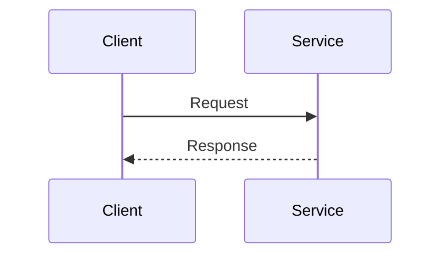
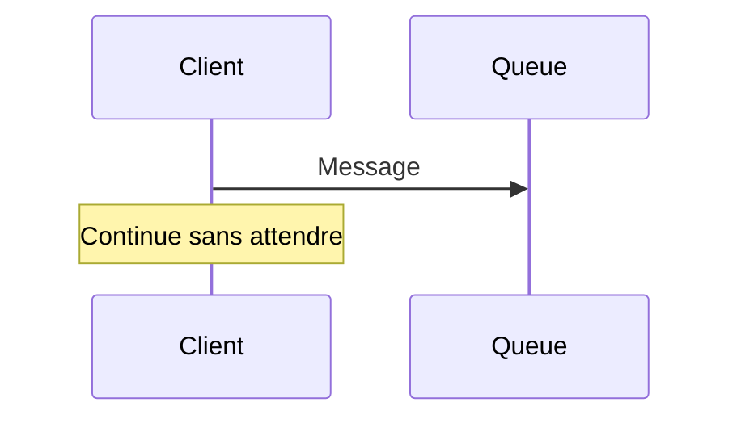
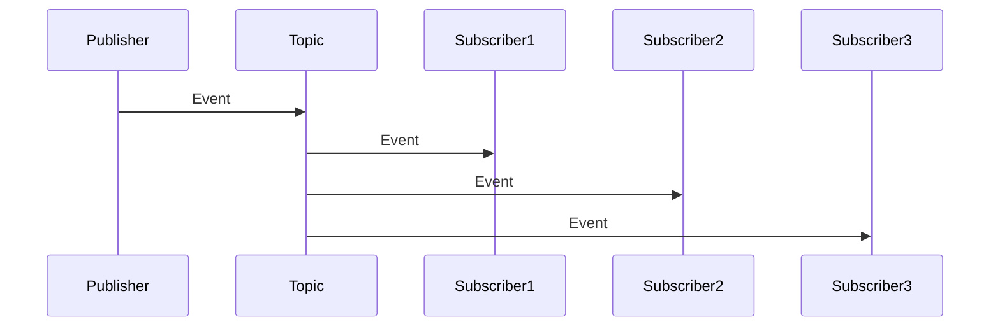

# Types de communication


# Types de communication

## Vue d'ensemble

Dans une architecture microservices, les services doivent communiquer entre eux. Le choix du type de communication impacte directement la **résilience**, la **performance** et la **complexité** du système.

## 🧭 Deux dimensions

### 1. Relation

| Type | Description | Cas d'usage |
|------|-------------|-------------|
| **Un-à-un** | Une requête → un service | Consultation de données, opérations CRUD |
| **Un-à-plusieurs** | Une requête → plusieurs services | Notification d'événements, broadcasting |

### 2. Synchronicité

| Type | Description | Caractéristiques |
|------|-------------|------------------|
| **Synchrone** | Le client attend la réponse | Couplage temporel fort, plus simple |
| **Asynchrone** | Le client n'attend pas | Découplage temporel, plus résilient |

## 📡 Communication synchrone

### REST (HTTP/JSON)

**Avantages :**
- Standard universel, facile à débugger
- Large écosystème d'outils
- Lisibilité des données (JSON)

**Inconvénients :**
- Verbeux (overhead réseau)
- Typé faiblement
- Performance moindre que gRPC

**Quand l'utiliser :**
- APIs publiques ou externes
- Intégration avec des systèmes tiers
- Prototypage rapide

```http
GET /api/users/123 HTTP/1.1
Host: user-service.internal
Accept: application/json
```

### gRPC (HTTP/2 + Protobuf)

**Avantages :**
- Très performant (sérialisation binaire)
- Typage fort avec Protobuf
- Streaming bidirectionnel natif
- Génération automatique de clients

**Inconvénients :**
- Moins lisible (binaire)
- Nécessite compilation de schémas
- Debugging plus complexe

**Quand l'utiliser :**
- Communication interne entre microservices
- Besoins de performance élevés
- Streaming de données

```protobuf
service UserService {
  rpc GetUser (GetUserRequest) returns (User);
  rpc StreamUsers (stream UserRequest) returns (stream User);
}
```

### GraphQL

**Avantages :**
- Le client demande uniquement les données nécessaires
- Pas de sur-fetching ou under-fetching
- Introspection du schéma

**Inconvénients :**
- Complexité côté serveur
- Caching plus difficile
- Courbe d'apprentissage

**Quand l'utiliser :**
- APIs BFF (Backend for Frontend)
- Clients avec besoins variés
- Agrégation de plusieurs sources

## 📨 Communication asynchrone

### Message Queue (RabbitMQ, AWS SQS)

**Concept :** File d'attente avec garantie de livraison

**Avantages :**
- Découplage temporel complet
- Retry automatique
- Gestion de la charge (buffering)

**Inconvénients :**
- Latence plus élevée
- Complexité opérationnelle
- Ordre de traitement à gérer

**Quand l'utiliser :**
- Tâches asynchrones (emails, notifications)
- Lissage de charge
- Garantie de traitement

```python
# Producer
channel.basic_publish(
    exchange='',
    routing_key='user.created',
    body=json.dumps({'user_id': 123})
)
```

### Event Streaming (Kafka, AWS Kinesis)

**Concept :** Log distribué d'événements

**Avantages :**
- Replay possible des événements
- Très haut débit
- Persistance des événements
- Partitionnement pour scalabilité

**Inconvénients :**
- Complexité opérationnelle élevée
- Overhead pour petits volumes
- Requiert expertise

**Quand l'utiliser :**
- Event Sourcing
- Analytics en temps réel
- Intégration de données (CDC)
- Volumes importants

```java
ProducerRecord<String, String> record = 
    new ProducerRecord<>("user-events", "user.created", payload);
producer.send(record);
```

### Pub/Sub (Redis Pub/Sub, Google Pub/Sub)

**Concept :** Diffusion à plusieurs abonnés

**Avantages :**
- Broadcast simple
- Faible latence
- Pas de persistance (léger)

**Inconvénients :**
- Pas de garantie de livraison (Redis)
- Pas de replay

**Quand l'utiliser :**
- Notifications temps réel
- Invalidation de cache
- Broadcasting d'événements non critiques

## 🎯 Patterns de communication

### Request/Response

Le client envoie une requête et attend une réponse



**Usage :** Lecture de données, opérations CRUD

### Fire and Forget

Envoi sans attendre de réponse



**Usage :** Logs, analytics, notifications

### Publish/Subscribe

Un émetteur, plusieurs récepteurs



**Usage :** Event-driven architecture, CQRS

## 📊 Tableau de comparaison

| Critère | REST | gRPC | Message Queue | Kafka |
|---------|------|------|---------------|-------|
| **Performance** | ⭐⭐⭐ | ⭐⭐⭐⭐⭐ | ⭐⭐⭐ | ⭐⭐⭐⭐⭐ |
| **Simplicité** | ⭐⭐⭐⭐⭐ | ⭐⭐⭐ | ⭐⭐⭐ | ⭐⭐ |
| **Découplage** | ⭐⭐ | ⭐⭐ | ⭐⭐⭐⭐⭐ | ⭐⭐⭐⭐⭐ |
| **Debugging** | ⭐⭐⭐⭐⭐ | ⭐⭐⭐ | ⭐⭐ | ⭐⭐ |
| **Streaming** | ⭐⭐ | ⭐⭐⭐⭐⭐ | ⭐⭐ | ⭐⭐⭐⭐⭐ |

## 🎨 Recommandations

- **APIs externes** → REST avec OpenAPI
- **Communication interne haute performance** → gRPC
- **Événements métier** → Kafka ou Event Bus
- **Tâches asynchrones** → Message Queue (RabbitMQ, SQS)
- **Frontend flexible** → GraphQL (BFF)

## Ressources

- [gRPC vs REST](https://www.imaginarycloud.com/blog/grpc-vs-rest/)
- [Kafka Documentation](https://kafka.apache.org/documentation/)
- [Understanding Message Queues](https://aws.amazon.com/message-queue/)