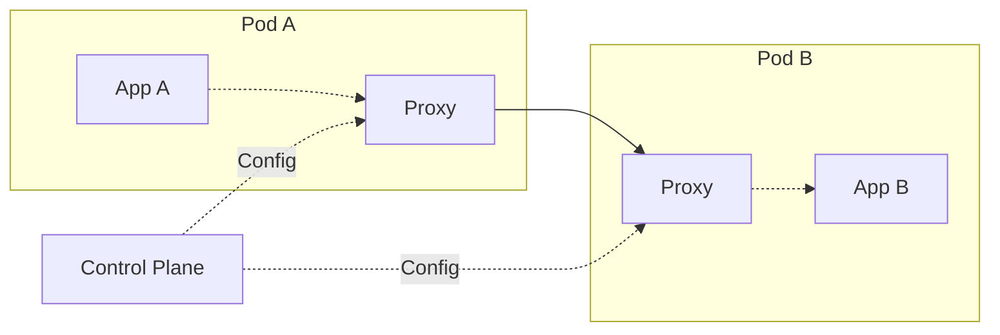

# Service Mesh

## Concept

Un **Service Mesh** est une couche d'infrastructure dédiée qui gère la communication entre microservices. Il décharge les services de la logique de réseau, sécurité et observabilité.

:::tip Principe
Ajouter un proxy léger (sidecar) à côté de chaque instance de service pour intercepter et gérer tout le trafic réseau.
:::

## 🎯 Problème résolu

### Sans Service Mesh

Chaque service doit implémenter :
- ❌ Circuit breaker, retry, timeout
- ❌ Load balancing
- ❌ Service discovery
- ❌ TLS mutuel
- ❌ Distributed tracing
- ❌ Metrics collection

**→ Code dupliqué, complexité, risques d'incohérence**

### Avec Service Mesh

✅ Logique de réseau **externalisée** dans l'infrastructure
✅ Configuration **centralisée**
✅ Observabilité **unifiée**

## 🏗️ Architecture

### Pattern Sidecar



**Composants :**
- **Data Plane** : proxies sidecar (Envoy)
- **Control Plane** : configuration et orchestration

## 🔧 Principales solutions

### Istio

Le plus complet et mature

**Avantages :**
- Riche en fonctionnalités
- Support multi-cloud
- Large communauté

**Inconvénients :**
- Complexe à opérer
- Overhead de ressources

```yaml
# Exemple de configuration Istio
apiVersion: networking.istio.io/v1beta1
kind: VirtualService
metadata:
  name: reviews
spec:
  hosts:
  - reviews
  http:
  - route:
    - destination:
        host: reviews
        subset: v1
      weight: 80
    - destination:
        host: reviews
        subset: v2
      weight: 20
```

### Linkerd

Léger et simple

**Avantages :**
- Performance excellente
- Facilité d'utilisation
- Faible consommation ressources

**Inconvénients :**
- Moins de fonctionnalités qu'Istio
- Écosystème plus restreint

### Consul Connect

Par HashiCorp

**Avantages :**
- Intégration native avec Consul
- Multi-datacenter
- Support multi-plateforme (pas seulement K8s)

### AWS App Mesh

Service managé AWS

**Avantages :**
- Zéro opérations (managé)
- Intégration AWS native
- Pay-as-you-go

**Inconvénients :**
- Vendor lock-in
- Uniquement AWS

## 🚀 Fonctionnalités

### 1. Traffic Management

#### Load Balancing avancé

```yaml
# Round-robin pondéré
- destination:
    host: api-service
  weight: 80
- destination:
    host: api-service-canary
  weight: 20
```

#### Canary Deployment

```yaml
# Trafic progressif vers nouvelle version
http:
- match:
  - headers:
      user-type:
        exact: beta
  route:
  - destination:
      host: service
      subset: v2
- route:
  - destination:
      host: service
      subset: v1
```

#### Circuit Breaking

```yaml
apiVersion: networking.istio.io/v1beta1
kind: DestinationRule
metadata:
  name: api-service
spec:
  host: api-service
  trafficPolicy:
    connectionPool:
      tcp:
        maxConnections: 100
      http:
        http1MaxPendingRequests: 50
        maxRequestsPerConnection: 2
    outlierDetection:
      consecutiveErrors: 5
      interval: 30s
      baseEjectionTime: 30s
```

### 2. Security

#### mTLS automatique

```yaml
# Activer mTLS pour tout le namespace
apiVersion: security.istio.io/v1beta1
kind: PeerAuthentication
metadata:
  name: default
  namespace: production
spec:
  mtls:
    mode: STRICT
```

**Avantages :**
- Chiffrement automatique
- Gestion de certificats transparente
- Rotation automatique

#### Authorization policies

```yaml
apiVersion: security.istio.io/v1beta1
kind: AuthorizationPolicy
metadata:
  name: allow-read
spec:
  action: ALLOW
  rules:
  - from:
    - source:
        principals: ["cluster.local/ns/default/sa/frontend"]
    to:
    - operation:
        methods: ["GET"]
```

### 3. Observability

#### Distributed Tracing

Propagation automatique des headers de tracing (Jaeger, Zipkin)

```yaml
# Aucune instrumentation nécessaire !
# Le sidecar injecte automatiquement les span
```

#### Métriques

Collecte automatique des métriques standard :

```promql
# Latence P99
histogram_quantile(0.99, 
  rate(istio_request_duration_milliseconds_bucket[5m])
)

# Taux d'erreur
rate(istio_requests_total{response_code=~"5.."}[5m])

# Trafic entrant
sum(rate(istio_requests_total[5m])) by (destination_service)
```

#### Service Graph

Visualisation automatique des dépendances

```
Frontend → API Gateway → User Service
                      → Product Service → DB
```

### 4. Resiliency

#### Retry automatique

```yaml
http:
- route:
  - destination:
      host: api-service
  retries:
    attempts: 3
    perTryTimeout: 2s
    retryOn: 5xx,reset,connect-failure
```

#### Timeout

```yaml
http:
- route:
  - destination:
      host: slow-service
  timeout: 5s
```

#### Fault Injection (test de résilience)

```yaml
# Simuler 10% de latence pour tester
http:
- fault:
    delay:
      percentage:
        value: 10
      fixedDelay: 5s
  route:
  - destination:
      host: service
```

## 🎨 Cas d'usage

### 1. Migration progressive vers microservices

```yaml
# Router 90% vers le monolithe, 10% vers microservice
http:
- route:
  - destination:
      host: monolith
    weight: 90
  - destination:
      host: new-microservice
    weight: 10
```

### 2. Multi-cluster

Distribuer le trafic entre plusieurs clusters Kubernetes

```yaml
# Failover automatique
http:
- route:
  - destination:
      host: service.cluster-primary
    weight: 100
  mirror:
    host: service.cluster-backup
```

### 3. A/B Testing

```yaml
# Envoyer utilisateurs premium vers version améliorée
http:
- match:
  - headers:
      user-tier:
        exact: premium
  route:
  - destination:
      subset: premium-version
- route:
  - destination:
      subset: standard-version
```

## 📊 Performance

### Overhead typique

| Métrique | Sans Service Mesh | Avec Service Mesh |
|----------|-------------------|-------------------|
| **Latency** | ~1ms | ~1-3ms (+1-2ms) |
| **CPU** | Baseline | +10-20% |
| **Memory** | Baseline | +50-100MB/pod |

:::tip
L'overhead est souvent négligeable comparé aux bénéfices (sécurité, observabilité)
:::

## ⚠️ Considérations

### Quand utiliser un Service Mesh ?

✅ **Oui si :**
- 10+ microservices
- Besoin de mTLS universel
- Observabilité critique
- Déploiements canary fréquents
- Multi-cluster/multi-cloud

❌ **Non si :**
- Début de projet (< 5 services)
- Équipe sans expertise Kubernetes
- Contraintes de latence extrêmes (< 5ms)
- Infrastructure simple

### Complexité opérationnelle

**Compétences requises :**
- Kubernetes avancé
- Networking (Envoy, iptables)
- Certificats TLS

**Opérations :**
- Mise à jour du control plane
- Gestion des certificats
- Debugging réseau complexe

## ✅ Bonnes pratiques

1. **Commencer simple** : activer progressivement les fonctionnalités
2. **Namespace isolation** : segmenter par environnement
3. **Monitoring du mesh** : métriques du control plane et sidecars
4. **Limites de ressources** : définir requests/limits pour sidecars
5. **Stratégie mTLS** : PERMISSIVE → STRICT progressivement
6. **Versioning des configurations** : GitOps pour les ressources mesh
7. **Plan de rollback** : pouvoir désactiver rapidement

## 🧪 Migration progressive

### Phase 1 : Observability

```yaml
# Activer uniquement les métriques et traces
annotations:
  sidecar.istio.io/inject: "true"
```

### Phase 2 : Security

```yaml
# Activer mTLS en mode permissif
mtls:
  mode: PERMISSIVE  # Accepte TLS et plain
```

### Phase 3 : Traffic Management

```yaml
# Activer circuit breaker, retry, etc.
trafficPolicy:
  connectionPool: {...}
  outlierDetection: {...}
```

### Phase 4 : Strict Mode

```yaml
# Forcer mTLS pour tout
mtls:
  mode: STRICT
```

## 📈 Métriques clés

```promql
# Santé du control plane
up{job="istiod"}

# Latence ajoutée par sidecar
histogram_quantile(0.99, envoy_cluster_upstream_rq_time_bucket)

# Taux de connexion TLS
rate(istio_tcp_connections_opened_total{security_policy="mutual_tls"}[5m])

# Memory sidecar
container_memory_usage_bytes{container="istio-proxy"}
```

## Ressources

- [Istio Documentation](https://istio.io/latest/docs/)
- [Linkerd](https://linkerd.io/)
- [The Service Mesh: What Every Software Engineer Needs to Know (Book)](https://www.nginx.com/resources/library/the-service-mesh/)
- [CNCF Service Mesh Landscape](https://landscape.cncf.io/card-mode?category=service-mesh)