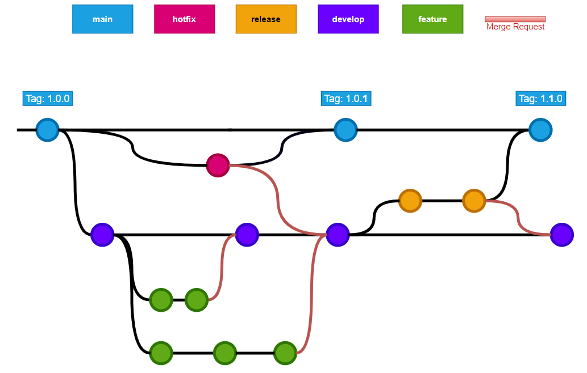

# GitFlow

Vous êtes habitué à travailler avec Git mais ne comprenez pas vraiment comment l'utiliser correctement dans de grandes équipes ?
Ne vous inquiétez pas, vous y arriverez.

---

## 1. Principes de Git Flow

Le diagramme suivant montre le flux de développement cible avec Git.



**Branches principales :**

- **`main` ou `master`** : représente une version stable après release
- **`develop`** : branche de développement qui évolue au fil des sprints, elle doit toujours être fonctionnelle et opérationnelle
- **`feature/NOM`** : branche de fonctionnalité, VOTRE branche spécifique à une story ou tâche. Vous pouvez la déployer sur un environnement de développement
- **`bugfix/NOM`** : branche pour corriger des bugs, elle doit être fusionnée dans `develop`
- **`hotfix/NOM`** : branche pour corriger un bug CRITIQUE sur une version publiée

---

## 2. Configuration de Git

Pour bien démarrer votre développement avec Git, certaines options sont recommandées :
```bash
git config --global pull.rebase true
git config --global fetch.prune true
git config --global core.editor "'C:/Program Files/Notepad++/notepad++.exe' -multiInst -notabbar -nosession -noPlugin"
git config --global diff.colorMoved zebra
```

**Explications :**

- **Première ligne** : toujours rebaser votre dépôt local lors du pull des nouvelles mises à jour
- **Deuxième ligne** : nettoyer votre dépôt local lors du fetch (nettoyage limité aux références de branches supprimées après une merge request)
- **Troisième ligne** (optionnel) : utiliser Notepad++ comme éditeur Git
- **Quatrième ligne** (optionnel) : utile pour lire les diffs dans un terminal

---

## 3. Corriger un bug

Pour corriger un bug :
```bash
# Si le dépôt local n'existe pas
git clone <url>

# Si le dépôt local existe déjà
git switch develop
git pull origin develop

# Créer une nouvelle branche
git checkout -b bugfix/<nom-descriptif-du-bug>

# ... Corriger le bug et à la fin :
git add .
git commit -m "[JIR1-123456] Fix: correction du bug XYZ"
git push origin bugfix/<nom-descriptif-du-bug>
```

---

## 4. Démarrer une nouvelle fonctionnalité

Pour démarrer une nouvelle fonctionnalité, voici les étapes simples :
```bash
# Si le dépôt local n'existe pas
git clone <url>

# Si le dépôt local existe déjà
git switch develop
git pull origin develop

# Créer votre branche de fonctionnalité
git checkout -b feature/NOM        # ex: feature/packaging-application

# ... Sous-tâche de la fonctionnalité
git add .
git commit -m "[JIR1-123456] Step 1: implémentation de XYZ"

# ... Sous-tâche de la fonctionnalité
git add .
git commit -m "[JIR1-123456] Step 2: ajout des tests"

# Pousser vos changements quand terminé
git add .
git commit -m "[JIR1-123456] New feature: ajout de la fonctionnalité XYZ"
git push origin feature/NOM
```

> **NOTE :** Vérifiez que vous êtes toujours synchronisé avec la dernière version de développement. Vous devrez rebaser votre travail.

**Exemple de rebase :**
```bash
# Mettre à jour sa branche
git pull

# Rebaser sur develop
git pull --rebase origin develop

# Suivre les étapes de rebase (voir plus bas)

# Si le conflit de merge est simple, il sera résolu automatiquement
# Une fois les conflits résolus
git push origin feature/<nom-de-la-feature>
```

---

## 5. Cas d'usage courants

### 5.1 Rebase difficile

Il y a deux possibilités :

**Option 1 : Peu de modifications (cherry-pick)**

Si vous avez peu de modifications et savez exactement ce qui a été modifié :
```bash
# Pousser votre branche actuelle
git push origin feature/<nom-de-la-feature>

# Cloner un repo propre
git switch develop
git pull

# Créer une nouvelle branche
git checkout -b feature/<nom-de-la-feature-secours>

# Si le cherry-pick est facile
git cherry-pick <commit-ref>

# Sinon, copier vos fichiers dans la nouvelle branche
# ...

# Tester et pousser vers la nouvelle branche
git add .
git commit -m "[JIR1-123456] New feature: XYZ"
git push origin feature/<branche-de-secours>
```

> Une fois mergée, vous pouvez supprimer l'ancienne branche.

**Option 2 : Beaucoup de conflits (rebase manuel)**

Si vous avez beaucoup de conflits :
```bash
# Mettre à jour votre branche
git pull

# Rebaser sur develop
git pull --rebase origin develop
```

> Utilisez VS Code pour résoudre les conflits

Pour chaque commit résolu :
```bash
# Ajouter les fichiers résolus
git add .
git commit -m "[JIR1-123456] Fix: résolution des conflits sur <commit_ref>"

# Continuer le rebase
git rebase --continue
```

---

### 5.2 Merge

Pour simplifier et par praticité, les merges sont préférés lors de la synchronisation entre branches.
```bash
# Récupérer les références distantes
git fetch -a

# Merger les branches
git merge origin/feature/machin

# Éditer les conflits
git add .

# Commiter
git commit -m "[JIR1-XXXX] Merge: synchronisation ..."

# Pousser
git push
```

---

### 5.3 Modifier un commit

Pour modifier un commit :
```bash
git commit --amend
```

Cela ouvrira l'éditeur et vous pourrez changer le message ou le contenu du commit.

---

### 5.4 Ajouter des fichiers au dernier commit

Pour ajouter des fichiers au dernier commit existant :
```bash
git commit --amend --no-edit
```

---

## Commandes Git utiles supplémentaires
```bash
# Voir l'historique des commits
git log --oneline --graph --decorate --all

# Voir les différences avant de commiter
git diff

# Voir le statut des fichiers
git status

# Annuler les modifications locales
git checkout -- <fichier>

# Annuler le dernier commit (garder les changements)
git reset --soft HEAD~1

# Annuler le dernier commit (supprimer les changements)
git reset --hard HEAD~1

# Mettre de côté des modifications temporairement
git stash

# Récupérer les modifications mises de côté
git stash pop

# Voir la liste des branches
git branch -a

# Supprimer une branche locale
git branch -d feature/nom-branche

# Supprimer une branche distante
git push origin --delete feature/nom-branche
```

---

## Bonnes pratiques

✅ **À faire :**
- Commiter régulièrement avec des messages clairs
- Toujours travailler sur une branche dédiée (jamais directement sur `develop` ou `main`)
- Synchroniser régulièrement avec `develop` pour éviter les gros conflits
- Faire des commits atomiques (une modification logique = un commit)
- Préfixer vos commits avec la référence du ticket : `[JIR1-12345]`

❌ **À éviter :**
- Commiter directement sur `develop` ou `main`
- Faire des commits trop gros avec plusieurs modifications non liées
- Oublier de pull avant de commencer à travailler
- Pousser du code non testé

---

## Workflow recommandé

### Workflow quotidien

1. **Matin :** Mettre à jour votre branche
```bash
   git switch develop
   git pull origin develop
   git switch feature/ma-branche
   git pull --rebase origin develop
```

2. **Pendant la journée :** Commiter régulièrement
```bash
   git add .
   git commit -m "[JIR1-123] Description claire"
```

3. **Fin de journée :** Pousser votre travail
```bash
   git push origin feature/ma-branche
```

### Avant de créer une Merge Request
```bash
# 1. S'assurer d'être à jour avec develop
git switch develop
git pull origin develop

# 2. Rebaser sa branche
git switch feature/ma-branche
git pull --rebase origin develop

# 3. Résoudre les conflits éventuels
# 4. Tester que tout fonctionne
# 5. Pousser
git push origin feature/ma-branche

# 6. Créer la Merge Request dans GitLab
```