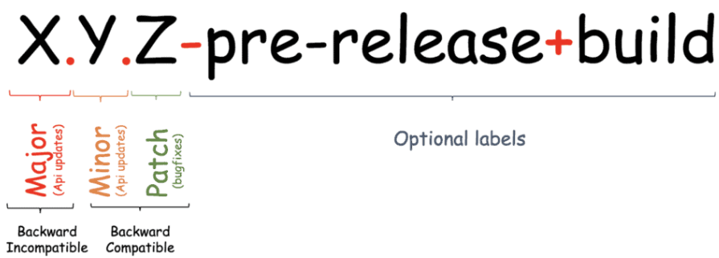

# Versioning (Gestion des versions)

## Introduction

Le versioning est un aspect critique du développement logiciel et de la gestion des releases. Un versioning approprié permet aux développeurs et aux utilisateurs de suivre les changements, gérer les dépendances et comprendre la stabilité et la compatibilité des composants logiciels.

Ce document présente les bonnes pratiques de versioning, avec un accent sur le respect des conventions de Semantic Versioning (SemVer) et la gestion des versions de pré-release.

---

## Semantic Versioning (SemVer)

Le Semantic Versioning (SemVer) est un schéma de versioning qui vise à donner du sens aux changements sous-jacents dans une release. Un numéro de version SemVer est formaté comme `MAJEUR.MINEUR.CORRECTIF`, où chaque segment a des implications spécifiques :

- **MAJEUR** : Incrémenté pour les changements incompatibles de l'API
- **MINEUR** : Incrémenté pour l'ajout de fonctionnalités rétrocompatibles
- **CORRECTIF** : Incrémenté pour les corrections de bugs rétrocompatibles



### Exemples concrets
```
1.0.0       → Version stable initiale
1.1.0       → Fonctionnalité rétrocompatible ajoutée
1.1.1       → Correction de bug rétrocompatible
2.0.0       → Changements majeurs non rétrocompatibles
2.0.0-rc.1  → Release candidate n°1 de la future version 2.0.0
```

### Quand incrémenter chaque segment ?

| Segment | Quand l'incrémenter | Exemples |
|---------|---------------------|----------|
| **MAJEUR** | Changements cassant la rétrocompatibilité | Suppression d'une API, modification du comportement d'une méthode |
| **MINEUR** | Ajout de nouvelles fonctionnalités | Nouvelle fonctionnalité, nouveau endpoint API |
| **CORRECTIF** | Correction de bugs | Fix de sécurité, correction d'un comportement erroné |

---

## Versions de pré-release

Les versions de pré-release sont utilisées pour indiquer que la version est instable et pourrait ne pas satisfaire les exigences de compatibilité prévues. Elles sont indiquées en ajoutant un tiret suivi d'une série d'identifiants séparés par des points.

### Format
```
MAJEUR.MINEUR.CORRECTIF-identifiant.numéro
```

### Identifiants courants de pré-release

| Identifiant | Description | Stabilité | Usage |
|-------------|-------------|-----------|-------|
| **alpha** | Tests et développement précoces | ⚠️ Très instable | Développement actif |
| **beta** | Plus stable qu'alpha | ⚠️ Instable | Tests internes/externes |
| **rc** (release candidate) | Potentiellement prête pour la production | ✅ Stable | Tests finaux avant release |

### Exemples
```
1.0.0-alpha.1   → Première version alpha
1.0.0-alpha.2   → Deuxième version alpha
1.0.0-beta.1    → Première version beta
1.0.0-beta.2    → Deuxième version beta
1.0.0-rc.1      → Premier release candidate
1.0.0-rc.2      → Deuxième release candidate
1.0.0           → Version finale stable
```

### Ordre des versions de pré-release

Les versions de pré-release précèdent leurs versions normales associées. Par exemple :
```
1.0.0-alpha.1 < 1.0.0-alpha.2 < 1.0.0-beta.1 < 1.0.0-rc.1 < 1.0.0
```

**Règles d'ordre :**
1. Les versions avec identifiants alphabétiques sont comparées lexicographiquement
2. Les versions avec identifiants numériques sont comparées numériquement
3. Une version de pré-release est toujours inférieure à la version normale associée

---

## Bonnes pratiques de versioning

### 1. ✅ Incrémenter les versions de manière logique

**MAJEUR** - Incrémentez quand :
- Vous supprimez des fonctionnalités existantes
- Vous modifiez le comportement d'APIs existantes
- Vous effectuez des changements cassant la rétrocompatibilité

**MINEUR** - Incrémentez quand :
- Vous ajoutez de nouvelles fonctionnalités rétrocompatibles
- Vous dépréciez des fonctionnalités (sans les supprimer)
- Vous améliorez significativement des fonctionnalités internes

**CORRECTIF** - Incrémentez quand :
- Vous corrigez des bugs
- Vous effectuez des corrections de sécurité
- Vous améliorez les performances sans changer l'API

### 2. 🏷️ Utiliser les tags de pré-release pour les versions instables

Utilisez les tags de pré-release (`alpha`, `beta`, `rc`) pour indiquer les versions instables ou en phase de test.

**Exemple de workflow :**
```bash
# Phase de développement
1.0.0-alpha.1
1.0.0-alpha.2

# Phase de tests internes
1.0.0-beta.1
1.0.0-beta.2

# Tests finaux
1.0.0-rc.1
1.0.0-rc.2

# Release stable
1.0.0
```

### 3. 📝 Maintenir un Changelog

Conservez un changelog détaillé qui documente tous les changements effectués dans chaque version.

**Format recommandé (Keep a Changelog) :**
```markdown
# Changelog

## [1.2.0] - 2024-12-17

### Added
- Nouvelle fonctionnalité d'export PDF
- Support de l'authentification OAuth2

### Changed
- Amélioration des performances de la recherche
- Mise à jour de la documentation API

### Fixed
- Correction du bug de pagination
- Fix du memory leak dans le service de cache

### Deprecated
- L'ancienne API REST sera supprimée en version 2.0.0

## [1.1.1] - 2024-12-10

### Fixed
- Correction critique de sécurité sur l'authentification
```

### 4. 🤖 Automatiser le versioning

Utilisez des outils automatisés pour gérer le versioning.

**Outils recommandés :**

**Maven (Java) :**
```xml
<plugin>
    <groupId>org.codehaus.mojo</groupId>
    <artifactId>versions-maven-plugin</artifactId>
    <version>2.16.0</version>
</plugin>
```
```bash
# Incrémenter la version MAJEUR
mvn versions:set -DnewVersion=2.0.0

# Incrémenter la version MINEUR
mvn versions:set -DnewVersion=1.1.0

# Incrémenter la version CORRECTIF
mvn versions:set -DnewVersion=1.0.1
```

**NPM (Angular/Node.js) :**
```bash
# Incrémenter la version MAJEUR
npm version major

# Incrémenter la version MINEUR
npm version minor

# Incrémenter la version CORRECTIF
npm version patch

# Version de pré-release
npm version prerelease --preid=beta
```

**Semantic Release (automatisation complète) :**
```bash
npm install --save-dev semantic-release

# Configuration dans package.json
{
  "release": {
    "branches": ["main", "develop"],
    "plugins": [
      "@semantic-release/commit-analyzer",
      "@semantic-release/release-notes-generator",
      "@semantic-release/changelog",
      "@semantic-release/npm",
      "@semantic-release/git"
    ]
  }
}
```

### 5. 📢 Communiquer clairement les changements

Communiquez clairement les changements de version, en particulier les mises à jour MAJEURES.

**Éléments à inclure dans les release notes :**

- ✨ Nouvelles fonctionnalités
- 🔧 Corrections de bugs
- ⚠️ Breaking changes (changements cassants)
- 📚 Mises à jour de la documentation
- 🔐 Correctifs de sécurité
- 🚀 Améliorations de performance
- 📦 Mises à jour de dépendances

**Exemple de release note :**
```markdown
# Version 2.0.0 - BREAKING CHANGES

## ⚠️ Breaking Changes
- L'API REST v1 a été supprimée. Utilisez maintenant l'API v2.
- Le format de configuration a changé. Voir le guide de migration ci-dessous.

## ✨ Nouvelles fonctionnalités
- Support de PostgreSQL 15
- Nouveau système de cache distribué avec Redis
- Interface d'administration refonte complète

## 🔧 Corrections
- Fix du memory leak dans le service de notification
- Correction de la gestion des timeouts

## 📚 Guide de migration
Pour migrer de la version 1.x vers 2.0.0, suivez ces étapes :
1. Mettre à jour votre configuration (voir exemple)
2. Migrer les appels API v1 vers v2 (voir documentation)
3. Tester votre application
```

### 6. 🛡️ Éviter les breaking changes

Minimisez les breaking changes pour assurer un chemin de mise à jour fluide.

**Stratégies pour éviter les breaking changes :**

1. **Dépréciation progressive**
```java
   @Deprecated(since = "1.5", forRemoval = true)
   public void oldMethod() {
       // Sera supprimé en version 2.0.0
   }
   
   public void newMethod() {
       // Nouvelle implémentation
   }
```

2. **Versioning d'API**
```
   /api/v1/users    → Ancienne version
   /api/v2/users    → Nouvelle version
```

3. **Feature flags**
```java
   if (featureFlags.isEnabled("new-authentication")) {
       // Nouveau comportement
   } else {
       // Ancien comportement
   }
```

4. **Configuration rétrocompatible**
```yaml
   # Supporter les deux formats
   database:
     url: "jdbc:postgresql://localhost:5432/mydb"  # Ancien format
     connection-string: "postgresql://localhost:5432/mydb"  # Nouveau format
```

---

## Workflow de versioning recommandé

### Pour un projet Java/Maven
```bash
# 1. Créer une branche de release
git checkout -b release/1.2.0

# 2. Mettre à jour la version dans pom.xml
mvn versions:set -DnewVersion=1.2.0

# 3. Mettre à jour le CHANGELOG.md
# ... éditer manuellement

# 4. Commiter les changements
git add .
git commit -m "chore: bump version to 1.2.0"

# 5. Créer un tag
git tag -a v1.2.0 -m "Release version 1.2.0"

# 6. Pousser
git push origin release/1.2.0
git push origin v1.2.0

# 7. Merger dans main et develop
git checkout main
git merge release/1.2.0
git push origin main

git checkout develop
git merge release/1.2.0
git push origin develop
```

### Pour un projet Angular/NPM
```bash
# 1. Créer une branche de release
git checkout -b release/1.2.0

# 2. Incrémenter la version
npm version minor  # Crée automatiquement le tag

# 3. Mettre à jour le CHANGELOG.md
# ... éditer manuellement

# 4. Commiter et pousser
git push origin release/1.2.0
git push origin --tags

# 5. Merger dans main et develop
git checkout main
git merge release/1.2.0
git push origin main

git checkout develop
git merge release/1.2.0
git push origin develop
```

---

## Gestion des versions selon l'environnement

| Environnement | Type de version | Exemple | Stabilité |
|--------------|-----------------|---------|-----------|
| **Développement** | SNAPSHOT / alpha | `1.2.0-SNAPSHOT` | ⚠️ Instable |
| **Recette** | beta | `1.2.0-beta.1` | ⚠️ Tests en cours |
| **Pré-production** | rc | `1.2.0-rc.1` | ✅ Stable |
| **Production** | Stable | `1.2.0` | ✅ Production |

---

## Outils et ressources

### Outils de versioning

- **Maven Versions Plugin** - Gestion des versions Maven
- **semantic-release** - Automatisation complète du versioning
- **standard-version** - Génération automatique de changelog
- **commitizen** - Aide à la rédaction de commits conventionnels

### Ressources

- [Semantic Versioning Specification](https://semver.org/)
- [Keep a Changelog](https://keepachangelog.com/)
- [Conventional Commits](https://www.conventionalcommits.org/)
- [Maven Versions Plugin Documentation](https://www.mojohaus.org/versions-maven-plugin/)

---

## Checklist avant une release

- [ ] Le code est mergé dans la branche de release
- [ ] Tous les tests passent (unitaires, intégration, e2e)
- [ ] Le CHANGELOG.md est à jour
- [ ] La version est incrémentée correctement dans tous les fichiers
- [ ] La documentation est à jour
- [ ] Les release notes sont rédigées
- [ ] Un tag Git est créé
- [ ] Les breaking changes sont documentés avec un guide de migration
- [ ] L'équipe est informée de la release
- [ ] Le déploiement est planifié

---

## Exemples de messages de commit

Pour faciliter l'automatisation du versioning, utilisez les Conventional Commits :
```bash
# MAJEUR (breaking change)
feat!: suppression de l'API v1
BREAKING CHANGE: l'API v1 n'est plus supportée

# MINEUR (nouvelle fonctionnalité)
feat: ajout de l'export PDF

# CORRECTIF (bug fix)
fix: correction du bug de pagination

# Autres types
docs: mise à jour de la documentation
chore: mise à jour des dépendances
refactor: refactoring du service d'authentification
perf: amélioration des performances de recherche
test: ajout de tests unitaires
```

---

## Résumé

✅ **À faire :**
- Suivre le Semantic Versioning (SemVer)
- Utiliser des versions de pré-release pour les versions instables
- Maintenir un changelog détaillé
- Automatiser le versioning
- Communiquer clairement les changements
- Documenter les breaking changes

❌ **À éviter :**
- Sauter des versions arbitrairement
- Faire des breaking changes dans des versions MINOR ou PATCH
- Oublier de documenter les changements
- Release en production sans tests suffisants
- Changer la version manuellement sans processus clair