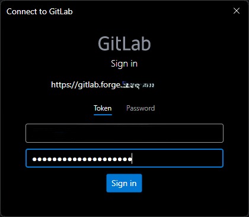

# Connexion à Git avec GitLab

## Création d'un Personal Access Token

Depuis GitLab 17.5, l'authentification par login/mot de passe n'est plus autorisée. Vous devez obligatoirement utiliser un **Personal Access Token** (jeton d'accès personnel).

### Étapes de création

Pour créer un Personal Access Token, utilisez ce lien :
```
https://gitlab-hostname/-/user_settings/personal_access_tokens?name=TokenForGit&scopes=api%2Cread_user
```

### Configuration du token

Les deux portées (scopes) à sélectionner sont :
- `api`
- `read_user`

> **Astuce :** Si vous souhaitez que votre token n'expire jamais, supprimez la date d'expiration.


---

## Connexion depuis Git Bash

Lors de l'apparition de la fenêtre de connexion dans Git Bash, vous devez entrer votre adresse e-mail :



---

## Points importants

- ⚠️ **Obligatoire** : L'utilisation d'un Personal Access Token est requise depuis GitLab 17.5
- 🔒 **Sécurité** : Conservez votre token en lieu sûr, il remplace votre mot de passe
- ⏰ **Expiration** : Définissez une date d'expiration appropriée selon vos besoins de sécurité