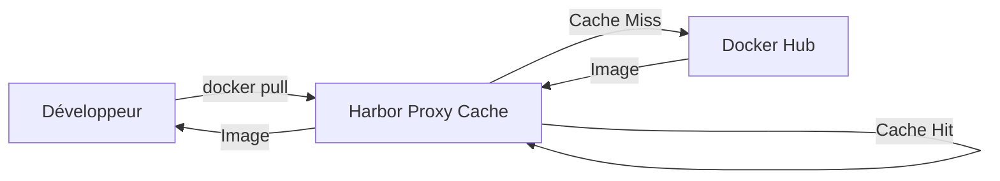
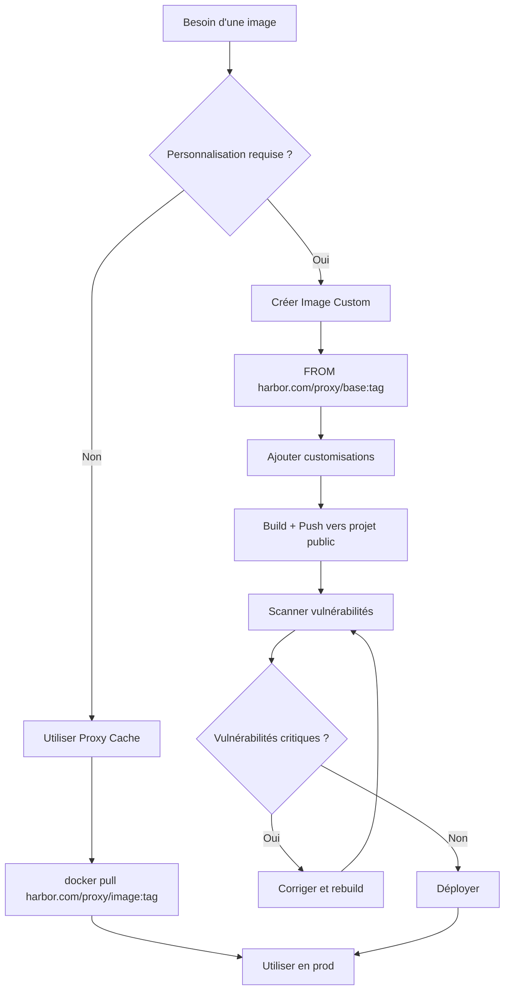

# Proxy Cache vs Images Personnalisées sur Harbor

## Introduction

Lorsque vous gérez un registre Harbor, vous avez deux stratégies principales pour accéder aux images de conteneurs publiques :

1. **Proxy Cache** : Configurer Harbor comme cache intermédiaire vers des registries publics
2. **Images Personnalisées** : Créer et maintenir vos propres images dans un projet Harbor public

Ce guide vous aide à comprendre les différences et à choisir l'approche adaptée à vos besoins.

## Qu'est-ce qu'un Proxy Cache ?

### Concept

Un proxy cache Harbor agit comme un miroir intelligent entre vos utilisateurs et les registries publics (Docker Hub, Quay.io, gcr.io, etc.).



### Configuration dans Harbor

1. Créez un nouveau projet de type "Proxy Cache"
2. Configurez l'URL du registry source (ex: `https://hub.docker.com`)
3. Utilisez le proxy dans vos pulls :

```bash
# Au lieu de :
docker pull nginx:latest

# Utilisez :
docker pull harbor.votredomaine.com/dockerhub-proxy/nginx:latest
```

### Avantages ✅

- **Zéro maintenance** : Les images restent identiques aux originales
- **Économie de bande passante** : Une seule récupération depuis Internet pour toute l'équipe
- **Contournement des rate limits** : Évite les restrictions Docker Hub (100 pulls/6h en mode anonyme)
- **Disponibilité accrue** : Continue de servir les images même si Docker Hub est down
- **Transparence** : Aucune modification des images, traçabilité complète

### Inconvénients ❌

- **Aucune personnalisation possible** : Vous ne pouvez pas modifier les images
- **Dépendance upstream** : Si l'image est supprimée du registry source, elle disparaîtra du cache
- **Pas de contrôle sur le contenu** : Vous héritez des vulnérabilités de l'image source

## Images Personnalisées dans un Projet Public

### Concept

Vous créez vos propres images (basées ou non sur des images publiques) et les stockez dans votre projet Harbor public.

```dockerfile
# Dockerfile
FROM nginx:1.25-alpine

# Personnalisations
RUN apk add --no-cache curl vim && \
    rm -rf /var/cache/apk/*

# Configuration custom
COPY nginx.conf /etc/nginx/nginx.conf
COPY ssl/ /etc/nginx/ssl/

# Labels pour la traçabilité
LABEL maintainer="votre-equipe@votredomaine.com" \
      version="1.0.0" \
      description="Nginx personnalisé avec config entreprise"

EXPOSE 80 443
```

### Pipeline CI/CD

```yaml
# .gitlab-ci.yml ou GitHub Actions
build-and-push:
  stage: build
  script:
    - docker login harbor.votredomaine.com -u $HARBOR_USER -p $HARBOR_PASSWORD
    - docker build -t harbor.votredomaine.com/myproject/nginx-custom:${CI_COMMIT_TAG} .
    - docker push harbor.votredomaine.com/myproject/nginx-custom:${CI_COMMIT_TAG}
    - docker tag harbor.votredomaine.com/myproject/nginx-custom:${CI_COMMIT_TAG} \
                 harbor.votredomaine.com/myproject/nginx-custom:latest
    - docker push harbor.votredomaine.com/myproject/nginx-custom:latest
```

### Avantages ✅

- **Contrôle total** : Vous décidez exactement ce qui est dans l'image
- **Personnalisation** : Ajout d'outils, configurations, certificats, etc.
- **Sécurité renforcée** : Vous pouvez patcher les vulnérabilités immédiatement
- **Immuabilité garantie** : Les versions ne changent jamais, aucun risque de suppression
- **Compliance** : Respect des politiques de sécurité de l'entreprise
- **Optimisation** : Suppression des composants inutiles, réduction de la taille

### Inconvénients ❌

- **Maintenance continue** : Vous devez rebuilder pour les updates de sécurité
- **Stockage** : Consomme l'espace disque de Harbor
- **Effort initial** : Setup des pipelines CI/CD et Dockerfiles
- **Responsabilité** : Vous êtes responsable des vulnérabilités et bugs

## Tableau Comparatif

| Critère | Proxy Cache | Images Personnalisées |
|---------|-------------|----------------------|
| **Maintenance** | 🟢 Aucune | 🔴 Élevée (rebuilds réguliers) |
| **Personnalisation** | 🔴 Impossible | 🟢 Totale |
| **Stockage Harbor** | 🟡 Modéré (cache) | 🔴 Élevé (versions multiples) |
| **Sécurité** | 🟡 Dépend de l'upstream | 🟢 Sous votre contrôle |
| **Temps de setup** | 🟢 5 minutes | 🔴 Plusieurs heures |
| **Rate limiting** | 🟢 Contourné | 🟢 N/A |
| **Traçabilité** | 🟢 Parfaite | 🟢 Parfaite |
| **Disponibilité** | 🟢 Haute | 🟢 Totale |

## Quand Utiliser Chaque Approche ?

### Utilisez un Proxy Cache pour 📦

- Images officielles utilisées sans modification
  - `redis`, `postgres`, `nginx`, `alpine`
- Images de build temporaires
  - `node:18`, `golang:1.21`, `maven:3.9`
- Services tiers standards
  - `grafana/grafana`, `prom/prometheus`
- Environnements de développement

**Exemple d'usage :**

```yaml
# docker-compose.yml
services:
  database:
    image: harbor.votredomaine.com/dockerhub-proxy/postgres:15-alpine
    
  cache:
    image: harbor.votredomaine.com/dockerhub-proxy/redis:7-alpine
    
  monitoring:
    image: harbor.votredomaine.com/quay-proxy/prometheus/prometheus:v2.45.0
```

### Utilisez des Images Personnalisées pour 🔧

- Applications avec configurations spécifiques
- Images nécessitant des outils additionnels
- Environnements de production critiques
- Besoins de sécurité renforcés
- Images devant respecter des standards internes
- Optimisation des tailles d'images

**Exemple d'usage :**

```yaml
# docker-compose.yml
services:
  frontend:
    image: harbor.votredomaine.com/myproject/frontend:2.1.0
    # Image custom avec Nginx + configs SSL + headers sécurité
    
  backend:
    image: harbor.votredomaine.com/myproject/backend:2.1.0
    # Image custom avec Node.js + outils monitoring + certificats
```

## Stratégie Hybride Recommandée 🎯

La meilleure approche combine les deux stratégies :

```yaml
version: '3.8'

services:
  # ===== PROXY CACHE : Images standards =====
  postgres:
    image: harbor.votredomaine.com/dockerhub-proxy/postgres:15-alpine
    # Pas de modification nécessaire
    
  redis:
    image: harbor.votredomaine.com/dockerhub-proxy/redis:7-alpine
    # Utilisé tel quel
    
  # ===== IMAGES CUSTOM : Applications métier =====
  api:
    image: harbor.votredomaine.com/myproject/api:${VERSION}
    # Buildée depuis node:18-alpine (via proxy cache)
    # + code métier + configs + optimisations
    
  web:
    image: harbor.votredomaine.com/myproject/web:${VERSION}
    # Buildée depuis nginx:alpine (via proxy cache)
    # + frontend build + SSL + headers sécurité
    
  # ===== IMAGE CUSTOM : Base partagée =====
  worker:
    image: harbor.votredomaine.com/myproject/python-base:3.11
    # Image de base partagée pour tous les workers Python
    # Inclut : libs communes, outils monitoring, certificats CA
```

## Bonnes Pratiques

### Pour le Proxy Cache

```bash
# 1. Créez des projets proxy séparés par source
harbor.votredomaine.com/dockerhub-proxy/
harbor.votredomaine.com/quay-proxy/
harbor.votredomaine.com/gcr-proxy/

# 2. Configurez la rétention du cache
# Dans Harbor UI : Projects → Policy → Retention

# 3. Utilisez des tags explicites (évitez :latest en prod)
docker pull harbor.votredomaine.com/dockerhub-proxy/nginx:1.25-alpine
```

### Pour les Images Personnalisées

```dockerfile
# 1. Multi-stage builds pour réduire la taille
FROM harbor.votredomaine.com/dockerhub-proxy/node:18 AS builder
WORKDIR /app
COPY package*.json ./
RUN npm ci --production
COPY . .
RUN npm run build

FROM harbor.votredomaine.com/dockerhub-proxy/nginx:alpine
COPY --from=builder /app/dist /usr/share/nginx/html

# 2. Utilisez des images de base du proxy cache
FROM harbor.votredomaine.com/dockerhub-proxy/alpine:3.18

# 3. Versionnez explicitement
LABEL version="2.1.0" \
      build-date="2024-01-15" \
      commit-sha="${GIT_COMMIT}"

# 4. Scannez les vulnérabilités
# Harbor intégré avec Trivy/Clair
```

## Workflow Complet



## Conclusion

Le choix entre proxy cache et images personnalisées n'est pas binaire. Une architecture moderne utilise :

- **Proxy cache** pour 70-80% des images (base de données, outils, services standards)
- **Images personnalisées** pour 20-30% (applications métier, images avec besoins spécifiques)

Cette approche optimise le rapport effort/bénéfice tout en maintenant flexibilité et contrôle.

:::tip Conseil
Commencez par le proxy cache pour toutes vos images, puis créez des images personnalisées uniquement quand un besoin spécifique se présente.
:::

:::warning Attention
En production, évitez le tag `:latest` même avec un proxy cache. Utilisez toujours des versions explicites pour garantir la reproductibilité.
:::