# ☕ Pipeline Java/Maven - GitLab CI

Pipeline CI/CD complet pour applications Java Spring Boot avec Maven sur GitLab CI.

## 🎯 Architecture du Pipeline GitLab CI

```mermaid
graph LR
    subgraph "Stages GitLab CI"
        BUILD[🔨 Build]
        TEST[🧪 Test]
        QUALITY[📊 Quality]
        SECURITY[🔒 Security]
        PACKAGE[📦 Package]
        DEPLOY_DEV[🔧 Deploy Dev]
        DEPLOY_STAGING[🎭 Deploy Staging]
        DEPLOY_PROD[🚀 Deploy Prod]
    end
    
    BUILD --> TEST
    TEST --> QUALITY
    QUALITY --> SECURITY
    SECURITY --> PACKAGE
    PACKAGE --> DEPLOY_DEV
    DEPLOY_DEV --> DEPLOY_STAGING
    DEPLOY_STAGING --> DEPLOY_PROD
    
    subgraph "Outils"
        MAVEN[📦 Maven]
        SONAR[📊 SonarQube]
        TRIVY[🔍 Trivy]
        DOCKER[🐳 Docker]
        KUBECTL[☸️ kubectl]
    end
    
    BUILD --> MAVEN
    QUALITY --> SONAR
    SECURITY --> TRIVY
    PACKAGE --> DOCKER
    DEPLOY_PROD --> KUBECTL
```



## 📋 Pipeline GitLab CI Complet

```yaml title=".gitlab-ci.yml"
# GitLab CI Pipeline pour Java/Maven
# Version: 1.0
# Description: Pipeline DevSecOps complet

variables:
  # Maven
  MAVEN_OPTS: "-Dmaven.repo.local=$CI_PROJECT_DIR/.m2/repository"
  MAVEN_CLI_OPTS: "--batch-mode --errors --fail-at-end --show-version"
  
  # Docker
  DOCKER_DRIVER: overlay2
  DOCKER_TLS_CERTDIR: "/certs"
  REGISTRY: $CI_REGISTRY
  IMAGE_NAME: $CI_REGISTRY_IMAGE
  
  # Application
  APP_NAME: "my-spring-app"
  
  # Kubernetes
  KUBE_NAMESPACE_DEV: "dev"
  KUBE_NAMESPACE_STAGING: "staging"
  KUBE_NAMESPACE_PROD: "production"

# Cache Maven dependencies
cache:
  key: ${CI_COMMIT_REF_SLUG}
  paths:
    - .m2/repository/
    - target/

# Stages
stages:
  - build
  - test
  - quality
  - security
  - package
  - deploy-dev
  - deploy-staging
  - deploy-prod

# Templates
.maven_template: &maven_template
  image: maven:3.9-eclipse-temurin-21
  before_script:
    - echo "Maven version:"
    - mvn --version

.docker_template: &docker_template
  image: docker:24-dind
  services:
    - docker:24-dind
  before_script:
    - docker info
    - echo "$CI_REGISTRY_PASSWORD" | docker login -u "$CI_REGISTRY_USER" --password-stdin $CI_REGISTRY

.kubectl_template: &kubectl_template
  image: bitnami/kubectl:latest
  before_script:
    - kubectl version --client
    - kubectl config get-contexts

# ============================================
# Stage 1: BUILD
# ============================================
build:maven:
  <<: *maven_template
  stage: build
  script:
    - echo "🔨 Building with Maven..."
    - mvn $MAVEN_CLI_OPTS clean compile
    - echo "✅ Build successful"
  artifacts:
    paths:
      - target/
    expire_in: 1 hour
  only:
    - branches
    - merge_requests

# ============================================
# Stage 2: TEST
# ============================================
test:unit:
  <<: *maven_template
  stage: test
  script:
    - echo "🧪 Running unit tests..."
    - mvn $MAVEN_CLI_OPTS test
    - echo "📊 Generating coverage report..."
    - mvn jacoco:report
  artifacts:
    when: always
    reports:
      junit:
        - target/surefire-reports/TEST-*.xml
      coverage_report:
        coverage_format: cobertura
        path: target/site/jacoco/jacoco.xml
    paths:
      - target/surefire-reports/
      - target/site/jacoco/
    expire_in: 1 week
  coverage: '/Total.*?([0-9]{1,3})%/'
  only:
    - branches
    - merge_requests

test:integration:
  <<: *maven_template
  stage: test
  services:
    - name: postgres:15-alpine
      alias: postgres
    - name: redis:7-alpine
      alias: redis
  variables:
    POSTGRES_DB: testdb
    POSTGRES_USER: testuser
    POSTGRES_PASSWORD: testpass
    SPRING_DATASOURCE_URL: "jdbc:postgresql://postgres:5432/testdb"
    SPRING_DATASOURCE_USERNAME: testuser
    SPRING_DATASOURCE_PASSWORD: testpass
    SPRING_REDIS_HOST: redis
  script:
    - echo "🧪 Running integration tests..."
    - mvn $MAVEN_CLI_OPTS verify -DskipUnitTests
  artifacts:
    when: always
    reports:
      junit:
        - target/failsafe-reports/TEST-*.xml
    paths:
      - target/failsafe-reports/
    expire_in: 1 week
  only:
    - branches
    - merge_requests

# ============================================
# Stage 3: QUALITY
# ============================================
quality:checkstyle:
  <<: *maven_template
  stage: quality
  script:
    - echo "📋 Running Checkstyle..."
    - mvn $MAVEN_CLI_OPTS checkstyle:check
  artifacts:
    when: always
    paths:
      - target/checkstyle-result.xml
    expire_in: 1 week
  allow_failure: false
  only:
    - branches
    - merge_requests

quality:spotbugs:
  <<: *maven_template
  stage: quality
  script:
    - echo "🐛 Running SpotBugs..."
    - mvn $MAVEN_CLI_OPTS spotbugs:check
  artifacts:
    when: always
    paths:
      - target/spotbugsXml.xml
    expire_in: 1 week
  allow_failure: true
  only:
    - branches
    - merge_requests

quality:pmd:
  <<: *maven_template
  stage: quality
  script:
    - echo "📊 Running PMD..."
    - mvn $MAVEN_CLI_OPTS pmd:check
  artifacts:
    when: always
    paths:
      - target/pmd.xml
    expire_in: 1 week
  allow_failure: true
  only:
    - branches
    - merge_requests

quality:sonarqube:
  <<: *maven_template
  stage: quality
  script:
    - echo "📊 Running SonarQube analysis..."
    - mvn $MAVEN_CLI_OPTS sonar:sonar
        -Dsonar.projectKey=$CI_PROJECT_PATH_SLUG
        -Dsonar.projectName="$CI_PROJECT_NAME"
        -Dsonar.host.url=$SONAR_HOST_URL
        -Dsonar.login=$SONAR_TOKEN
        -Dsonar.qualitygate.wait=true
        -Dsonar.coverage.jacoco.xmlReportPaths=target/site/jacoco/jacoco.xml
  dependencies:
    - test:unit
  allow_failure: false
  only:
    - branches
    - merge_requests
  except:
    - tags

# ============================================
# Stage 4: SECURITY
# ============================================
security:dependency-check:
  <<: *maven_template
  stage: security
  script:
    - echo "🔍 Running OWASP Dependency Check..."
    - mvn $MAVEN_CLI_OPTS org.owasp:dependency-check-maven:check
        -DfailBuildOnCVSS=7
        -DsuppressionFiles=dependency-check-suppression.xml
  artifacts:
    when: always
    paths:
      - target/dependency-check-report.html
      - target/dependency-check-report.json
    reports:
      dependency_scanning: target/dependency-check-report.json
    expire_in: 1 week
  allow_failure: false
  only:
    - branches
    - merge_requests

security:trivy-fs:
  image: aquasec/trivy:latest
  stage: security
  script:
    - echo "🔍 Scanning filesystem with Trivy..."
    - trivy fs --security-checks vuln,secret,config
        --severity CRITICAL,HIGH
        --format json
        --output trivy-fs-report.json
        .
    - trivy fs --security-checks vuln,secret,config
        --severity CRITICAL,HIGH
        --format template
        --template "@/contrib/html.tpl"
        --output trivy-fs-report.html
        .
    - echo "📊 Trivy filesystem scan complete"
  artifacts:
    when: always
    paths:
      - trivy-fs-report.json
      - trivy-fs-report.html
    reports:
      container_scanning: trivy-fs-report.json
    expire_in: 1 week
  allow_failure: false
  only:
    - branches
    - merge_requests

security:gitleaks:
  image: zricethezav/gitleaks:latest
  stage: security
  script:
    - echo "🔐 Scanning for secrets with Gitleaks..."
    - gitleaks detect --source . --report-format json --report-path gitleaks-report.json --verbose
  artifacts:
    when: always
    paths:
      - gitleaks-report.json
    expire_in: 1 week
  allow_failure: false
  only:
    - branches
    - merge_requests

security:sbom-generate:
  <<: *maven_template
  stage: security
  script:
    - echo "📋 Generating SBOM with CycloneDX..."
    - mvn $MAVEN_CLI_OPTS cyclonedx:makeAggregateBom
    - echo "📋 Generating SBOM with Syft..."
    - curl -sSfL https://raw.githubusercontent.com/anchore/syft/main/install.sh | sh -s -- -b /usr/local/bin
    - syft packages dir:. -o cyclonedx-json=sbom-syft.json
    - syft packages dir:. -o spdx-json=sbom-spdx.json
  artifacts:
    paths:
      - target/bom.json
      - target/bom.xml
      - sbom-syft.json
      - sbom-spdx.json
    expire_in: 1 month
  only:
    - branches
    - merge_requests

security:sbom-scan:
  image: anchore/grype:latest
  stage: security
  dependencies:
    - security:sbom-generate
  script:
    - echo "🔍 Scanning SBOM with Grype..."
    - grype sbom:sbom-syft.json -o json --file grype-report.json
    - grype sbom:sbom-syft.json -o table
    - |
      CRITICAL=$(cat grype-report.json | jq '[.matches[] | select(.vulnerability.severity=="Critical")] | length')
      HIGH=$(cat grype-report.json | jq '[.matches[] | select(.vulnerability.severity=="High")] | length')
      echo "Critical: $CRITICAL, High: $HIGH"
      if [ "$CRITICAL" -gt "0" ]; then
        echo "❌ Critical vulnerabilities found!"
        exit 1
      fi
  artifacts:
    when: always
    paths:
      - grype-report.json
    expire_in: 1 week
  allow_failure: false
  only:
    - branches
    - merge_requests

# ============================================
# Stage 5: PACKAGE
# ============================================
package:jar:
  <<: *maven_template
  stage: package
  script:
    - echo "📦 Building JAR..."
    - mvn $MAVEN_CLI_OPTS package -DskipTests
    - echo "JAR file:"
    - ls -lh target/*.jar
  artifacts:
    paths:
      - target/*.jar
    expire_in: 1 month
  only:
    - branches
    - merge_requests
    - tags

package:docker:
  <<: *docker_template
  stage: package
  dependencies:
    - package:jar
  script:
    - echo "🐳 Building Docker image..."
    - |
      if [ "$CI_COMMIT_TAG" != "" ]; then
        TAG="$CI_COMMIT_TAG"
      else
        TAG="$CI_COMMIT_SHORT_SHA"
      fi
    - echo "Tag: $TAG"
    - docker build -t $IMAGE_NAME:$TAG -t $IMAGE_NAME:latest .
    - echo "🔍 Scanning image with Trivy..."
    - docker run --rm -v /var/run/docker.sock:/var/run/docker.sock aquasec/trivy:latest image
        --severity CRITICAL,HIGH
        --exit-code 1
        --no-progress
        $IMAGE_NAME:$TAG
    - echo "✍️ Signing image with Cosign..."
    - apk add --no-cache cosign
    - echo "$COSIGN_PRIVATE_KEY" > cosign.key
    - cosign sign --key cosign.key --yes $IMAGE_NAME:$TAG
    - rm cosign.key
    - echo "📤 Pushing image..."
    - docker push $IMAGE_NAME:$TAG
    - docker push $IMAGE_NAME:latest
    - echo "✅ Docker image pushed: $IMAGE_NAME:$TAG"
  only:
    - branches
    - merge_requests
    - tags

# ============================================
# Stage 6: DEPLOY DEV
# ============================================
deploy:dev:
  <<: *kubectl_template
  stage: deploy-dev
  environment:
    name: development
    url: https://dev.example.com
    on_stop: stop:dev
  script:
    - echo "🚀 Deploying to Development..."
    - kubectl config use-context $KUBE_CONTEXT_DEV
    - |
      if [ "$CI_COMMIT_TAG" != "" ]; then
        TAG="$CI_COMMIT_TAG"
      else
        TAG="$CI_COMMIT_SHORT_SHA"
      fi
    - kubectl set image deployment/$APP_NAME
        $APP_NAME=$IMAGE_NAME:$TAG
        -n $KUBE_NAMESPACE_DEV
    - kubectl rollout status deployment/$APP_NAME -n $KUBE_NAMESPACE_DEV --timeout=5m
    - echo "✅ Deployment to Dev successful"
    - echo "🧪 Running smoke tests..."
    - sleep 10
    - kubectl run curl-test --rm -i --restart=Never --image=curlimages/curl:latest
        -n $KUBE_NAMESPACE_DEV
        -- curl -f http://$APP_NAME:8080/actuator/health || exit 1
  only:
    - branches
    - merge_requests
  except:
    - tags

stop:dev:
  <<: *kubectl_template
  stage: deploy-dev
  environment:
    name: development
    action: stop
  script:
    - echo "🛑 Stopping Development environment..."
    - kubectl scale deployment/$APP_NAME --replicas=0 -n $KUBE_NAMESPACE_DEV
  when: manual
  only:
    - branches

# ============================================
# Stage 7: DEPLOY STAGING
# ============================================
deploy:staging:
  <<: *kubectl_template
  stage: deploy-staging
  environment:
    name: staging
    url: https://staging.example.com
  script:
    - echo "🚀 Deploying to Staging..."
    - kubectl config use-context $KUBE_CONTEXT_STAGING
    - TAG="$CI_COMMIT_SHORT_SHA"
    - kubectl set image deployment/$APP_NAME
        $APP_NAME=$IMAGE_NAME:$TAG
        -n $KUBE_NAMESPACE_STAGING
    - kubectl rollout status deployment/$APP_NAME -n $KUBE_NAMESPACE_STAGING --timeout=5m
    - echo "✅ Deployment to Staging successful"
    - echo "🧪 Running E2E tests..."
    - sleep 20
    # Ici, lancer vos tests E2E (Newman, Selenium, etc.)
  only:
    - main
    - develop
  when: manual

# ============================================
# Stage 8: DEPLOY PRODUCTION
# ============================================
deploy:production:
  <<: *kubectl_template
  stage: deploy-prod
  environment:
    name: production
    url: https://app.example.com
  script:
    - echo "🚀 Deploying to Production..."
    - kubectl config use-context $KUBE_CONTEXT_PROD
    - |
      if [ "$CI_COMMIT_TAG" != "" ]; then
        TAG="$CI_COMMIT_TAG"
      else
        echo "❌ Production deployment requires a tag"
        exit 1
      fi
    - echo "Deploying version: $TAG"
    - kubectl set image deployment/$APP_NAME
        $APP_NAME=$IMAGE_NAME:$TAG
        -n $KUBE_NAMESPACE_PROD
    - kubectl rollout status deployment/$APP_NAME -n $KUBE_NAMESPACE_PROD --timeout=10m
    - echo "✅ Deployment to Production successful"
    - echo "🧪 Running smoke tests..."
    - sleep 30
    - kubectl run curl-test --rm -i --restart=Never --image=curlimages/curl:latest
        -n $KUBE_NAMESPACE_PROD
        -- curl -f http://$APP_NAME:8080/actuator/health || exit 1
    - echo "📊 Creating GitLab release..."
    - |
      curl --request POST --header "PRIVATE-TOKEN: $CI_JOB_TOKEN"
        "$CI_API_V4_URL/projects/$CI_PROJECT_ID/releases"
        --form "name=Release $TAG"
        --form "tag_name=$TAG"
        --form "description=Production release $TAG"
  only:
    - tags
  when: manual

# ============================================
# Scheduled Jobs
# ============================================
security:scheduled-scan:
  <<: *maven_template
  stage: security
  script:
    - echo "🔍 Running scheduled security scan..."
    - mvn $MAVEN_CLI_OPTS org.owasp:dependency-check-maven:check
  artifacts:
    when: always
    paths:
      - target/dependency-check-report.html
    expire_in: 1 month
  only:
    - schedules
```

## 📦 Configuration Maven (pom.xml)

```xml title="pom.xml"
<?xml version="1.0" encoding="UTF-8"?>
<project xmlns="http://maven.apache.org/POM/4.0.0"
         xmlns:xsi="http://www.w3.org/2001/XMLSchema-instance"
         xsi:schemaLocation="http://maven.apache.org/POM/4.0.0
         https://maven.apache.org/xsd/maven-4.0.0.xsd">
    <modelVersion>4.0.0</modelVersion>
    
    <parent>
        <groupId>org.springframework.boot</groupId>
        <artifactId>spring-boot-starter-parent</artifactId>
        <version>3.2.0</version>
        <relativePath/>
    </parent>
    
    <groupId>com.example</groupId>
    <artifactId>my-spring-app</artifactId>
    <version>1.0.0-SNAPSHOT</version>
    <name>My Spring Boot Application</name>
    <description>Application Java avec pipeline GitLab CI</description>
    
    <properties>
        <java.version>21</java.version>
        <maven.compiler.source>21</maven.compiler.source>
        <maven.compiler.target>21</maven.compiler.target>
        <project.build.sourceEncoding>UTF-8</project.build.sourceEncoding>
        
        <!-- Versions -->
        <spring-boot.version>3.2.0</spring-boot.version>
        <jacoco.version>0.8.11</jacoco.version>
        <checkstyle.version>10.12.5</checkstyle.version>
        <spotbugs.version>4.8.1</spotbugs.version>
        <pmd.version>6.55.0</pmd.version>
        <sonar.version>3.10.0.2594</sonar.version>
        <dependency-check.version>9.0.7</dependency-check.version>
        <cyclonedx.version>2.7.11</cyclonedx.version>
        
        <!-- SonarQube -->
        <sonar.java.coveragePlugin>jacoco</sonar.java.coveragePlugin>
        <sonar.dynamicAnalysis>reuseReports</sonar.dynamicAnalysis>
        <sonar.coverage.jacoco.xmlReportPaths>
            ${project.build.directory}/site/jacoco/jacoco.xml
        </sonar.coverage.jacoco.xmlReportPaths>
        
        <!-- Quality Gates -->
        <jacoco.minimum.coverage>0.80</jacoco.minimum.coverage>
    </properties>
    
    <dependencies>
        <!-- Spring Boot Starters -->
        <dependency>
            <groupId>org.springframework.boot</groupId>
            <artifactId>spring-boot-starter-web</artifactId>
        </dependency>
        
        <dependency>
            <groupId>org.springframework.boot</groupId>
            <artifactId>spring-boot-starter-data-jpa</artifactId>
        </dependency>
        
        <dependency>
            <groupId>org.springframework.boot</groupId>
            <artifactId>spring-boot-starter-security</artifactId>
        </dependency>
        
        <dependency>
            <groupId>org.springframework.boot</groupId>
            <artifactId>spring-boot-starter-actuator</artifactId>
        </dependency>
        
        <dependency>
            <groupId>org.springframework.boot</groupId>
            <artifactId>spring-boot-starter-validation</artifactId>
        </dependency>
        
        <!-- Database -->
        <dependency>
            <groupId>org.postgresql</groupId>
            <artifactId>postgresql</artifactId>
            <scope>runtime</scope>
        </dependency>
        
        <!-- Cache -->
        <dependency>
            <groupId>org.springframework.boot</groupId>
            <artifactId>spring-boot-starter-data-redis</artifactId>
        </dependency>
        
        <!-- Monitoring -->
        <dependency>
            <groupId>io.micrometer</groupId>
            <artifactId>micrometer-registry-prometheus</artifactId>
        </dependency>
        
        <!-- Test -->
        <dependency>
            <groupId>org.springframework.boot</groupId>
            <artifactId>spring-boot-starter-test</artifactId>
            <scope>test</scope>
        </dependency>
        
        <dependency>
            <groupId>org.springframework.security</groupId>
            <artifactId>spring-security-test</artifactId>
            <scope>test</scope>
        </dependency>
    </dependencies>
    
    <build>
        <plugins>
            <!-- Spring Boot Plugin -->
            <plugin>
                <groupId>org.springframework.boot</groupId>
                <artifactId>spring-boot-maven-plugin</artifactId>
            </plugin>
            
            <!-- JaCoCo Coverage -->
            <plugin>
                <groupId>org.jacoco</groupId>
                <artifactId>jacoco-maven-plugin</artifactId>
                <version>${jacoco.version}</version>
                <executions>
                    <execution>
                        <id>prepare-agent</id>
                        <goals>
                            <goal>prepare-agent</goal>
                        </goals>
                    </execution>
                    <execution>
                        <id>report</id>
                        <phase>test</phase>
                        <goals>
                            <goal>report</goal>
                        </goals>
                    </execution>
                    <execution>
                        <id>check</id>
                        <goals>
                            <goal>check</goal>
                        </goals>
                        <configuration>
                            <rules>
                                <rule>
                                    <element>BUNDLE</element>
                                    <limits>
                                        <limit>
                                            <counter>INSTRUCTION</counter>
                                            <value>COVEREDRATIO</value>
                                            <minimum>${jacoco.minimum.coverage}</minimum>
                                        </limit>
                                        <limit>
                                            <counter>BRANCH</counter>
                                            <value>COVEREDRATIO</value>
                                            <minimum>${jacoco.minimum.coverage}</minimum>
                                        </limit>
                                    </limits>
                                </rule>
                            </rules>
                        </configuration>
                    </execution>
                </executions>
            </plugin>
            
            <!-- Checkstyle -->
            <plugin>
                <groupId>org.apache.maven.plugins</groupId>
                <artifactId>maven-checkstyle-plugin</artifactId>
                <version>3.3.1</version>
                <configuration>
                    <configLocation>google_checks.xml</configLocation>
                    <consoleOutput>true</consoleOutput>
                    <failsOnError>true</failsOnError>
                    <violationSeverity>warning</violationSeverity>
                </configuration>
                <executions>
                    <execution>
                        <id>validate</id>
                        <phase>validate</phase>
                        <goals>
                            <goal>check</goal>
                        </goals>
                    </execution>
                </executions>
            </plugin>
            
            <!-- SpotBugs -->
            <plugin>
                <groupId>com.github.spotbugs</groupId>
                <artifactId>spotbugs-maven-plugin</artifactId>
                <version>4.8.1.0</version>
                <configuration>
                    <effort>Max</effort>
                    <threshold>Low</threshold>
                    <xmlOutput>true</xmlOutput>
                </configuration>
                <executions>
                    <execution>
                        <id>analyze</id>
                        <phase>verify</phase>
                        <goals>
                            <goal>check</goal>
                        </goals>
                    </execution>
                </executions>
            </plugin>
            
            <!-- PMD -->
            <plugin>
                <groupId>org.apache.maven.plugins</groupId>
                <artifactId>maven-pmd-plugin</artifactId>
                <version>3.21.2</version>
                <configuration>
                    <rulesets>
                        <ruleset>/rulesets/java/quickstart.xml</ruleset>
                    </rulesets>
                    <printFailingErrors>true</printFailingErrors>
                </configuration>
                <executions>
                    <execution>
                        <id>analyze</id>
                        <phase>verify</phase>
                        <goals>
                            <goal>check</goal>
                        </goals>
                    </execution>
                </executions>
            </plugin>
            
            <!-- SonarQube -->
            <plugin>
                <groupId>org.sonarsource.scanner.maven</groupId>
                <artifactId>sonar-maven-plugin</artifactId>
                <version>${sonar.version}</version>
            </plugin>
            
            <!-- OWASP Dependency Check -->
            <plugin>
                <groupId>org.owasp</groupId>
                <artifactId>dependency-check-maven</artifactId>
                <version>${dependency-check.version}</version>
                <configuration>
                    <format>ALL</format>
                    <failBuildOnCVSS>7</failBuildOnCVSS>
                    <suppressionFiles>
                        <suppressionFile>dependency-check-suppression.xml</suppressionFile>
                    </suppressionFiles>
                </configuration>
                <executions>
                    <execution>
                        <goals>
                            <goal>check</goal>
                        </goals>
                    </execution>
                </executions>
            </plugin>
            
            <!-- CycloneDX SBOM -->
            <plugin>
                <groupId>org.cyclonedx</groupId>
                <artifactId>cyclonedx-maven-plugin</artifactId>
                <version>${cyclonedx.version}</version>
                <executions>
                    <execution>
                        <phase>package</phase>
                        <goals>
                            <goal>makeAggregateBom</goal>
                        </goals>
                    </execution>
                </executions>
                <configuration>
                    <projectType>application</projectType>
                    <schemaVersion>1.5</schemaVersion>
                    <includeBomSerialNumber>true</includeBomSerialNumber>
                    <includeCompileScope>true</includeCompileScope>
                    <includeProvidedScope>true</includeProvidedScope>
                    <includeRuntimeScope>true</includeRuntimeScope>
                    <includeSystemScope>true</includeSystemScope>
                    <includeTestScope>false</includeTestScope>
                    <includeLicenseText>false</includeLicenseText>
                    <outputFormat>all</outputFormat>
                </configuration>
            </plugin>
            
            <!-- Failsafe for integration tests -->
            <plugin>
                <groupId>org.apache.maven.plugins</groupId>
                <artifactId>maven-failsafe-plugin</artifactId>
                <executions>
                    <execution>
                        <goals>
                            <goal>integration-test</goal>
                            <goal>verify</goal>
                        </goals>
                    </execution>
                </executions>
            </plugin>
        </plugins>
    </build>
</project>
```