# 🐳 Harbor - Enterprise Container Registry

Harbor est un registry Docker enterprise **open-source** (CNCF) avec scanning de sécurité, RBAC avancé, et réplication multi-sites.

:::info Points clés
- 🆓 **Gratuit** et open-source (Apache 2.0)
- 🔒 **Sécurité** : Scan Trivy, signing Cosign/Notary
- 🌍 **Multi-cloud** : Aucun vendor lock-in
- 📦 **OCI compliant** : Docker, Helm, artifacts
- 🔄 **Réplication** : Multi-sites, DR, edge
:::

## 💰 Analyse des Coûts

### Comparaison Cloud Public vs On-Premise

Pour **100GB de stockage** avec **trafic moyen** (500GB/mois sortie) :

| Composant | Cloud Public (AWS) | Cloud Privé (On-Prem) | Hybrid (K8s managé) |
|-----------|-------------------|----------------------|---------------------|
| **Compute** | EKS: ~73$/mois (2 nodes t3.medium) | Serveurs: 0€ (existants) | AKS/EKS: ~73$/mois |
| **Stockage** | S3: 10$/mois (100GB)<br/>+ 45$/mois (500GB sortie) | SAN/NAS: ~20$/mois (amortissé) | S3: 10$/mois + 45$/mois sortie |
| **Base de données** | RDS PostgreSQL: ~30$/mois | VM PostgreSQL: 0€ | RDS: ~30$/mois |
| **Redis** | ElastiCache: ~15$/mois | VM Redis: 0€ | ElastiCache: ~15$/mois |
| **Load Balancer** | ALB: ~20$/mois | HAProxy: 0€ | ALB: ~20$/mois |
| **Backup** | S3 backup: ~5$/mois | Backup interne: ~5$/mois | S3 backup: ~5$/mois |
| **Total mensuel** | **~198$/mois** | **~25$/mois** | **~198$/mois** |
| **Total annuel** | **~2,376$/an** | **~300$/an** | **~2,376$/an** |

:::success Économies On-Premise
Pour 100GB, l'**on-premise** peut économiser **~2,000$/an** vs cloud public, mais nécessite infrastructure existante et équipe DevOps.
:::

### Calcul détaillé par taille

```mdx-code-block
import Tabs from '@theme/Tabs';
import TabItem from '@theme/TabItem';

<Tabs>
  <TabItem value="small" label="Petite équipe (50GB)" default>
```

**Profil :** Startup, 5-10 développeurs, 50GB images, 200GB transfert/mois

**Cloud Public (AWS/Azure/GCP)**

Compute (EKS/AKS 2 nodes t3.small) : ~45$/mois, Stockage S3 (50GB) : 5$/mois, Transfert sortie (200GB) : 18$/mois, RDS PostgreSQL : 15$/mois, ElastiCache Redis : 12$/mois, Load Balancer : 20$/mois

**Total : ~115$/mois (~1,380$/an)**

**On-Premise / VM**

VM Harbor (4 vCPU, 8GB RAM) : Existant, Stockage local/NAS (50GB) : ~10$/mois, PostgreSQL VM : Existant, Redis VM : Existant, Backup : ~3$/mois

**Total : ~13$/mois (~156$/an)**

**Économie : ~1,224$/an**

```mdx-code-block
  </TabItem>
  <TabItem value="medium" label="Équipe moyenne (200GB)">
```

**Profil :** Scale-up, 20-50 développeurs, 200GB images, 1TB transfert/mois

**Cloud Public**

Compute (3 nodes t3.medium) : 110$/mois, Stockage S3 (200GB) : 20$/mois, Transfert sortie (1TB) : 90$/mois, RDS PostgreSQL : 40$/mois, ElastiCache Redis : 20$/mois, Load Balancer : 25$/mois

**Total : ~305$/mois (~3,660$/an)**

**On-Premise**

Serveurs dédiés (3 nodes) : ~100$/mois location ou existant, Stockage SAN (200GB) : ~30$/mois amortissé, PostgreSQL HA : Existant, Redis HA : Existant, Backup : ~10$/mois

**Total : ~140$/mois (~1,680$/an)**

**Économie : ~1,980$/an**

```mdx-code-block
  </TabItem>
  <TabItem value="large" label="Enterprise (1TB+)">
```

**Profil :** Grande entreprise, 100+ développeurs, 1TB+ images, 5TB transfert/mois

**Cloud Public**

Compute (6 nodes m5.large) : 500$/mois, Stockage S3 (1TB) : 100$/mois, Transfert sortie (5TB) : 450$/mois, RDS PostgreSQL : 180$/mois, ElastiCache Redis : 100$/mois, Load Balancer : 50$/mois

**Total : ~1,380$/mois (~16,560$/an)**

**On-Premise**

Cluster K8s (6 nodes physiques) : ~600$/mois amortissement, Stockage SAN HA (2TB) : ~150$/mois amortissé, PostgreSQL HA cluster : ~50$/mois, Redis Cluster : ~30$/mois, Backup & DR : ~50$/mois

**Total : ~880$/mois (~10,560$/an)**

**Économie : ~6,000$/an**

```mdx-code-block
  </TabItem>
</Tabs>
```

:::tip Recommandation coûts
- **< 50GB** : Cloud managé (Docker Hub, GitHub Packages, DigitalOcean)
- **50-500GB** : Harbor on-premise si infrastructure existante
- **500GB+** : Harbor on-premise avec stockage S3 hybride
- **Multi-sites** : Harbor avec réplication (économie sur bande passante)
:::

### Coûts cachés à considérer

**Cloud Public**

Coûts de transfert inter-régions (0.02$/GB), Snapshots et backups S3 (0.05$/GB), Logs CloudWatch/Stackdriver (~10-30$/mois), Coûts de sortie vers internet (0.09$/GB)

**On-Premise**

Électricité et refroidissement (~50-100$/mois), Salaire DevOps (amortir sur plusieurs services), Mises à jour matériel tous les 3-5 ans, Bande passante internet entreprise

---

## 🚀 Installation Harbor

### Option 1 : Docker Compose (Dev/Test/On-Premise)

Idéal pour environnements de développement, test, ou petit on-premise (< 10 utilisateurs).

**Prérequis :**

```bash
# Serveur minimum
# CPU: 4 cores
# RAM: 8GB
# Disk: 100GB+
# OS: Ubuntu 22.04 LTS

# Installer Docker et Docker Compose
curl -fsSL https://get.docker.com -o get-docker.sh
sh get-docker.sh

# Installer Docker Compose
sudo apt install docker-compose-plugin -y
```

**Installation rapide :**

```bash
# 1. Télécharger Harbor
wget https://github.com/goharbor/harbor/releases/download/v2.10.0/harbor-offline-installer-v2.10.0.tgz
tar xvf harbor-offline-installer-v2.10.0.tgz
cd harbor

# 2. Configurer Harbor
cp harbor.yml.tmpl harbor.yml
nano harbor.yml
```

Configuration minimale `harbor.yml` :

```yaml
# Configuration Harbor On-Premise
hostname: harbor.example.com

# HTTP settings (pour dev/test)
http:
  port: 80

# HTTPS settings (recommandé pour production)
https:
  port: 443
  certificate: /data/cert/harbor.crt
  private_key: /data/cert/harbor.key

# Admin credentials
harbor_admin_password: HarborAdmin123!

# Database (PostgreSQL interne)
database:
  password: db_password_changeme
  max_idle_conns: 100
  max_open_conns: 900

# Data volume
data_volume: /data

# Storage (local pour on-premise simple)
storage_service:
  filesystem:
    rootdirectory: /data/registry

# Log
log:
  level: info
  local:
    rotate_count: 50
    rotate_size: 200M
    location: /var/log/harbor

# Trivy scanner (sécurité)
trivy:
  ignore_unfixed: false
  skip_update: false
  offline_scan: false
  insecure: false
```

**Pour production on-premise avec S3 compatible (MinIO)** :

```yaml
storage_service:
  s3:
    region: us-east-1
    bucket: harbor-registry
    accesskey: minio_access_key
    secretkey: minio_secret_key
    regionendpoint: http://minio.local:9000
    encrypt: false
    secure: false
    v4auth: true
```

**Installation :**

```bash
# 3. Générer certificats SSL (si HTTPS)
mkdir -p /data/cert
openssl req -newkey rsa:4096 -nodes -sha256 -keyout /data/cert/harbor.key \
  -x509 -days 365 -out /data/cert/harbor.crt \
  -subj "/C=FR/ST=Paris/L=Paris/O=MyCompany/CN=harbor.example.com"

# 4. Installer Harbor avec Trivy
sudo ./install.sh --with-trivy

# 5. Vérifier les services
docker-compose ps
```

**Accès :**

URL : `https://harbor.example.com`, Login : `admin`, Password : celui défini dans `harbor.yml`

:::warning Production on-premise
Pour la production, utilisez un PostgreSQL externe, Redis externe, et stockage S3/MinIO pour la haute disponibilité.
:::

---

### Option 2 : Kubernetes (Production)

Recommandé pour production, haute disponibilité, et scalabilité.

**Prérequis :**

```bash
# Cluster Kubernetes (1.20+)
# kubectl configuré
# Helm 3+
# Cert-manager (pour SSL automatique)

# Installer cert-manager
kubectl apply -f https://github.com/cert-manager/cert-manager/releases/download/v1.13.0/cert-manager.yaml
```

#### Installation sur cluster on-premise (bare metal)

```bash
# 1. Créer namespace
kubectl create namespace harbor

# 2. Ajouter le repo Helm
helm repo add harbor https://helm.goharbor.io
helm repo update

# 3. Créer les secrets (si DB/Redis externes)
kubectl create secret generic harbor-database \
  --from-literal=password=PostgresPassword123! \
  -n harbor

kubectl create secret generic harbor-redis \
  --from-literal=password=RedisPassword123! \
  -n harbor
```

**Configuration `harbor-values-onprem.yaml` (on-premise avec stockage local)** :

```yaml
# Harbor sur Kubernetes On-Premise avec stockage local/NFS

expose:
  type: ingress
  tls:
    enabled: true
    certSource: secret
    secret:
      secretName: harbor-tls
  ingress:
    hosts:
      core: harbor.example.com
    className: nginx
    annotations:
      cert-manager.io/cluster-issuer: "letsencrypt-prod"
      nginx.ingress.kubernetes.io/proxy-body-size: "0"
      nginx.ingress.kubernetes.io/ssl-redirect: "true"

externalURL: https://harbor.example.com

# Credentials
harborAdminPassword: "HarborAdmin123!"

# Persistence avec NFS ou local storage
persistence:
  enabled: true
  resourcePolicy: "keep"
  persistentVolumeClaim:
    registry:
      existingClaim: ""
      storageClass: "nfs-client"  # ou "local-path" pour stockage local
      size: 500Gi
    database:
      storageClass: "nfs-client"
      size: 50Gi
    redis:
      storageClass: "nfs-client"
      size: 5Gi
    trivy:
      storageClass: "nfs-client"
      size: 20Gi

# Base de données interne (pour on-premise simple)
database:
  type: internal
  internal:
    password: "DatabasePassword123!"

# Redis interne
redis:
  type: internal
  internal:
    password: "RedisPassword123!"

# Trivy scanner
trivy:
  enabled: true
  resources:
    requests:
      cpu: 200m
      memory: 512Mi
    limits:
      cpu: 1
      memory: 1Gi

# Réplication
core:
  replicas: 2
  resources:
    requests:
      cpu: 500m
      memory: 1Gi
    limits:
      cpu: 2
      memory: 2Gi

# Job service
jobservice:
  replicas: 2

# Registry
registry:
  replicas: 2
  resources:
    requests:
      cpu: 500m
      memory: 512Mi
    limits:
      cpu: 1
      memory: 1Gi

# Metrics pour monitoring
metrics:
  enabled: true
```

**Installation :**

```bash
# Installer Harbor
helm install harbor harbor/harbor \
  -n harbor \
  -f harbor-values-onprem.yaml \
  --version 1.14.0

# Vérifier le déploiement
kubectl get pods -n harbor
kubectl get ingress -n harbor
```

#### Installation sur cloud public (EKS/AKS/GKE)

**Configuration `harbor-values-cloud.yaml` (avec S3 et services managés)** :

```yaml
# Harbor sur Kubernetes Cloud avec S3 et RDS

expose:
  type: loadBalancer
  tls:
    enabled: true
    certSource: secret
  loadBalancer:
    name: harbor-lb
    annotations:
      service.beta.kubernetes.io/aws-load-balancer-type: "nlb"
      service.beta.kubernetes.io/aws-load-balancer-ssl-cert: "arn:aws:acm:..."

externalURL: https://harbor.example.com

harborAdminPassword: "HarborAdmin123!"

# Stockage S3 (AWS/MinIO/GCS)
imageChartStorage:
  type: s3
  s3:
    region: eu-west-1
    bucket: harbor-registry-prod
    accesskey: AWS_ACCESS_KEY_ID
    secretkey: AWS_SECRET_ACCESS_KEY
    regionendpoint: https://s3.eu-west-1.amazonaws.com
    encrypt: true
    secure: true
    v4auth: true

# Base de données externe (RDS)
database:
  type: external
  external:
    host: harbor-db.xxx.eu-west-1.rds.amazonaws.com
    port: 5432
    username: harbor
    password: "PostgresPassword123!"
    coreDatabase: registry
    sslmode: require

# Redis externe (ElastiCache)
redis:
  type: external
  external:
    addr: harbor-redis.xxx.cache.amazonaws.com:6379
    password: "RedisPassword123!"
    coreDatabaseIndex: "0"
    jobserviceDatabaseIndex: "1"
    registryDatabaseIndex: "2"

# Haute disponibilité
portal:
  replicas: 3
core:
  replicas: 3
jobservice:
  replicas: 3
registry:
  replicas: 3

# Autoscaling
autoscaling:
  enabled: true
  minReplicas: 2
  maxReplicas: 10
  targetCPUUtilizationPercentage: 70
```

**Installation cloud :**

```bash
# Créer les secrets pour S3 et DB
kubectl create secret generic harbor-s3 \
  --from-literal=accesskey=YOUR_AWS_ACCESS_KEY \
  --from-literal=secretkey=YOUR_AWS_SECRET_KEY \
  -n harbor

# Installer Harbor
helm install harbor harbor/harbor \
  -n harbor \
  -f harbor-values-cloud.yaml \
  --version 1.14.0
```

---

## 🎯 Architecture Harbor

```mermaid
graph TB
    subgraph "Développeurs"
        DEV1[👨‍💻 Dev Java]
        DEV2[👩‍💻 Dev Drupal]
        DEV3[🧑‍💻 Dev Angular]
    end
    
    subgraph "CI/CD Pipeline - GitLab"
        GITLAB[🦊 GitLab CI]
        BUILD[🔨 Docker Build]
        SCAN[🔍 Trivy Scan]
        PUSH[📤 Push to Harbor]
    end
    
    subgraph "Harbor Registry"
        direction TB
        HARBOR[🏛️ Harbor Core]
        
        subgraph "Projects"
            PROJ_JAVA[☕ java-apps]
            PROJ_DRUPAL[🔷 drupal-apps]
            PROJ_ANGULAR[🅰️ angular-apps]
        end
        
        subgraph "Security"
            TRIVY_HARBOR[🔍 Trivy Scanner]
            POLICIES[📋 Security Policies]
        end
        
        subgraph "Storage"
            S3[☁️ S3/MinIO/NFS]
        end
    end
    
    subgraph "Deployment"
        K8S_PROD[☸️ K8s Production]
    end
    
    subgraph "Replication"
        HARBOR_DR[🏛️ Harbor DR Site]
    end
    
    DEV1 -->|git push| GITLAB
    DEV2 -->|git push| GITLAB
    DEV3 -->|git push| GITLAB
    
    GITLAB --> BUILD
    BUILD --> PUSH
    PUSH --> HARBOR
    
    HARBOR --> SCAN
    SCAN --> TRIVY_HARBOR
    
    HARBOR --> PROJ_JAVA
    HARBOR --> PROJ_DRUPAL
    HARBOR --> PROJ_ANGULAR
    
    HARBOR --> POLICIES
    HARBOR --> S3
    
    PROJ_JAVA --> K8S_PROD
    PROJ_DRUPAL --> K8S_PROD
    PROJ_ANGULAR --> K8S_PROD
    
    HARBOR -.Replication.-> HARBOR_DR
    
    style HARBOR fill:#326CE5,color:#fff
    style GITLAB fill:#FC6D26,color:#fff
    style K8S_PROD fill:#326CE5,color:#fff
```



---

## 🔐 Configuration Post-Installation

### 1. Configuration via l'interface Harbor

Une fois Harbor installé, connectez-vous à l'interface web : `https://harbor.example.com`

**Créer les projets :**

1. Aller dans **Projects** → **New Project**
2. Créer vos projets (ex: `java-apps`, `drupal-apps`, `angular-apps`)
3. Configurer pour chaque projet :
   - **Public** : Non (privé)
   - **Auto-scan** : Activé
   - **Prevent vulnerable images** : Activé
   - **Severity** : Critical ou High

**Créer les robot accounts pour GitLab CI :**

1. Aller dans votre projet → **Robot Accounts** → **New Robot Account**
2. Nom : `gitlab-ci-bot`
3. Permissions :
   - ✅ Push repository
   - ✅ Pull repository
   - ✅ Create scan
4. Copier le **token** généré pour GitLab CI

**Configurer les quotas (optionnel) :**

1. Project → **Configuration** → **Quota**
2. Définir limite (ex: 100GB)

:::tip Robot Account
Le token du robot account est affiché **une seule fois**. Copiez-le immédiatement dans les variables GitLab CI.
:::

---

## 🔄 Intégration GitLab CI

### Configuration GitLab CI/CD

**1. Ajouter les variables dans GitLab**

Aller dans **Settings** → **CI/CD** → **Variables** et ajouter :

| Variable | Valeur | Protégé | Masqué |
|----------|--------|---------|--------|
| `HARBOR_URL` | `harbor.example.com` | ✅ | ❌ |
| `HARBOR_USERNAME` | `robot$gitlab-ci-bot` | ✅ | ❌ |
| `HARBOR_PASSWORD` | `<token du robot>` | ✅ | ✅ |
| `HARBOR_PROJECT` | `java-apps` | ✅ | ❌ |

**2. Pipeline GitLab CI pour Java/Spring Boot**

```yaml title=".gitlab-ci.yml"
# Pipeline GitLab CI - Build et Push vers Harbor

stages:
  - build
  - scan
  - deploy

variables:
  IMAGE_NAME: my-spring-app
  IMAGE_TAG: $CI_COMMIT_SHORT_SHA
  FULL_IMAGE: $HARBOR_URL/$HARBOR_PROJECT/$IMAGE_NAME

# Template pour login Harbor
.docker_login: &docker_login
  before_script:
    - echo $HARBOR_PASSWORD | docker login $HARBOR_URL -u $HARBOR_USERNAME --password-stdin

build:
  stage: build
  image: docker:24
  services:
    - docker:24-dind
  <<: *docker_login
  script:
    # Build de l'image
    - docker build -t $FULL_IMAGE:$IMAGE_TAG .
    - docker tag $FULL_IMAGE:$IMAGE_TAG $FULL_IMAGE:latest
    
    # Push vers Harbor
    - docker push $FULL_IMAGE:$IMAGE_TAG
    - docker push $FULL_IMAGE:latest
    
    - echo "✅ Image pushed to Harbor"
    - echo "Image: $FULL_IMAGE:$IMAGE_TAG"
  only:
    - main
    - develop
    - tags

# Vérification du scan Harbor
check-vulnerabilities:
  stage: scan
  image: curlimages/curl:latest
  script:
    - echo "⏳ Waiting for Harbor scan..."
    - sleep 30
    
    # Récupérer le résultat du scan
    - |
      SCAN_RESULT=$(curl -s -u "$HARBOR_USERNAME:$HARBOR_PASSWORD" \
        "https://$HARBOR_URL/api/v2.0/projects/$HARBOR_PROJECT/repositories/$IMAGE_NAME/artifacts/$IMAGE_TAG" \
        | grep -o '"severity":"[^"]*"' | head -1 | cut -d'"' -f4)
    
    - echo "Scan result: $SCAN_RESULT"
    
    # Bloquer si vulnérabilités critiques
    - |
      if [ "$SCAN_RESULT" = "Critical" ]; then
        echo "❌ Critical vulnerabilities found!"
        exit 1
      fi
    
    - echo "✅ No critical vulnerabilities"
  only:
    - main
  allow_failure: false

deploy-staging:
  stage: deploy
  image: bitnami/kubectl:latest
  script:
    - kubectl config use-context staging
    - kubectl set image deployment/my-app app=$FULL_IMAGE:$IMAGE_TAG -n staging
    - echo "✅ Deployed to staging"
  only:
    - develop
  when: manual

deploy-production:
  stage: deploy
  image: bitnami/kubectl:latest
  script:
    - kubectl config use-context production
    - kubectl set image deployment/my-app app=$FULL_IMAGE:$IMAGE_TAG -n production
    - echo "✅ Deployed to production"
  only:
    - tags
  when: manual
```

**3. Pipeline pour application Drupal/PHP**

```yaml title=".gitlab-ci.yml"
# Pipeline GitLab CI - Drupal

stages:
  - build
  - push

variables:
  IMAGE_NAME: drupal-app
  HARBOR_PROJECT: drupal-apps

build-drupal:
  stage: build
  image: docker:24
  services:
    - docker:24-dind
  before_script:
    - echo $HARBOR_PASSWORD | docker login $HARBOR_URL -u $HARBOR_USERNAME --password-stdin
  script:
    # Build multi-stage
    - |
      docker build \
        --build-arg PHP_VERSION=8.2 \
        --build-arg DRUPAL_VERSION=10.2 \
        -t $HARBOR_URL/$HARBOR_PROJECT/$IMAGE_NAME:$CI_COMMIT_SHORT_SHA \
        -t $HARBOR_URL/$HARBOR_PROJECT/$IMAGE_NAME:latest \
        .
    
    # Push
    - docker push $HARBOR_URL/$HARBOR_PROJECT/$IMAGE_NAME:$CI_COMMIT_SHORT_SHA
    - docker push $HARBOR_URL/$HARBOR_PROJECT/$IMAGE_NAME:latest
    
    - echo "✅ Drupal image pushed"
  only:
    - main
    - merge_requests
```

**4. Pipeline pour application Angular/Node.js**

```yaml title=".gitlab-ci.yml"
# Pipeline GitLab CI - Angular

stages:
  - test
  - build
  - push

variables:
  IMAGE_NAME: angular-app
  HARBOR_PROJECT: angular-apps
  NODE_VERSION: "20"

test:
  stage: test
  image: node:20
  script:
    - npm ci
    - npm run lint
    - npm run test:ci
  cache:
    paths:
      - node_modules/

build-angular:
  stage: build
  image: docker:24
  services:
    - docker:24-dind
  before_script:
    - echo $HARBOR_PASSWORD | docker login $HARBOR_URL -u $HARBOR_USERNAME --password-stdin
  script:
    # Build avec BuildKit pour optimisation
    - export DOCKER_BUILDKIT=1
    - |
      docker build \
        --build-arg NODE_VERSION=$NODE_VERSION \
        --cache-from $HARBOR_URL/$HARBOR_PROJECT/$IMAGE_NAME:latest \
        -t $HARBOR_URL/$HARBOR_PROJECT/$IMAGE_NAME:$CI_COMMIT_SHORT_SHA \
        -t $HARBOR_URL/$HARBOR_PROJECT/$IMAGE_NAME:latest \
        .
    
    # Push
    - docker push $HARBOR_URL/$HARBOR_PROJECT/$IMAGE_NAME:$CI_COMMIT_SHORT_SHA
    - docker push $HARBOR_URL/$HARBOR_PROJECT/$IMAGE_NAME:latest
  only:
    - main
```

**5. Pipeline avec Kaniko (sans Docker-in-Docker)**

```yaml title=".gitlab-ci.yml"
# Alternative avec Kaniko (plus sécurisé, pas besoin de DinD)

build-kaniko:
  stage: build
  image:
    name: gcr.io/kaniko-project/executor:latest
    entrypoint: [""]
  script:
    # Créer la config Harbor
    - mkdir -p /kaniko/.docker
    - echo "{\"auths\":{\"$HARBOR_URL\":{\"username\":\"$HARBOR_USERNAME\",\"password\":\"$HARBOR_PASSWORD\"}}}" > /kaniko/.docker/config.json
    
    # Build et push
    - |
      /kaniko/executor \
        --context $CI_PROJECT_DIR \
        --dockerfile $CI_PROJECT_DIR/Dockerfile \
        --destination $HARBOR_URL/$HARBOR_PROJECT/$IMAGE_NAME:$CI_COMMIT_SHORT_SHA \
        --destination $HARBOR_URL/$HARBOR_PROJECT/$IMAGE_NAME:latest \
        --cache=true \
        --cache-repo=$HARBOR_URL/$HARBOR_PROJECT/cache
  only:
    - main
```

### Configuration Kubernetes pour pull depuis Harbor

**Créer le secret dans Kubernetes :**

```bash
# Créer le pull secret
kubectl create secret docker-registry harbor-pull-secret \
  --docker-server=harbor.example.com \
  --docker-username=robot\$gitlab-ci-bot \
  --docker-password=<robot-token> \
  --namespace=production
```

**Utiliser dans les Deployments :**

```yaml title="deployment.yaml"
apiVersion: apps/v1
kind: Deployment
metadata:
  name: my-spring-app
  namespace: production
spec:
  replicas: 3
  selector:
    matchLabels:
      app: my-spring-app
  template:
    metadata:
      labels:
        app: my-spring-app
    spec:
      # Utiliser le secret Harbor
      imagePullSecrets:
        - name: harbor-pull-secret
      containers:
        - name: app
          image: harbor.example.com/java-apps/my-spring-app:latest
          ports:
            - containerPort: 8080
```

---

## 📊 Réplication Multi-Sites

### Configuration DR (Disaster Recovery)

```bash
# 1. Ajouter l'endpoint DR
curl -X POST "$HARBOR_URL/api/v2.0/registries" \
  -u "$HARBOR_USER:$HARBOR_PASSWORD" \
  -H "Content-Type: application/json" \
  -d '{
    "name": "harbor-dr-site",
    "type": "harbor",
    "url": "https://harbor-dr.example.com",
    "credential": {
      "access_key": "robot$replication",
      "access_secret": "robot-token"
    },
    "insecure": false
  }'

# 2. Créer règle de réplication
curl -X POST "$HARBOR_URL/api/v2.0/replication/policies" \
  -u "$HARBOR_USER:$HARBOR_PASSWORD" \
  -H "Content-Type: application/json" \
  -d '{
    "name": "replicate-to-dr",
    "description": "Replicate all to DR site",
    "src_registry": {"id": 0},
    "dest_registry": {"id": 1},
    "trigger": {
      "type": "event_based"
    },
    "filters": [
      {"type": "name", "value": "**"}
    ],
    "enabled": true,
    "override": true
  }'
```

---

## 📈 Monitoring et Maintenance

### Garbage Collection

```bash
# Planifier GC quotidien
curl -X POST "$HARBOR_URL/api/v2.0/system/gc/schedule" \
  -u "$HARBOR_USER:$HARBOR_PASSWORD" \
  -H "Content-Type: application/json" \
  -d '{
    "schedule": {
      "type": "Daily",
      "cron": "0 2 * * *"
    },
    "delete_untagged": true
  }'
```

### Backup automatique

```bash title="harbor-backup.sh"
#!/bin/bash
# Backup Harbor (Docker Compose)

BACKUP_DIR="/backup/harbor-$(date +%Y%m%d-%H%M)"
mkdir -p $BACKUP_DIR

# Backup database
docker exec harbor-db pg_dumpall -U postgres > $BACKUP_DIR/database.sql

# Backup config
cp -r /path/to/harbor $BACKUP_DIR/config

# Backup data (ou sync vers S3)
aws s3 sync /data $BACKUP_DIR/data --exclude "*/cache/*"

# Archive
tar -czf $BACKUP_DIR.tar.gz $BACKUP_DIR
aws s3 cp $BACKUP_DIR.tar.gz s3://backup-bucket/harbor/

echo "✅ Backup completed: $BACKUP_DIR.tar.gz"
```

---

## 🎯 Best Practices

### Sécurité

1. **Activer auto-scan** : Toutes les images scannées automatiquement
2. **Bloquer vulnérabilités critiques** : Empêcher pull d'images à risque
3. **Robot accounts** : Jamais de credentials personnels en CI/CD
4. **RBAC strict** : Permissions minimales par projet
5. **Signer les images** : Cosign ou Notary pour production

### Performance

1. **S3 pour stockage** : Plus fiable et scalable qu'un filesystem
2. **Redis externe** : Meilleure performance en production
3. **PostgreSQL externe** : HA et backups simplifiés
4. **Cache layers** : CDN pour geo-distribution
5. **Quotas par projet** : Éviter saturation

### Opérations

1. **Garbage collection** : Daily à 2h du matin
2. **Backups automatiques** : Daily vers S3
3. **Monitoring** : Prometheus + Grafana
4. **Réplication** : DR site + edge sites
5. **Mises à jour** : Suivre les releases Harbor

:::tip Démarrage rapide
**Dev/Test** : Docker Compose (15 min)

**Production on-prem** : Kubernetes + NFS (2h)

**Production cloud** : Kubernetes + S3 + RDS (3h)
:::

---

## 📚 Ressources

- [Harbor Documentation](https://goharbor.io/docs/)
- [Harbor GitHub](https://github.com/goharbor/harbor)
- [Harbor Helm Chart](https://github.com/goharbor/harbor-helm)
- [Trivy Scanner](https://github.com/aquasecurity/trivy)
- [CNCF Harbor](https://www.cncf.io/projects/harbor/)

---

**Harbor : Le registry enterprise-grade gratuit pour vos containers ! 🐳🔒**