# 🐳 Harbor - Enterprise Container Registry

Harbor est un registry Docker enterprise open-source avec scanning de sécurité, gestion des accès, et réplication.

## 🎯 Architecture Harbor

```mermaid
graph TB
    subgraph "Développeurs"
        DEV1[👨‍💻 Dev Java]
        DEV2[👩‍💻 Dev Drupal]
        DEV3[🧑‍💻 Dev Angular]
    end
    
    subgraph "CI/CD Pipeline"
        GHA[GitHub Actions]
        BUILD[🔨 Docker Build]
        SCAN[🔍 Trivy Scan]
        SIGN[✍️ Cosign Sign]
    end
    
    subgraph "Harbor Registry"
        direction TB
        HARBOR[🏛️ Harbor Core]
        
        subgraph "Projects"
            PROJ_JAVA[☕ java-apps]
            PROJ_DRUPAL[🔷 drupal-apps]
            PROJ_ANGULAR[🅰️ angular-apps]
            PROJ_BASE[📦 base-images]
        end
        
        subgraph "Security"
            TRIVY_HARBOR[🔍 Trivy Scanner]
            COSIGN_VERIFY[✅ Signature Verification]
            POLICIES[📋 Security Policies]
        end
        
        subgraph "Storage"
            S3[☁️ S3/MinIO]
            CACHE[⚡ Cache Layer]
        end
    end
    
    subgraph "Deployment Targets"
        K8S_DEV[☸️ K8s Dev]
        K8S_STAGING[☸️ K8s Staging]
        K8S_PROD[☸️ K8s Production]
    end
    
    subgraph "Replication"
        HARBOR_DR[🏛️ Harbor DR Site]
        HARBOR_EDGE[🏛️ Harbor Edge]
    end
    
    DEV1 --> GHA
    DEV2 --> GHA
    DEV3 --> GHA
    
    GHA --> BUILD
    BUILD --> SCAN
    SCAN --> SIGN
    SIGN --> HARBOR
    
    HARBOR --> PROJ_JAVA
    HARBOR --> PROJ_DRUPAL
    HARBOR --> PROJ_ANGULAR
    HARBOR --> PROJ_BASE
    
    HARBOR --> TRIVY_HARBOR
    HARBOR --> COSIGN_VERIFY
    HARBOR --> POLICIES
    
    HARBOR --> S3
    HARBOR --> CACHE
    
    PROJ_JAVA --> K8S_DEV
    PROJ_JAVA --> K8S_STAGING
    PROJ_JAVA --> K8S_PROD
    
    PROJ_DRUPAL --> K8S_DEV
    PROJ_DRUPAL --> K8S_STAGING
    PROJ_DRUPAL --> K8S_PROD
    
    PROJ_ANGULAR --> K8S_DEV
    PROJ_ANGULAR --> K8S_STAGING
    PROJ_ANGULAR --> K8S_PROD
    
    HARBOR -.Replication.-> HARBOR_DR
    HARBOR -.Replication.-> HARBOR_EDGE
    
    style HARBOR fill:#326CE5,color:#fff
    style TRIVY_HARBOR fill:#4B0082,color:#fff
    style K8S_PROD fill:#326CE5,color:#fff
```



## 🚀 Installation Harbor

### Docker Compose (Dev/Test)

```yaml title="docker-compose-harbor.yml"
version: '3.8'

services:
  # Harbor Registry
  registry:
    image: goharbor/registry-photon:v2.9.0
    container_name: registry
    restart: always
    volumes:
      - ./harbor/data:/storage
    networks:
      - harbor
    environment:
      - REGISTRY_HTTP_SECRET=changeme

  # Harbor Portal (UI)
  portal:
    image: goharbor/harbor-portal:v2.9.0
    container_name: harbor-portal
    restart: always
    depends_on:
      - core
    networks:
      - harbor

  # Harbor Core
  core:
    image: goharbor/harbor-core:v2.9.0
    container_name: harbor-core
    restart: always
    depends_on:
      - registry
      - redis
      - postgresql
    networks:
      - harbor
    environment:
      - CORE_SECRET=changeme
      - JOBSERVICE_SECRET=changeme
      - DATABASE_TYPE=postgresql
      - POSTGRESQL_HOST=postgresql
      - POSTGRESQL_PORT=5432
      - POSTGRESQL_USERNAME=postgres
      - POSTGRESQL_PASSWORD=changeme
      - POSTGRESQL_DATABASE=registry
      - REGISTRY_CONTROLLER_URL=http://registry:5000
    volumes:
      - ./harbor/config:/etc/core
      - ./harbor/ca:/etc/core/ca

  # Job Service
  jobservice:
    image: goharbor/harbor-jobservice:v2.9.0
    container_name: harbor-jobservice
    restart: always
    depends_on:
      - core
    networks:
      - harbor
    environment:
      - CORE_SECRET=changeme
      - JOBSERVICE_SECRET=changeme
      - CORE_URL=http://core:8080

  # Redis
  redis:
    image: goharbor/redis-photon:v2.9.0
    container_name: harbor-redis
    restart: always
    networks:
      - harbor

  # PostgreSQL
  postgresql:
    image: goharbor/harbor-db:v2.9.0
    container_name: harbor-db
    restart: always
    networks:
      - harbor
    environment:
      - POSTGRES_PASSWORD=changeme
    volumes:
      - ./harbor/database:/var/lib/postgresql/data

  # Trivy Adapter (Scanning)
  trivy-adapter:
    image: goharbor/trivy-adapter-photon:v2.9.0
    container_name: trivy-adapter
    restart: always
    depends_on:
      - redis
    networks:
      - harbor
    environment:
      - SCANNER_REDIS_URL=redis://redis:6379
      - SCANNER_TRIVY_CACHE_DIR=/home/scanner/.cache/trivy

  # Nginx (Reverse Proxy)
  nginx:
    image: goharbor/nginx-photon:v2.9.0
    container_name: harbor-nginx
    restart: always
    depends_on:
      - core
      - portal
    ports:
      - "80:8080"
      - "443:8443"
    networks:
      - harbor
    volumes:
      - ./harbor/nginx:/etc/nginx:ro

networks:
  harbor:
    external: false

volumes:
  harbor-data:
  harbor-database:
```

### Installation avec Helm (Production)

```bash
# Ajouter le repo Harbor
helm repo add harbor https://helm.goharbor.io
helm repo update

# Créer le namespace
kubectl create namespace harbor
```

```yaml title="harbor-values.yaml"
# Harbor Helm Values pour Production

expose:
  type: ingress
  tls:
    enabled: true
    certSource: secret
    secret:
      secretName: harbor-tls
      notarySecretName: notary-tls
  ingress:
    hosts:
      core: harbor.example.com
      notary: notary.example.com
    className: nginx
    annotations:
      cert-manager.io/cluster-issuer: "letsencrypt-prod"
      nginx.ingress.kubernetes.io/ssl-redirect: "true"
      nginx.ingress.kubernetes.io/proxy-body-size: "0"

externalURL: https://harbor.example.com

# Persistence
persistence:
  enabled: true
  resourcePolicy: "keep"
  persistentVolumeClaim:
    registry:
      storageClass: "gp3"
      size: 500Gi
    jobservice:
      storageClass: "gp3"
      size: 10Gi
    database:
      storageClass: "gp3"
      size: 100Gi
    redis:
      storageClass: "gp3"
      size: 10Gi
    trivy:
      storageClass: "gp3"
      size: 20Gi

# Image pull secret
imagePullPolicy: IfNotPresent

# Admin credentials
harborAdminPassword: "ChangeMe123!"

# S3 Storage (recommandé pour production)
imageChartStorage:
  type: s3
  s3:
    region: eu-west-1
    bucket: harbor-registry-prod
    accesskey: AWS_ACCESS_KEY
    secretkey: AWS_SECRET_KEY
    regionendpoint: https://s3.eu-west-1.amazonaws.com
    encrypt: true
    secure: true

# Database (externe recommandé)
database:
  type: external
  external:
    host: postgresql.example.com
    port: 5432
    username: harbor
    password: "HarborPassword123!"
    coreDatabase: registry
    notaryServerDatabase: notary_server
    notarySignerDatabase: notary_signer
    sslmode: require

# Redis (externe recommandé)
redis:
  type: external
  external:
    addr: redis.example.com:6379
    password: "RedisPassword123!"
    sentinelMasterSet: ""
    coreDatabaseIndex: "0"
    jobserviceDatabaseIndex: "1"
    registryDatabaseIndex: "2"
    trivyAdapterIndex: "5"

# Trivy scanner
trivy:
  enabled: true
  resources:
    requests:
      cpu: 200m
      memory: 512Mi
    limits:
      cpu: 1
      memory: 1Gi

# Notary (Image signing)
notary:
  enabled: true

# Metrics
metrics:
  enabled: true
  core:
    path: /metrics
    port: 8001
  registry:
    path: /metrics
    port: 5001
  exporter:
    path: /metrics
    port: 8001

# Cache
cache:
  enabled: true
  expireHours: 24
```

Installation :
```bash
helm install harbor harbor/harbor \
  --namespace harbor \
  --values harbor-values.yaml \
  --version 1.13.0
```

## 🔐 Configuration Sécurité

### 1. Configuration Projets

```bash
# Créer un projet Java
curl -X POST "https://harbor.example.com/api/v2.0/projects" \
  -H "Authorization: Basic $(echo -n 'admin:password' | base64)" \
  -H "Content-Type: application/json" \
  -d '{
    "project_name": "java-apps",
    "public": false,
    "metadata": {
      "auto_scan": "true",
      "prevent_vul": "true",
      "severity": "critical",
      "reuse_sys_cve_whitelist": "true"
    }
  }'

# Créer un projet Drupal
curl -X POST "https://harbor.example.com/api/v2.0/projects" \
  -H "Authorization: Basic $(echo -n 'admin:password' | base64)" \
  -H "Content-Type: application/json" \
  -d '{
    "project_name": "drupal-apps",
    "public": false,
    "metadata": {
      "auto_scan": "true",
      "prevent_vul": "true",
      "severity": "high"
    }
  }'

# Créer un projet Angular
curl -X POST "https://harbor.example.com/api/v2.0/projects" \
  -H "Authorization: Basic $(echo -n 'admin:password' | base64)" \
  -H "Content-Type: application/json" \
  -d '{
    "project_name": "angular-apps",
    "public": false,
    "metadata": {
      "auto_scan": "true",
      "prevent_vul": "true"
    }
  }'
```

### 2. Security Policies

```yaml title="harbor-security-policy.yaml"
# Policy pour empêcher le pull d'images vulnérables
apiVersion: v1
kind: ConfigMap
metadata:
  name: harbor-security-policy
  namespace: harbor
data:
  policy.json: |
    {
      "version": "v1",
      "policies": [
        {
          "name": "prevent-critical-vulnerabilities",
          "description": "Block images with critical vulnerabilities",
          "action": "deny",
          "conditions": [
            {
              "type": "vulnerability",
              "severity": "critical",
              "operator": ">=",
              "value": 1
            }
          ]
        },
        {
          "name": "require-signature",
          "description": "Require signed images for production",
          "action": "deny",
          "conditions": [
            {
              "type": "signature",
              "required": true,
              "signers": ["cosign"]
            }
          ]
        },
        {
          "name": "enforce-scan",
          "description": "Ensure all images are scanned",
          "action": "deny",
          "conditions": [
            {
              "type": "scan_status",
              "value": "not_scanned"
            }
          ]
        }
      ]
    }
```

### 3. Robot Accounts

```bash
# Créer un robot account pour CI/CD
curl -X POST "https://harbor.example.com/api/v2.0/projects/java-apps/robots" \
  -H "Authorization: Basic $(echo -n 'admin:password' | base64)" \
  -H "Content-Type: application/json" \
  -d '{
    "name": "github-actions-bot",
    "description": "Robot for GitHub Actions CI/CD",
    "duration": -1,
    "level": "project",
    "permissions": [
      {
        "kind": "project",
        "namespace": "java-apps",
        "access": [
          {"resource": "repository", "action": "push"},
          {"resource": "repository", "action": "pull"},
          {"resource": "artifact", "action": "read"},
          {"resource": "scan", "action": "create"}
        ]
      }
    ]
  }'
```

## 🔄 Intégration CI/CD

### GitHub Actions

```yaml title=".github/workflows/harbor-push.yml"
name: Build and Push to Harbor

on:
  push:
    branches: [main]

env:
  HARBOR_URL: harbor.example.com
  HARBOR_PROJECT: java-apps
  IMAGE_NAME: my-spring-app

jobs:
  build-and-push:
    runs-on: ubuntu-latest
    
    steps:
      - name: Checkout
        uses: actions/checkout@v4
      
      - name: Set up Docker Buildx
        uses: docker/setup-buildx-action@v3
      
      - name: Log in to Harbor
        uses: docker/login-action@v3
        with:
          registry: ${{ env.HARBOR_URL }}
          username: ${{ secrets.HARBOR_USERNAME }}
          password: ${{ secrets.HARBOR_PASSWORD }}
      
      - name: Extract metadata
        id: meta
        uses: docker/metadata-action@v5
        with:
          images: ${{ env.HARBOR_URL }}/${{ env.HARBOR_PROJECT }}/${{ env.IMAGE_NAME }}
          tags: |
            type=sha,prefix={{branch}}-
            type=ref,event=branch
            type=semver,pattern={{version}}
      
      - name: Build and push
        uses: docker/build-push-action@v5
        with:
          context: .
          push: true
          tags: ${{ steps.meta.outputs.tags }}
          labels: ${{ steps.meta.outputs.labels }}
          cache-from: type=gha
          cache-to: type=gha,mode=max
      
      - name: Sign image with Cosign
        run: |
          IMAGE_DIGEST=$(docker inspect --format='{{.RepoDigests}}' \
            ${{ env.HARBOR_URL }}/${{ env.HARBOR_PROJECT }}/${{ env.IMAGE_NAME }}:${{ github.sha }} \
            | cut -d'[' -f2 | cut -d']' -f1)
          
          cosign sign --yes \
            --key env://COSIGN_PRIVATE_KEY \
            ${IMAGE_DIGEST}
        env:
          COSIGN_PRIVATE_KEY: ${{ secrets.COSIGN_PRIVATE_KEY }}
          COSIGN_PASSWORD: ${{ secrets.COSIGN_PASSWORD }}
      
      - name: Trigger Harbor Scan
        run: |
          curl -X POST \
            "https://${{ env.HARBOR_URL }}/api/v2.0/projects/${{ env.HARBOR_PROJECT }}/repositories/${{ env.IMAGE_NAME }}/artifacts/${{ github.sha }}/scan" \
            -H "Authorization: Basic $(echo -n '${{ secrets.HARBOR_USERNAME }}:${{ secrets.HARBOR_PASSWORD }}' | base64)"
      
      - name: Check Scan Results
        run: |
          sleep 30  # Wait for scan to complete
          
          SCAN_RESULT=$(curl -s \
            "https://${{ env.HARBOR_URL }}/api/v2.0/projects/${{ env.HARBOR_PROJECT }}/repositories/${{ env.IMAGE_NAME }}/artifacts/${{ github.sha }}" \
            -H "Authorization: Basic $(echo -n '${{ secrets.HARBOR_USERNAME }}:${{ secrets.HARBOR_PASSWORD }}' | base64)" \
            | jq -r '.scan_overview."application/vnd.security.vulnerability.report; version=1.1".severity')
          
          if [ "$SCAN_RESULT" == "Critical" ]; then
            echo "❌ Critical vulnerabilities found!"
            exit 1
          fi
          
          echo "✅ No critical vulnerabilities"
```

## 📊 Replication

### Configuration Multi-site

```yaml title="harbor-replication.yaml"
# Replication vers DR site
apiVersion: v1
kind: ConfigMap
metadata:
  name: harbor-replication-dr
data:
  replication-policy.json: |
    {
      "name": "replicate-to-dr",
      "description": "Replicate all images to DR site",
      "src_registry": {
        "id": 0
      },
      "dest_registry": {
        "id": 1,
        "name": "harbor-dr",
        "url": "https://harbor-dr.example.com",
        "credential": {
          "access_key": "robot$replication",
          "access_secret": "password"
        }
      },
      "trigger": {
        "type": "event_based"
      },
      "filters": [
        {
          "type": "name",
          "value": "**"
        }
      ],
      "enabled": true,
      "deletion": false,
      "override": true,
      "speed": 0
    }

---
# Replication vers Edge sites
apiVersion: v1
kind: ConfigMap
metadata:
  name: harbor-replication-edge
data:
  replication-policy.json: |
    {
      "name": "replicate-to-edge",
      "description": "Replicate production images to edge sites",
      "filters": [
        {
          "type": "name",
          "value": "**/prod-**"
        },
        {
          "type": "tag",
          "value": "v*"
        }
      ],
      "dest_registry": {
        "url": "https://harbor-edge.example.com"
      },
      "trigger": {
        "type": "manual"
      }
    }
```

## 📈 Monitoring Harbor

### Prometheus Metrics

```yaml title="harbor-servicemonitor.yaml"
apiVersion: monitoring.coreos.com/v1
kind: ServiceMonitor
metadata:
  name: harbor
  namespace: harbor
spec:
  selector:
    matchLabels:
      app: harbor
  endpoints:
    - port: metrics
      path: /metrics
      interval: 30s
```

### Grafana Dashboard

```json
{
  "dashboard": {
    "title": "Harbor Registry Monitoring",
    "panels": [
      {
        "title": "Registry Storage Usage",
        "targets": [{
          "expr": "harbor_project_quota_usage_byte"
        }]
      },
      {
        "title": "Push/Pull Rate",
        "targets": [
          {"expr": "rate(harbor_core_http_request_total{operation=\"push\"}[5m])"},
          {"expr": "rate(harbor_core_http_request_total{operation=\"pull\"}[5m])"}
        ]
      },
      {
        "title": "Vulnerabilities by Severity",
        "targets": [{
          "expr": "sum by(severity) (harbor_artifact_vulnerabilities)"
        }]
      },
      {
        "title": "Scan Duration",
        "targets": [{
          "expr": "harbor_scan_duration_seconds"
        }]
      }
    ]
  }
}
```

## 🔧 Administration

### Garbage Collection

```bash
# Lancer le garbage collection
curl -X POST "https://harbor.example.com/api/v2.0/system/gc/schedule" \
  -H "Authorization: Basic $(echo -n 'admin:password' | base64)" \
  -H "Content-Type: application/json" \
  -d '{
    "schedule": {
      "type": "Daily",
      "cron": "0 2 * * *"
    },
    "delete_untagged": true,
    "dry_run": false
  }'
```

### Backup

```bash
#!/bin/bash
# harbor-backup.sh

BACKUP_DIR="/backup/harbor-$(date +%Y%m%d)"
mkdir -p $BACKUP_DIR

# Backup database
kubectl exec -n harbor harbor-db-0 -- \
  pg_dump -U postgres registry > $BACKUP_DIR/database.sql

# Backup Harbor config
kubectl get cm -n harbor -o yaml > $BACKUP_DIR/config.yaml

# Backup secrets
kubectl get secret -n harbor -o yaml > $BACKUP_DIR/secrets.yaml

# Tar and encrypt
tar -czf - $BACKUP_DIR | \
  openssl enc -aes-256-cbc -salt -out $BACKUP_DIR.tar.gz.enc

# Upload to S3
aws s3 cp $BACKUP_DIR.tar.gz.enc s3://backup-bucket/harbor/
```

## 🎯 Best Practices

1. **Utiliser S3 pour le storage** : Plus fiable et scalable
2. **Activer le scan automatique** : Toutes les images scannées
3. **Mettre en place des quotas** : Limiter l'usage par projet
4. **Robot accounts pour CI/CD** : Pas de credentials utilisateur
5. **Réplication géographique** : DR et performance
6. **Garbage collection régulier** : Libérer l'espace
7. **Monitoring actif** : Alertes sur les vulnérabilités
8. **Backup automatisé** : Daily backup vers S3

## 📚 Ressources

- [Harbor Documentation](https://goharbor.io/docs/)
- [Harbor API](https://goharbor.io/docs/latest/working-with-projects/working-with-images/pulling-pushing-images/)
- [Trivy Scanner](https://github.com/aquasecurity/trivy)

---

**Harbor : Registry enterprise-grade pour vos containers ! 🐳🔒**
