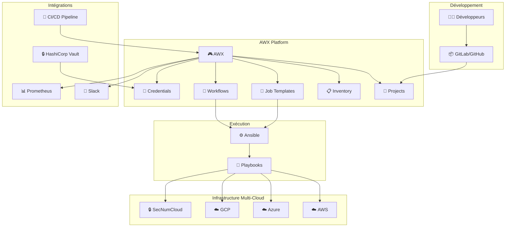
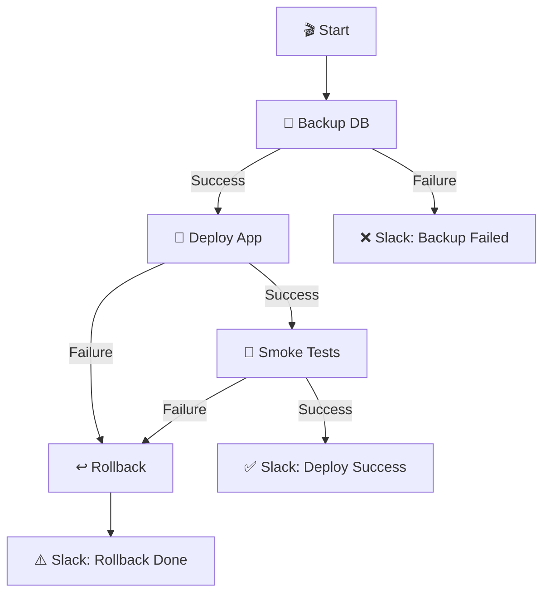

# 🎮 AWX - Orchestration Ansible

AWX (Ansible Automation Platform open-source) est l'interface web pour orchestrer Ansible à grande échelle avec RBAC, workflows et intégration CI/CD.

## 🎯 AWX dans l'écosystème



## 💡 Pourquoi AWX ?

### Sans AWX (Ansible CLI uniquement)
```bash
# Problèmes :
❌ Pas d'historique centralisé des exécutions
❌ Pas de contrôle d'accès (qui peut déployer où ?)
❌ Secrets en fichiers locaux (risque de fuite)
❌ Pas d'interface pour les non-techniciens
❌ Difficile d'intégrer avec CI/CD
❌ Logs dispersés sur chaque serveur
```

### Avec AWX
```bash
# Avantages :
✅ Interface web intuitive
✅ RBAC granulaire (organisations, équipes, permissions)
✅ Gestion sécurisée des credentials
✅ Historique complet de tous les jobs
✅ Workflows complexes avec conditions
✅ API REST pour automatisation
✅ Notifications Slack/Email/Webhooks
✅ Scheduling de jobs (cron intégré)
✅ Surveys (formulaires) pour paramétrer les jobs
```

## 🚀 Installation rapide

### Option 1 : Docker Compose (Dev/Demo)

```bash
# Télécharger
git clone https://github.com/ansible/awx.git
cd awx/tools/docker-compose

# Générer le secret
openssl rand -base64 30 > credentials/secret_key

# Lancer AWX
docker-compose up -d

# Attendre que tout démarre (~2 minutes)
docker-compose ps

# Accéder à l'interface
# URL: http://localhost:80
# User: admin
# Password: password (voir .env)
```

### Option 2 : Kubernetes avec Operator (Production)

```bash
# Installer l'operator
kubectl apply -f https://raw.githubusercontent.com/ansible/awx-operator/devel/deploy/awx-operator.yaml

# Créer une instance AWX
cat <<EOF | kubectl apply -f -
apiVersion: awx.ansible.com/v1beta1
kind: AWX
metadata:
  name: awx-prod
  namespace: awx
spec:
  service_type: ClusterIP
  ingress_type: ingress
  ingress_hosts:
    - hostname: awx.example.com
      tls_secret: awx-tls
EOF

# Suivre le déploiement
kubectl get awx -n awx -w
```

## 📋 Concepts clés

### 1. Organizations (Organisations)
**Rôle** : Isolation multi-tenant
```
Organization: Production
  ├── Teams: DevOps, Developers, Ops
  ├── Projects: Infrastructure, Applications
  ├── Inventories: AWS, Azure, GCP
  └── Credentials: SSH keys, API tokens
```

### 2. Projects (Projets)
**Rôle** : Lien avec Git où sont les playbooks
```yaml
Name: Infrastructure Automation
SCM Type: Git
SCM URL: https://gitlab.com/company/ansible-infra.git
SCM Branch: main
Update on Launch: Yes  # Pull automatique avant chaque job
```

### 3. Inventories (Inventaires)
**Rôle** : Liste des serveurs à gérer

**Static Inventory** :
```yaml
Production:
  ├── Web Servers
  │   ├── web01.aws (10.0.1.10)
  │   ├── web02.aws (10.0.1.11)
  │   └── web03.azure (10.1.1.10)
  └── Databases
      ├── db01.aws (10.0.2.10)
      └── db02.gcp (10.2.2.10)
```

**Dynamic Inventory** : Synchronisation automatique avec AWS/Azure/GCP
```yaml
Source: Amazon EC2
Credential: AWS Production
Regions: eu-west-1, us-east-1
Filters: tag:Environment=production
Update on Launch: Yes
```

### 4. Credentials (Identifiants)
**Rôle** : Gestion sécurisée des secrets

| Type | Usage |
|------|-------|
| **Machine** | SSH vers serveurs |
| **Source Control** | Git SSH key |
| **Vault** | Ansible Vault password |
| **Cloud** | AWS/Azure/GCP API keys |
| **HashiCorp Vault** | Integration avec Vault externe |

### 5. Job Templates (Modèles de job)
**Rôle** : Configuration réutilisable pour lancer un playbook

```yaml
Name: Deploy Java Application
Inventory: Production
Project: Applications
Playbook: playbooks/deploy-java.yml
Credentials:
  - Production SSH
  - Ansible Vault
Variables:
  app_version: latest
  environment: production
Ask Variables on Launch: Yes  # Permet de modifier les variables
```

### 6. Workflows (Workflows)
**Rôle** : Orchestration de plusieurs jobs avec conditions



## 🔄 Intégration avec CI/CD

### Cas d'usage : Déploiement automatique

```yaml title=".gitlab-ci.yml"
stages:
  - build
  - trigger-awx

build:app:
  stage: build
  script:
    - mvn package
    - docker build -t registry.com/my-app:$CI_COMMIT_SHA .
    - docker push registry.com/my-app:$CI_COMMIT_SHA

# Déclencher AWX pour déployer
deploy:staging:
  stage: trigger-awx
  script:
    - |
      curl -X POST https://awx.example.com/api/v2/job_templates/5/launch/ \
        -H "Authorization: Bearer $AWX_TOKEN" \
        -H "Content-Type: application/json" \
        -d '{
          "extra_vars": {
            "app_version": "'$CI_COMMIT_SHA'",
            "environment": "staging"
          }
        }'
  environment:
    name: staging
  only:
    - main

deploy:production:
  stage: trigger-awx
  script:
    - |
      curl -X POST https://awx.example.com/api/v2/job_templates/5/launch/ \
        -H "Authorization: Bearer $AWX_TOKEN" \
        -d '{
          "extra_vars": {
            "app_version": "'$CI_COMMIT_TAG'",
            "environment": "production"
          }
        }'
  environment:
    name: production
  when: manual
  only:
    - tags
```

### Résultat dans AWX
```
Job #247 - Deploy Java Application
├── Launched by: GitLab CI (via API)
├── Variables: 
│   └── app_version: a1b2c3d
│   └── environment: staging
├── Status: ✅ Successful
├── Duration: 2m 34s
└── Output: [Voir logs détaillés]
```

## 🎭 Workflows avancés

### Exemple : Déploiement multi-cloud progressif

```yaml
Workflow: Progressive Multi-Cloud Deployment

Nodes:
  1. Backup Databases (All clouds)
     ↓ Success
  2. Deploy to AWS eu-west-1
     ├─ Success → 3
     └─ Failure → Rollback & Stop
  3. Smoke Tests AWS
     ├─ Success → 4
     └─ Failure → Rollback AWS & Stop
  4. Deploy to Azure westeurope
     ├─ Success → 5
     └─ Failure → Rollback AWS & Azure & Stop
  5. Smoke Tests Azure
     ├─ Success → 6
     └─ Failure → Rollback All & Stop
  6. Deploy to GCP us-central1
     ├─ Success → 7
     └─ Failure → Rollback All & Stop
  7. Final Health Check (All)
     ├─ Success → Notify Slack Success
     └─ Failure → Notify Slack Warning
```

**Avantage** : Si un déploiement échoue, AWX rollback automatiquement les déploiements précédents ! 🛡️

## 🔐 RBAC (Role-Based Access Control)

### Structure des permissions

```
Organization: Production
├── Team: DevOps
│   └── Permissions:
│       ├── Execute: All Job Templates ✅
│       ├── Admin: All Inventories ✅
│       └── Admin: All Credentials ✅
│
├── Team: Developers
│   └── Permissions:
│       ├── Execute: Deploy Applications ✅
│       ├── Read: Inventories (Dev, Staging) ✅
│       └── Read: Credentials ❌ (secrets cachés)
│
└── Team: Auditors
    └── Permissions:
        ├── Read: All Jobs History ✅
        ├── Execute: Nothing ❌
        └── Read: Credentials ❌
```

### Exemple : Développeur lance un déploiement

```
👨‍💻 Développeur se connecte à AWX
    ↓
🔍 Voit uniquement ses Job Templates autorisés
    ↓
🎯 Clique sur "Deploy Java Application"
    ↓
📋 Remplit le Survey:
    - Environment: staging ✅ (autorisé)
    - Environment: production ❌ (bloqué par RBAC)
    ↓
🚀 Lance le job
    ↓
📊 Voit les logs en temps réel
    ↓
✅ Reçoit notification Slack
```

## 📊 Monitoring et Notifications

### Notifications intégrées

```yaml
Job Template: Deploy Production

Notifications:
  On Start:
    - Slack: #deployments
      Message: "🚀 Déploiement production démarré par @{username}"
      
  On Success:
    - Slack: #deployments
      Message: "✅ Déploiement réussi en {duration}"
    - Email: ops-team@example.com
    - Webhook: https://monitoring.example.com/deployment-success
    
  On Failure:
    - Slack: #alerts
      Message: "❌ DÉPLOIEMENT ÉCHOUÉ ! @channel"
    - PagerDuty: Incident création
    - Email: ops-team@example.com (urgent)
```

### Métriques Prometheus

AWX expose des métriques :
```
# Nombre de jobs exécutés
awx_jobs_total{status="successful"} 1247
awx_jobs_total{status="failed"} 23

# Durée moyenne des jobs
awx_job_duration_seconds{template="deploy-java"} 156.3

# Jobs en cours
awx_jobs_running 3
```

## 🎯 Cas d'usage réels

### 1. Onboarding nouveau serveur

**Sans AWX** :
```bash
# Process manuel
1. Se connecter en SSH
2. Installer packages
3. Configurer firewall
4. Installer monitoring
5. Configurer logs
6. Ajouter à l'inventaire
→ ~2 heures par serveur
```

**Avec AWX** :
```bash
# Job Template: "Bootstrap New Server"
1. Ajouter IP dans inventory dynamique
2. Lancer job "Bootstrap New Server"
3. AWX fait tout automatiquement
→ ~5 minutes, reproductible
```

### 2. Patch Tuesday (mises à jour mensuelles)

**Workflow AWX** :
```
Patch Management Workflow:
1. Take snapshot of all VMs (AWS/Azure/GCP)
2. Update packages on 10% of servers (canary)
3. Wait 1 hour + monitoring
4. If OK → Update remaining 90% by batches of 30%
5. If KO → Rollback snapshots + Alert
```

### 3. DR (Disaster Recovery) Test

**Job Template schedulé (1er dimanche du mois)** :
```yaml
Name: DR Test - Failover to Azure
Schedule: 0 2 * * 0  # 2h du matin, tous les dimanches

Steps:
  1. Backup production (AWS)
  2. Deploy to DR site (Azure)
  3. Smoke tests
  4. Generate DR report
  5. Destroy DR environment
  6. Slack notification avec rapport
```

## 📈 Avantages pour l'équipe

| Persona | Bénéfice AWX |
|---------|--------------|
| **DevOps** | API pour automatisation, historique complet, workflows |
| **Développeurs** | Self-service pour déployer (avec garde-fous RBAC) |
| **Ops** | Vue centralisée, notifications, rollback facile |
| **Managers** | Dashboard, métriques, audit trail |
| **Security** | Credentials sécurisés, audit complet, RBAC |

## 🚀 Pour aller plus loin

### Intégrations avancées

- **ServiceNow** : Création automatique de Change Requests
- **Jira** : Mise à jour des tickets après déploiement
- **HashiCorp Vault** : Rotation automatique des secrets
- **Git** : Approval process avec Merge Requests
- **Terraform Cloud** : AWX lance Terraform pour provisionner puis configure

### Ansible Collections dans AWX

```yaml
# requirements.yml dans le Project Git
collections:
  - name: community.general
  - name: ansible.posix
  - name: amazon.aws
  - name: azure.azcollection
  - name: google.cloud
```

AWX installe automatiquement ces collections avant l'exécution ! 📦

---

**AWX transforme Ansible en plateforme d'automatisation d'entreprise ! 🎮**

**Idéal pour orchestrer l'infrastructure multi-cloud à grande échelle ! 🌍**