# 🏗️ Terraform - Infrastructure Multi-Cloud

Infrastructure as Code avec Terraform pour Java, Drupal, Angular sur AWS, Azure, GCP et SecNumCloud.

## 🎯 Architecture Terraform

```mermaid
graph TB
    subgraph "Terraform Structure"
        direction TB
        ROOT[📁 Root Module]
        
        subgraph "Modules"
            NETWORK[🌐 Network Module]
            COMPUTE[💻 Compute Module]
            DATABASE[🗄️ Database Module]
            STORAGE[📦 Storage Module]
            K8S[☸️ Kubernetes Module]
            SECURITY[🔒 Security Module]
            MONITORING[📊 Monitoring Module]
        end
        
        subgraph "Environments"
            DEV[🔧 Dev]
            STAGING[🎭 Staging]
            PROD[🚀 Production]
        end
        
        ROOT --> NETWORK
        ROOT --> COMPUTE
        ROOT --> DATABASE
        ROOT --> STORAGE
        ROOT --> K8S
        ROOT --> SECURITY
        ROOT --> MONITORING
        
        NETWORK --> DEV
        NETWORK --> STAGING
        NETWORK --> PROD
        
        COMPUTE --> DEV
        COMPUTE --> STAGING
        COMPUTE --> PROD
    end
    
    subgraph "Cloud Providers"
        AWS[☁️ AWS]
        AZURE[🔷 Azure]
        GCP[🌐 GCP]
        SECNUM[🛡️ SecNumCloud]
    end
    
    DEV --> AWS
    STAGING --> AZURE
    PROD --> AWS
    PROD --> SECNUM
    
    subgraph "State Management"
        S3[📦 S3 Backend]
        DYNAMODB[🔐 DynamoDB Lock]
        ENCRYPTION[🔒 Encryption at Rest]
    end
    
    ROOT -.State.-> S3
    S3 --> DYNAMODB
    S3 --> ENCRYPTION
```



## 📁 Structure du projet

```
terraform/
├── modules/                          # Modules réutilisables
│   ├── vpc/
│   │   ├── main.tf
│   │   ├── variables.tf
│   │   ├── outputs.tf
│   │   └── README.md
│   ├── eks/
│   │   ├── main.tf
│   │   ├── variables.tf
│   │   ├── outputs.tf
│   │   └── README.md
│   ├── rds/
│   ├── s3/
│   ├── ecr/
│   ├── alb/
│   └── security-groups/
├── environments/
│   ├── dev/
│   │   ├── main.tf
│   │   ├── terraform.tfvars
│   │   └── backend.tf
│   ├── staging/
│   │   ├── main.tf
│   │   ├── terraform.tfvars
│   │   └── backend.tf
│   └── prod/
│       ├── main.tf
│       ├── terraform.tfvars
│       └── backend.tf
├── global/
│   ├── s3/                          # Backend S3
│   ├── iam/                         # IAM roles/policies
│   └── route53/                     # DNS zones
└── scripts/
    ├── init-backend.sh
    ├── plan-all.sh
    └── apply-all.sh
```

## 🌐 Module VPC Multi-Cloud

### AWS VPC Module

```hcl title="modules/vpc-aws/main.tf"
terraform {
  required_version = ">= 1.5"
  required_providers {
    aws = {
      source  = "hashicorp/aws"
      version = "~> 5.0"
    }
  }
}

variable "environment" {
  description = "Environment name"
  type        = string
}

variable "vpc_cidr" {
  description = "CIDR block for VPC"
  type        = string
  default     = "10.0.0.0/16"
}

variable "availability_zones" {
  description = "List of AZs"
  type        = list(string)
  default     = ["eu-west-1a", "eu-west-1b", "eu-west-1c"]
}

variable "enable_nat_gateway" {
  description = "Enable NAT Gateway"
  type        = bool
  default     = true
}

variable "single_nat_gateway" {
  description = "Use single NAT Gateway (dev)"
  type        = bool
  default     = false
}

variable "tags" {
  description = "Additional tags"
  type        = map(string)
  default     = {}
}

# VPC
resource "aws_vpc" "main" {
  cidr_block           = var.vpc_cidr
  enable_dns_hostnames = true
  enable_dns_support   = true

  tags = merge(
    {
      Name        = "${var.environment}-vpc"
      Environment = var.environment
      ManagedBy   = "Terraform"
    },
    var.tags
  )
}

# Internet Gateway
resource "aws_internet_gateway" "main" {
  vpc_id = aws_vpc.main.id

  tags = {
    Name        = "${var.environment}-igw"
    Environment = var.environment
  }
}

# Public Subnets
resource "aws_subnet" "public" {
  count                   = length(var.availability_zones)
  vpc_id                  = aws_vpc.main.id
  cidr_block              = cidrsubnet(var.vpc_cidr, 4, count.index)
  availability_zone       = var.availability_zones[count.index]
  map_public_ip_on_launch = true

  tags = {
    Name        = "${var.environment}-public-${count.index + 1}"
    Environment = var.environment
    Tier        = "public"
    "kubernetes.io/role/elb" = "1"
  }
}

# Private Subnets (Application)
resource "aws_subnet" "private_app" {
  count             = length(var.availability_zones)
  vpc_id            = aws_vpc.main.id
  cidr_block        = cidrsubnet(var.vpc_cidr, 4, count.index + 3)
  availability_zone = var.availability_zones[count.index]

  tags = {
    Name        = "${var.environment}-private-app-${count.index + 1}"
    Environment = var.environment
    Tier        = "private-app"
    "kubernetes.io/role/internal-elb" = "1"
  }
}

# Private Subnets (Database)
resource "aws_subnet" "private_db" {
  count             = length(var.availability_zones)
  vpc_id            = aws_vpc.main.id
  cidr_block        = cidrsubnet(var.vpc_cidr, 4, count.index + 6)
  availability_zone = var.availability_zones[count.index]

  tags = {
    Name        = "${var.environment}-private-db-${count.index + 1}"
    Environment = var.environment
    Tier        = "private-db"
  }
}

# Elastic IPs for NAT Gateways
resource "aws_eip" "nat" {
  count  = var.enable_nat_gateway ? (var.single_nat_gateway ? 1 : length(var.availability_zones)) : 0
  domain = "vpc"

  tags = {
    Name        = "${var.environment}-nat-eip-${count.index + 1}"
    Environment = var.environment
  }

  depends_on = [aws_internet_gateway.main]
}

# NAT Gateways
resource "aws_nat_gateway" "main" {
  count         = var.enable_nat_gateway ? (var.single_nat_gateway ? 1 : length(var.availability_zones)) : 0
  allocation_id = aws_eip.nat[count.index].id
  subnet_id     = aws_subnet.public[count.index].id

  tags = {
    Name        = "${var.environment}-nat-${count.index + 1}"
    Environment = var.environment
  }

  depends_on = [aws_internet_gateway.main]
}

# Route Table - Public
resource "aws_route_table" "public" {
  vpc_id = aws_vpc.main.id

  route {
    cidr_block = "0.0.0.0/0"
    gateway_id = aws_internet_gateway.main.id
  }

  tags = {
    Name        = "${var.environment}-public-rt"
    Environment = var.environment
  }
}

# Route Table Association - Public
resource "aws_route_table_association" "public" {
  count          = length(aws_subnet.public)
  subnet_id      = aws_subnet.public[count.index].id
  route_table_id = aws_route_table.public.id
}

# Route Tables - Private
resource "aws_route_table" "private" {
  count  = var.enable_nat_gateway ? (var.single_nat_gateway ? 1 : length(var.availability_zones)) : 0
  vpc_id = aws_vpc.main.id

  route {
    cidr_block     = "0.0.0.0/0"
    nat_gateway_id = aws_nat_gateway.main[count.index].id
  }

  tags = {
    Name        = "${var.environment}-private-rt-${count.index + 1}"
    Environment = var.environment
  }
}

# Route Table Association - Private App
resource "aws_route_table_association" "private_app" {
  count          = length(aws_subnet.private_app)
  subnet_id      = aws_subnet.private_app[count.index].id
  route_table_id = var.single_nat_gateway ? aws_route_table.private[0].id : aws_route_table.private[count.index].id
}

# Route Table Association - Private DB
resource "aws_route_table_association" "private_db" {
  count          = length(aws_subnet.private_db)
  subnet_id      = aws_subnet.private_db[count.index].id
  route_table_id = var.single_nat_gateway ? aws_route_table.private[0].id : aws_route_table.private[count.index].id
}

# VPC Flow Logs
resource "aws_flow_log" "main" {
  iam_role_arn    = aws_iam_role.flow_log.arn
  log_destination = aws_cloudwatch_log_group.flow_log.arn
  traffic_type    = "ALL"
  vpc_id          = aws_vpc.main.id

  tags = {
    Name        = "${var.environment}-vpc-flow-log"
    Environment = var.environment
  }
}

resource "aws_cloudwatch_log_group" "flow_log" {
  name              = "/aws/vpc/${var.environment}"
  retention_in_days = 30

  tags = {
    Environment = var.environment
  }
}

resource "aws_iam_role" "flow_log" {
  name = "${var.environment}-vpc-flow-log-role"

  assume_role_policy = jsonencode({
    Version = "2012-10-17"
    Statement = [
      {
        Action = "sts:AssumeRole"
        Effect = "Allow"
        Principal = {
          Service = "vpc-flow-logs.amazonaws.com"
        }
      }
    ]
  })
}

resource "aws_iam_role_policy" "flow_log" {
  name = "${var.environment}-vpc-flow-log-policy"
  role = aws_iam_role.flow_log.id

  policy = jsonencode({
    Version = "2012-10-17"
    Statement = [
      {
        Action = [
          "logs:CreateLogGroup",
          "logs:CreateLogStream",
          "logs:PutLogEvents",
          "logs:DescribeLogGroups",
          "logs:DescribeLogStreams"
        ]
        Effect   = "Allow"
        Resource = "*"
      }
    ]
  })
}

# Outputs
output "vpc_id" {
  description = "VPC ID"
  value       = aws_vpc.main.id
}

output "vpc_cidr" {
  description = "VPC CIDR"
  value       = aws_vpc.main.cidr_block
}

output "public_subnet_ids" {
  description = "List of public subnet IDs"
  value       = aws_subnet.public[*].id
}

output "private_app_subnet_ids" {
  description = "List of private application subnet IDs"
  value       = aws_subnet.private_app[*].id
}

output "private_db_subnet_ids" {
  description = "List of private database subnet IDs"
  value       = aws_subnet.private_db[*].id
}

output "nat_gateway_ips" {
  description = "NAT Gateway public IPs"
  value       = aws_eip.nat[*].public_ip
}
```

## ☸️ Module EKS

```hcl title="modules/eks/main.tf"
terraform {
  required_providers {
    aws = {
      source  = "hashicorp/aws"
      version = "~> 5.0"
    }
    kubernetes = {
      source  = "hashicorp/kubernetes"
      version = "~> 2.23"
    }
  }
}

variable "environment" {
  description = "Environment name"
  type        = string
}

variable "vpc_id" {
  description = "VPC ID"
  type        = string
}

variable "subnet_ids" {
  description = "Subnet IDs for EKS"
  type        = list(string)
}

variable "cluster_version" {
  description = "Kubernetes version"
  type        = string
  default     = "1.28"
}

variable "node_groups" {
  description = "Node group configurations"
  type = map(object({
    desired_size   = number
    min_size       = number
    max_size       = number
    instance_types = list(string)
  }))
  default = {
    general = {
      desired_size   = 2
      min_size       = 1
      max_size       = 4
      instance_types = ["t3.medium"]
    }
  }
}

# EKS Cluster
resource "aws_eks_cluster" "main" {
  name     = "${var.environment}-eks-cluster"
  role_arn = aws_iam_role.cluster.arn
  version  = var.cluster_version

  vpc_config {
    subnet_ids              = var.subnet_ids
    endpoint_private_access = true
    endpoint_public_access  = true
    public_access_cidrs     = ["0.0.0.0/0"]
    
    security_group_ids = [aws_security_group.cluster.id]
  }

  encryption_config {
    provider {
      key_arn = aws_kms_key.eks.arn
    }
    resources = ["secrets"]
  }

  enabled_cluster_log_types = [
    "api",
    "audit",
    "authenticator",
    "controllerManager",
    "scheduler"
  ]

  depends_on = [
    aws_iam_role_policy_attachment.cluster_AmazonEKSClusterPolicy,
    aws_iam_role_policy_attachment.cluster_AmazonEKSVPCResourceController,
    aws_cloudwatch_log_group.cluster
  ]

  tags = {
    Name        = "${var.environment}-eks-cluster"
    Environment = var.environment
  }
}

# KMS Key for EKS encryption
resource "aws_kms_key" "eks" {
  description             = "EKS Secret Encryption Key"
  deletion_window_in_days = 10
  enable_key_rotation     = true

  tags = {
    Name        = "${var.environment}-eks-key"
    Environment = var.environment
  }
}

resource "aws_kms_alias" "eks" {
  name          = "alias/${var.environment}-eks"
  target_key_id = aws_kms_key.eks.key_id
}

# CloudWatch Log Group
resource "aws_cloudwatch_log_group" "cluster" {
  name              = "/aws/eks/${var.environment}-cluster/cluster"
  retention_in_days = 30

  tags = {
    Environment = var.environment
  }
}

# IAM Role for EKS Cluster
resource "aws_iam_role" "cluster" {
  name = "${var.environment}-eks-cluster-role"

  assume_role_policy = jsonencode({
    Version = "2012-10-17"
    Statement = [{
      Action = "sts:AssumeRole"
      Effect = "Allow"
      Principal = {
        Service = "eks.amazonaws.com"
      }
    }]
  })
}

resource "aws_iam_role_policy_attachment" "cluster_AmazonEKSClusterPolicy" {
  policy_arn = "arn:aws:iam::aws:policy/AmazonEKSClusterPolicy"
  role       = aws_iam_role.cluster.name
}

resource "aws_iam_role_policy_attachment" "cluster_AmazonEKSVPCResourceController" {
  policy_arn = "arn:aws:iam::aws:policy/AmazonEKSVPCResourceController"
  role       = aws_iam_role.cluster.name
}

# Security Group for EKS Cluster
resource "aws_security_group" "cluster" {
  name        = "${var.environment}-eks-cluster-sg"
  description = "Security group for EKS cluster"
  vpc_id      = var.vpc_id

  egress {
    from_port   = 0
    to_port     = 0
    protocol    = "-1"
    cidr_blocks = ["0.0.0.0/0"]
  }

  tags = {
    Name        = "${var.environment}-eks-cluster-sg"
    Environment = var.environment
  }
}

# Node Groups
resource "aws_eks_node_group" "main" {
  for_each = var.node_groups

  cluster_name    = aws_eks_cluster.main.name
  node_group_name = "${var.environment}-${each.key}"
  node_role_arn   = aws_iam_role.node_group.arn
  subnet_ids      = var.subnet_ids

  scaling_config {
    desired_size = each.value.desired_size
    max_size     = each.value.max_size
    min_size     = each.value.min_size
  }

  instance_types = each.value.instance_types

  update_config {
    max_unavailable = 1
  }

  launch_template {
    id      = aws_launch_template.node_group[each.key].id
    version = aws_launch_template.node_group[each.key].latest_version
  }

  depends_on = [
    aws_iam_role_policy_attachment.node_group_AmazonEKSWorkerNodePolicy,
    aws_iam_role_policy_attachment.node_group_AmazonEKS_CNI_Policy,
    aws_iam_role_policy_attachment.node_group_AmazonEC2ContainerRegistryReadOnly,
  ]

  tags = {
    Name        = "${var.environment}-${each.key}-node-group"
    Environment = var.environment
  }
}

# Launch Template for Node Groups
resource "aws_launch_template" "node_group" {
  for_each = var.node_groups

  name_prefix = "${var.environment}-${each.key}-"

  block_device_mappings {
    device_name = "/dev/xvda"

    ebs {
      volume_size           = 50
      volume_type           = "gp3"
      iops                  = 3000
      throughput            = 125
      encrypted             = true
      delete_on_termination = true
    }
  }

  metadata_options {
    http_endpoint               = "enabled"
    http_tokens                 = "required"
    http_put_response_hop_limit = 1
  }

  tag_specifications {
    resource_type = "instance"
    tags = {
      Name        = "${var.environment}-${each.key}-node"
      Environment = var.environment
    }
  }
}

# IAM Role for Node Group
resource "aws_iam_role" "node_group" {
  name = "${var.environment}-eks-node-group-role"

  assume_role_policy = jsonencode({
    Version = "2012-10-17"
    Statement = [{
      Action = "sts:AssumeRole"
      Effect = "Allow"
      Principal = {
        Service = "ec2.amazonaws.com"
      }
    }]
  })
}

resource "aws_iam_role_policy_attachment" "node_group_AmazonEKSWorkerNodePolicy" {
  policy_arn = "arn:aws:iam::aws:policy/AmazonEKSWorkerNodePolicy"
  role       = aws_iam_role.node_group.name
}

resource "aws_iam_role_policy_attachment" "node_group_AmazonEKS_CNI_Policy" {
  policy_arn = "arn:aws:iam::aws:policy/AmazonEKS_CNI_Policy"
  role       = aws_iam_role.node_group.name
}

resource "aws_iam_role_policy_attachment" "node_group_AmazonEC2ContainerRegistryReadOnly" {
  policy_arn = "arn:aws:iam::aws:policy/AmazonEC2ContainerRegistryReadOnly"
  role       = aws_iam_role.node_group.name
}

# OIDC Provider for IRSA
data "tls_certificate" "cluster" {
  url = aws_eks_cluster.main.identity[0].oidc[0].issuer
}

resource "aws_iam_openid_connect_provider" "cluster" {
  client_id_list  = ["sts.amazonaws.com"]
  thumbprint_list = [data.tls_certificate.cluster.certificates[0].sha1_fingerprint]
  url             = aws_eks_cluster.main.identity[0].oidc[0].issuer

  tags = {
    Name        = "${var.environment}-eks-oidc"
    Environment = var.environment
  }
}

# Outputs
output "cluster_id" {
  description = "EKS cluster ID"
  value       = aws_eks_cluster.main.id
}

output "cluster_endpoint" {
  description = "EKS cluster endpoint"
  value       = aws_eks_cluster.main.endpoint
}

output "cluster_security_group_id" {
  description = "Security group ID attached to the EKS cluster"
  value       = aws_security_group.cluster.id
}

output "cluster_oidc_issuer_url" {
  description = "The URL on the EKS cluster OIDC Issuer"
  value       = try(aws_eks_cluster.main.identity[0].oidc[0].issuer, "")
}

output "oidc_provider_arn" {
  description = "ARN of the OIDC Provider for EKS"
  value       = aws_iam_openid_connect_provider.cluster.arn
}
```

Suite avec les environnements et Azure/GCP dans le prochain message...
