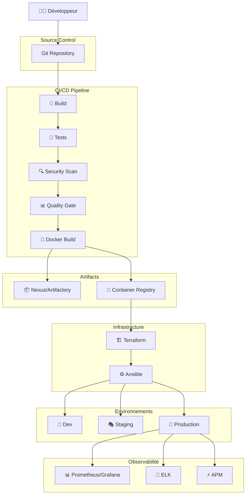

# 🚀 Plateforme DevSecOps - Introduction

Bienvenue dans la documentation de la plateforme DevSecOps pour l'industrialisation des stacks **Java** et **Drupal**.

## 🎯 Objectif

Standardiser et industrialiser le développement et le déploiement de nos applications **Java/Spring Boot** et **Drupal/PHP** sur des environnements hétérogènes :

- ☁️ Cloud Public (AWS, Azure, GCP)
- 🔒 Cloud Privé
- 🛡️ SecNumCloud (qualification ANSSI)
- 🖥️ IaaS (Infrastructure as a Service)
- ⚙️ KaaS (Kubernetes as a Service)
- 🏢 On-Premise

## ✨ Caractéristiques de la plateforme

### 🔄 CI/CD Automatisée
- **GitHub Actions** / **GitLab CI** / **Jenkins**
- Pipelines standardisés pour Java et Drupal
- Déploiements multi-environnements
- Rollback automatique

### 🔒 Sécurité (DevSecOps)
- **Trivy** : Scan de vulnérabilités conteneurs
- **SBOM** : Software Bill of Materials
- **Secrets Management** : Vault, SOPS
- **Compliance** : Policies as Code

### 📊 Qualité de Code
- **SonarQube** : Analyse statique
- **Quality Gates** : Seuils de qualité
- **Code Coverage** : >80%
- **Tests automatisés** : Unitaires, intégration, e2e

### 📦 Gestion des Artefacts
- **Nexus Repository** : Maven, npm, Docker
- **JFrog Artifactory** : Alternative enterprise
- **Container Registry** : Images Docker sécurisées

### 🏗️ Infrastructure as Code
- **Terraform** : Provisioning multi-cloud
- **Ansible** : Configuration management
- **Modules réutilisables** : Standards d'infrastructure

### 🔧 Automatisation
- **Renovate** : Mises à jour automatiques des dépendances
- **Dependabot** : Alternative GitHub
- **Semantic Versioning** : Versioning automatique

### 📈 Observabilité
- **Prometheus** : Métriques
- **Grafana** : Visualisation
- **ELK Stack** : Logs centralisés
- **APM** : Application Performance Monitoring

## 🏗️ Architecture Globale



## 📋 Prérequis

### Pour les développeurs
- Git
- Docker Desktop
- IDE (IntelliJ IDEA / VS Code / PHPStorm)
- Compte GitHub/GitLab
- Accès VPN (si nécessaire)

### Pour les DevOps
- Terraform >= 1.5
- Ansible >= 2.15
- kubectl >= 1.28
- helm >= 3.12
- AWS/Azure/GCP CLI
- Accès aux clouds cibles

## 🚀 Démarrage rapide

### Stack Java
```bash
# Cloner le template
git clone https://github.com/votre-org/java-template.git

# Construire l'application
./mvnw clean install

# Lancer en local
./mvnw spring-boot:run
```

### Stack Drupal
```bash
# Cloner le template
git clone https://github.com/votre-org/drupal-template.git

# Installer les dépendances
composer install

# Lancer avec Docker
docker-compose up -d
```

## 📚 Structure de la documentation

- **Vue d'ensemble** : Architecture et standards
- **Stack Java** : Guides spécifiques Java/Spring Boot
- **Stack Drupal** : Guides spécifiques Drupal/PHP
- **CI/CD** : Pipelines et automatisation
- **Sécurité** : DevSecOps et compliance
- **Qualité** : SonarQube et quality gates
- **Artefacts** : Nexus et Artifactory
- **Infrastructure** : Terraform et Ansible
- **Environnements** : Configuration multi-environnements
- **Outils** : Renovate, Git workflow

## 🎓 Parcours recommandés

<!-- ### 👨‍💻 Développeur Java
1. [Getting Started Java](java/getting-started)
2. [Structure de projet](java/project-structure)
3. [CI/CD Pipeline Java](cicd/pipelines-java)
4. [Sécurité applicative](java/security)

### 👩‍💻 Développeur Drupal
1. [Getting Started Drupal](drupal/getting-started)
2. [Structure de projet](drupal/project-structure)
3. [CI/CD Pipeline Drupal](cicd/pipelines-drupal)
4. [Sécurité Drupal](drupal/security)

### 🛠️ DevOps Engineer
1. [Architecture globale](overview/architecture)
2. [Infrastructure as Code](iac/overview)
3. [CI/CD Overview](cicd/overview)
4. [Environnements](environments/overview)

### 🔒 Security Engineer
1. [Vue d'ensemble sécurité](security/overview)
2. [Trivy et scan de vulnérabilités](security/trivy)
3. [SBOM](security/sbom)
4. [Compliance](security/secrets-management) -->

## 📞 Support et contribution

- **Issues** : [GitHub Issues](https://github.com/votre-org/devops-platform-docs/issues)
- **Discussions** : [GitHub Discussions](https://github.com/votre-org/devops-platform-docs/discussions)
- **Email** : devops@votre-org.com
- **Slack** : #devops-support

## 🔄 Mises à jour

Cette documentation est mise à jour régulièrement. Consultez le [CHANGELOG](https://github.com/votre-org/devops-platform-docs/blob/main/CHANGELOG.md) pour les dernières modifications.

---

**Prêt à commencer ?** Consultez la section [Vue d'ensemble](overview/architecture) pour comprendre l'architecture complète.
