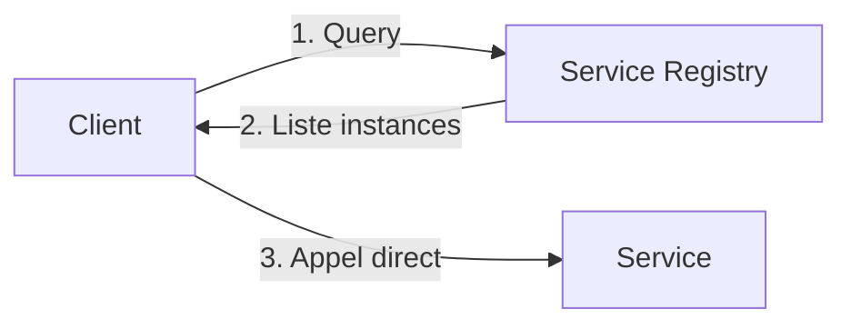
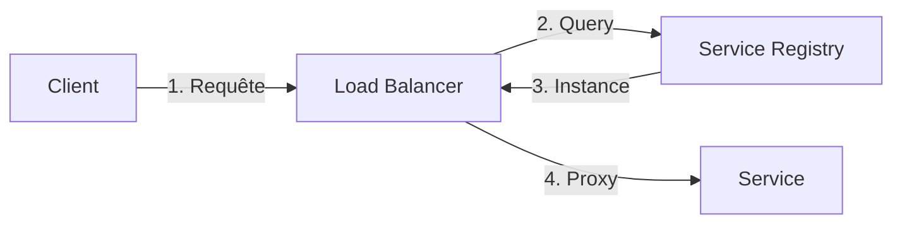

# Service Discovery

## Concept

Le **Service Discovery** permet aux services de se trouver dynamiquement dans un réseau sans configuration manuelle des adresses IP et ports.

:::tip Principe
Au lieu de coder en dur `http://user-service:3000`, les services interrogent un registre pour obtenir l'adresse actuelle.
:::

## 🎯 Problème résolu

### Sans Service Discovery

```javascript
// ❌ Adresses codées en dur
const USER_SERVICE_URL = 'http://192.168.1.10:3000';
const ORDER_SERVICE_URL = 'http://192.168.1.11:3000';

// Problèmes:
// - IP change lors d'un redéploiement
// - Scaling horizontal impossible
// - Plusieurs instances non gérées
```

### Avec Service Discovery

```javascript
// ✅ Résolution dynamique
const userServiceUrl = await serviceRegistry.discover('user-service');
const response = await fetch(`${userServiceUrl}/users/123`);

// Avantages:
// - IP/port résolus dynamiquement
// - Load balancing automatique
// - Health checks intégrés
```

## 🏗️ Patterns

### Client-Side Discovery

Le client interroge le registre et choisit une instance



**Avantages :**
- Pas de proxy (latence minimale)
- Client contrôle load balancing

**Inconvénients :**
- Logique de découverte dans chaque client
- Couplage avec le registre

### Server-Side Discovery

Un load balancer interroge le registre



**Avantages :**
- Clients simplifiés
- Load balancing centralisé

**Inconvénients :**
- Hop supplémentaire (latence)
- Load balancer = SPOF potentiel

## 🛠️ Solutions

### Consul (HashiCorp)

Service registry + health checking + KV store

#### Enregistrement

```javascript
const consul = require('consul')();

// Service s'enregistre au démarrage
await consul.agent.service.register({
  name: 'user-service',
  id: `user-service-${process.pid}`,
  address: '192.168.1.10',
  port: 3000,
  check: {
    http: 'http://192.168.1.10:3000/health',
    interval: '10s',
    timeout: '5s'
  }
});

// Désenregistrer à l'arrêt
process.on('SIGTERM', async () => {
  await consul.agent.service.deregister(`user-service-${process.pid}`);
  process.exit(0);
});
```

#### Découverte

```javascript
// Trouver toutes les instances saines
const services = await consul.health.service({
  service: 'user-service',
  passing: true
});

// Choisir une instance (round-robin, random, etc.)
const instance = services[Math.floor(Math.random() * services.length)];
const url = `http://${instance.Service.Address}:${instance.Service.Port}`;
```

### Eureka (Netflix)

Service registry pour Spring Cloud

```java
// Service s'enregistre automatiquement
@SpringBootApplication
@EnableEurekaClient
public class UserServiceApplication {
    public static void main(String[] args) {
        SpringApplication.run(UserServiceApplication.class, args);
    }
}

// application.yml
eureka:
  client:
    serviceUrl:
      defaultZone: http://eureka-server:8761/eureka/
  instance:
    preferIpAddress: true
    leaseRenewalIntervalInSeconds: 10
```

```java
// Découverte avec RestTemplate
@Autowired
private RestTemplate restTemplate;

// Appel avec nom de service (pas d'IP)
User user = restTemplate.getForObject(
    "http://user-service/users/123", 
    User.class
);
```

### Kubernetes Service Discovery

Natif dans Kubernetes via DNS

```yaml
# Service Kubernetes
apiVersion: v1
kind: Service
metadata:
  name: user-service
spec:
  selector:
    app: user-service
  ports:
    - port: 80
      targetPort: 3000
```

```javascript
// Résolution DNS automatique
// user-service.default.svc.cluster.local → IP du service
const response = await fetch('http://user-service/users/123');
```

### etcd

KV store distribué (utilisé par Kubernetes)

```javascript
const { Etcd3 } = require('etcd3');
const client = new Etcd3();

// Enregistrer service
await client.put('/services/user-service/instance-1')
  .value(JSON.stringify({
    host: '192.168.1.10',
    port: 3000
  }))
  .lease(10); // TTL 10 secondes

// Découvrir services
const services = await client.getAll()
  .prefix('/services/user-service/')
  .json();
```

## 🏥 Health Checks

### Types

#### Liveness Probe

Le service est-il vivant ?

```javascript
app.get('/health/live', (req, res) => {
  res.status(200).json({ status: 'alive' });
});
```

#### Readiness Probe

Le service est-il prêt à recevoir du trafic ?

```javascript
app.get('/health/ready', async (req, res) => {
  // Vérifier connexion BDD
  const dbHealthy = await checkDatabaseConnection();
  // Vérifier dépendances
  const depsHealthy = await checkDependencies();
  
  if (dbHealthy && depsHealthy) {
    res.status(200).json({ status: 'ready' });
  } else {
    res.status(503).json({ status: 'not ready' });
  }
});
```

### Configuration Consul

```javascript
check: {
  http: 'http://localhost:3000/health',
  interval: '10s',    // Vérifier toutes les 10s
  timeout: '5s',      // Timeout après 5s
  deregisterCriticalServiceAfter: '60s' // Désenregistrer si KO 60s
}
```

### Configuration Kubernetes

```yaml
apiVersion: v1
kind: Pod
spec:
  containers:
  - name: user-service
    livenessProbe:
      httpGet:
        path: /health/live
        port: 3000
      initialDelaySeconds: 30
      periodSeconds: 10
    readinessProbe:
      httpGet:
        path: /health/ready
        port: 3000
      initialDelaySeconds: 10
      periodSeconds: 5
```

## 🔄 Load Balancing

### Algorithmes

#### Round Robin

```javascript
class RoundRobinBalancer {
  constructor() {
    this.index = 0;
  }
  
  choose(instances) {
    const instance = instances[this.index % instances.length];
    this.index++;
    return instance;
  }
}
```

#### Random

```javascript
function randomBalancer(instances) {
  return instances[Math.floor(Math.random() * instances.length)];
}
```

#### Least Connections

```javascript
class LeastConnectionsBalancer {
  constructor() {
    this.connections = new Map();
  }
  
  choose(instances) {
    // Choisir instance avec moins de connexions actives
    return instances.reduce((least, instance) => {
      const connections = this.connections.get(instance.id) || 0;
      const leastConnections = this.connections.get(least.id) || 0;
      return connections < leastConnections ? instance : least;
    });
  }
}
```

#### Weighted Round Robin

```javascript
function weightedRoundRobin(instances) {
  // Instances avec weight: 2 sont choisies 2x plus souvent
  const weighted = instances.flatMap(i => 
    Array(i.weight || 1).fill(i)
  );
  return weighted[index++ % weighted.length];
}
```

## 📊 Monitoring

### Métriques importantes

```javascript
// Nombre de services enregistrés
consul_service_instances{service="user-service"}

// Services en échec
consul_health_service_status{status="critical"}

// Temps de résolution
service_discovery_lookup_duration_seconds

// Cache hits/misses
service_discovery_cache_hit_ratio
```

### Alertes

```yaml
# Prometheus alert
- alert: ServiceDiscoveryDown
  expr: up{job="consul"} == 0
  for: 5m
  annotations:
    summary: "Service registry is down"

- alert: NoHealthyInstances
  expr: consul_service_instances{service="user-service"} == 0
  annotations:
    summary: "No healthy instances of user-service"
```

## 🚀 Optimisations

### Caching

```javascript
class CachedServiceDiscovery {
  constructor(registry, ttl = 30000) {
    this.registry = registry;
    this.cache = new Map();
    this.ttl = ttl;
  }
  
  async discover(serviceName) {
    const cached = this.cache.get(serviceName);
    
    if (cached && Date.now() - cached.timestamp < this.ttl) {
      return cached.instances;
    }
    
    const instances = await this.registry.discover(serviceName);
    this.cache.set(serviceName, {
      instances,
      timestamp: Date.now()
    });
    
    return instances;
  }
}
```

### Watch pour mises à jour

```javascript
// Consul watch
const watcher = consul.watch({
  method: consul.health.service,
  options: { service: 'user-service', passing: true }
});

watcher.on('change', (services) => {
  console.log('Services updated:', services);
  updateLocalCache(services);
});

watcher.on('error', (err) => {
  console.error('Watch error:', err);
});
```

## ⚠️ Considérations

### 1. Split-brain

Registre partitionné → différentes vues du réseau

**Solution :** Utiliser consensus (Raft, Paxos)

### 2. Stale data

Cache obsolète après scaling/crash

**Solution :** TTL court + health checks fréquents

### 3. Registre down

SPOF si le registre est indisponible

**Solution :**
- Registre en cluster (3-5 nœuds)
- Cache local en fallback

```javascript
async function discoverWithFallback(serviceName) {
  try {
    return await consul.discover(serviceName);
  } catch (error) {
    console.warn('Registry unavailable, using cached value');
    return localCache.get(serviceName);
  }
}
```

## ✅ Bonnes pratiques

1. **Health checks** : liveness + readiness
2. **Graceful shutdown** : désenregistrement propre
3. **Timeouts** : ne pas bloquer sur registry
4. **Cache local** : fallback si registry down
5. **Monitoring** : alertes sur services critiques
6. **TTL court** : détection rapide des crashs
7. **Metadata** : version, zone, tags pour routing avancé

## Ressources

- [Consul by HashiCorp](https://www.consul.io/)
- [Eureka - Netflix OSS](https://github.com/Netflix/eureka)
- [etcd Documentation](https://etcd.io/docs/)
- [Kubernetes Service Discovery](https://kubernetes.io/docs/concepts/services-networking/service/)