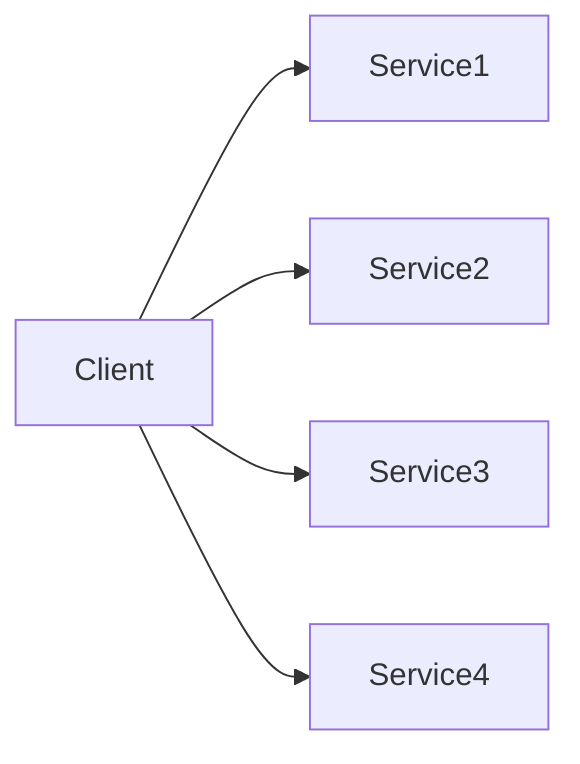
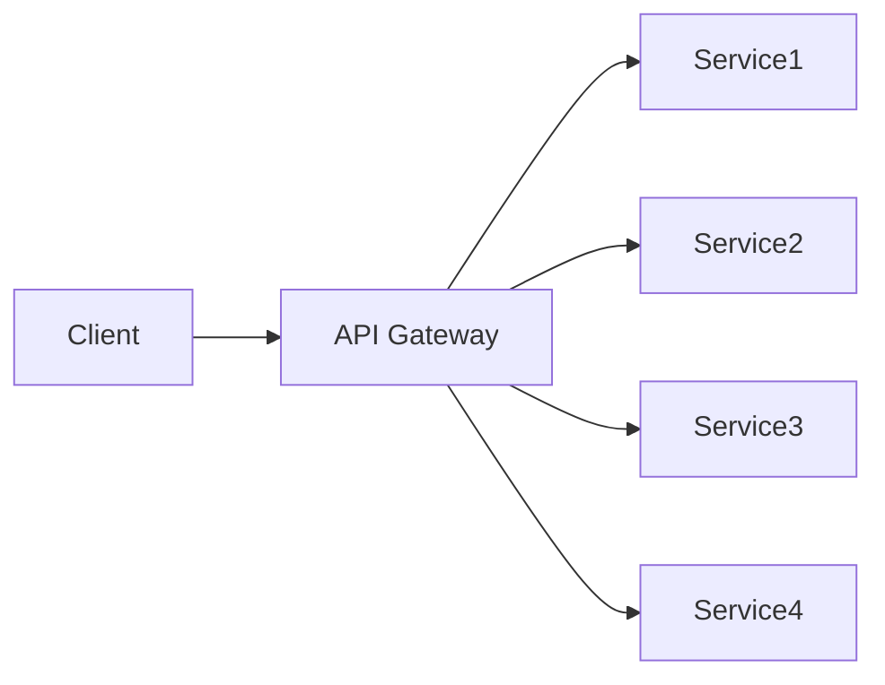

# API Gateway

## Concept

L'**API Gateway** est un point d'entrée unique qui route les requêtes vers les microservices appropriés. Il agit comme un reverse proxy avec des fonctionnalités supplémentaires.

:::tip Analogie
Comme un réceptionniste d'hôtel qui dirige les visiteurs vers les bonnes chambres.
:::

## 🎯 Problème résolu

### Sans API Gateway



**Problèmes :**
- Client doit connaître tous les endpoints
- CORS sur chaque service
- Authentification dupliquée
- Gestion des certificats par service

### Avec API Gateway



**Avantages :**
- Point d'entrée unique
- Logique transverse centralisée
- Découplage client/services

## 🔧 Fonctionnalités

### 1. Routage

```yaml
# Kong configuration
routes:
  - name: user-route
    paths:
      - /api/users
    service: user-service
    
  - name: order-route
    paths:
      - /api/orders
    service: order-service
```

### 2. Authentification & Autorisation

```javascript
// Validation JWT centralisée
app.use(async (req, res, next) => {
  const token = req.headers.authorization;
  
  try {
    const user = await verifyJWT(token);
    req.user = user;
    next();
  } catch {
    res.status(401).json({ error: 'Unauthorized' });
  }
});
```

### 3. Rate Limiting

```yaml
# Limiter à 100 req/min par IP
plugins:
  - name: rate-limiting
    config:
      minute: 100
      policy: local
```

### 4. Transformation de requêtes

```javascript
// Ajouter headers communs
app.use((req, res, next) => {
  req.headers['X-Request-Id'] = uuid();
  req.headers['X-Forwarded-For'] = req.ip;
  next();
});
```

### 5. Agrégation de réponses

```javascript
// Combiner plusieurs services
app.get('/api/dashboard', async (req, res) => {
  const [user, orders, notifications] = await Promise.all([
    fetch('http://user-service/users/me'),
    fetch('http://order-service/orders'),
    fetch('http://notification-service/notifications')
  ]);
  
  res.json({
    user: await user.json(),
    orders: await orders.json(),
    notifications: await notifications.json()
  });
});
```

### 6. Caching

```javascript
// Cache Redis
const cache = require('redis').createClient();

app.get('/api/products/:id', async (req, res) => {
  const cached = await cache.get(`product:${req.params.id}`);
  
  if (cached) {
    return res.json(JSON.parse(cached));
  }
  
  const product = await fetch(`http://product-service/products/${req.params.id}`);
  const data = await product.json();
  
  await cache.setex(`product:${req.params.id}`, 300, JSON.stringify(data));
  res.json(data);
});
```

## 🛠️ Solutions populaires

### Kong

Open-source, très performant

```bash
# Ajouter un service
curl -X POST http://localhost:8001/services \
  --data name=user-service \
  --data url=http://user-service:3000

# Ajouter une route
curl -X POST http://localhost:8001/services/user-service/routes \
  --data paths[]=/api/users

# Activer rate limiting
curl -X POST http://localhost:8001/services/user-service/plugins \
  --data name=rate-limiting \
  --data config.minute=100
```

### AWS API Gateway

Service managé AWS

```yaml
# Serverless Framework
functions:
  api:
    handler: handler.proxy
    events:
      - http:
          path: /{proxy+}
          method: ANY
          authorizer:
            name: authorizer
            type: token
```

### Nginx

Léger et rapide

```nginx
upstream user_service {
    server user-service:3000;
}

upstream order_service {
    server order-service:3000;
}

server {
    location /api/users {
        proxy_pass http://user_service;
    }
    
    location /api/orders {
        proxy_pass http://order_service;
    }
}
```

### Spring Cloud Gateway

Pour écosystème Java/Spring

```java
@Bean
public RouteLocator customRouteLocator(RouteLocatorBuilder builder) {
    return builder.routes()
        .route("user-route", r -> r.path("/api/users/**")
            .filters(f -> f.stripPrefix(1)
                .addRequestHeader("X-Gateway", "Spring")
                .circuitBreaker(c -> c.setName("userServiceCB")))
            .uri("lb://user-service"))
        .build();
}
```

## 🔐 Sécurité

### SSL Termination

```nginx
server {
    listen 443 ssl;
    ssl_certificate /etc/nginx/ssl/cert.pem;
    ssl_certificate_key /etc/nginx/ssl/key.pem;
    
    location / {
        proxy_pass http://internal-service; # HTTP en interne
    }
}
```

### API Key validation

```javascript
app.use((req, res, next) => {
  const apiKey = req.headers['x-api-key'];
  
  if (!isValidApiKey(apiKey)) {
    return res.status(403).json({ error: 'Invalid API key' });
  }
  
  next();
});
```

### CORS

```javascript
app.use(cors({
  origin: ['https://app.example.com'],
  credentials: true,
  allowedHeaders: ['Authorization', 'Content-Type']
}));
```

## 📊 Observabilité

### Logging

```javascript
app.use((req, res, next) => {
  const start = Date.now();
  
  res.on('finish', () => {
    logger.info({
      method: req.method,
      path: req.path,
      status: res.statusCode,
      duration: Date.now() - start,
      userId: req.user?.id
    });
  });
  
  next();
});
```

### Métriques

```javascript
const prometheus = require('prom-client');

const httpRequestDuration = new prometheus.Histogram({
  name: 'http_request_duration_ms',
  help: 'Duration of HTTP requests in ms',
  labelNames: ['method', 'route', 'status']
});

app.use((req, res, next) => {
  const end = httpRequestDuration.startTimer();
  res.on('finish', () => {
    end({ 
      method: req.method, 
      route: req.route?.path,
      status: res.statusCode 
    });
  });
  next();
});
```

### Distributed Tracing

```javascript
const opentelemetry = require('@opentelemetry/api');

app.use((req, res, next) => {
  const tracer = opentelemetry.trace.getTracer('api-gateway');
  const span = tracer.startSpan('http-request', {
    attributes: {
      'http.method': req.method,
      'http.url': req.url
    }
  });
  
  req.span = span;
  res.on('finish', () => span.end());
  next();
});
```

## ⚖️ API Gateway vs Service Mesh

| Aspect | API Gateway | Service Mesh |
|--------|-------------|--------------|
| **Scope** | North-South (externe → interne) | East-West (interne ↔ interne) |
| **Position** | Edge/Périmètre | Entre tous les services |
| **Authentification** | Clients externes | mTLS entre services |
| **Use case** | Point d'entrée unique | Communication inter-services |

:::tip Utiliser les deux
API Gateway pour trafic externe + Service Mesh pour trafic interne
:::

## ⚠️ Pièges à éviter

### 1. API Gateway trop intelligent

```javascript
// ❌ Logique métier dans gateway
app.post('/api/orders', async (req, res) => {
  // Calcul complexe de prix
  const price = calculateComplexPrice(req.body);
  // Validation métier
  if (!isValidOrder(req.body)) { ... }
});

// ✅ Gateway = routage uniquement
app.post('/api/orders', proxy('http://order-service'));
```

### 2. Single Point of Failure

**Solution :** Déployer plusieurs instances

```yaml
# Kubernetes deployment
apiVersion: apps/v1
kind: Deployment
metadata:
  name: api-gateway
spec:
  replicas: 3  # Haute disponibilité
```

### 3. Goulot d'étranglement

**Solution :** Scaler horizontalement + caching

```yaml
autoscaling:
  enabled: true
  minReplicas: 3
  maxReplicas: 10
  targetCPUUtilizationPercentage: 70
```

## ✅ Bonnes pratiques

1. **Stateless** : aucun état local dans le gateway
2. **Timeout** : définir des timeouts par route
3. **Circuit breaker** : isoler services défaillants
4. **Retry** : avec backoff exponentiel
5. **Caching** : agressif pour données publiques
6. **Monitoring** : métriques détaillées par route
7. **Versioning API** : `/v1/`, `/v2/`
8. **Rate limiting** : par utilisateur/IP
9. **Documentation** : exposer OpenAPI/Swagger

## 🧪 Tests

### Test de routage

```javascript
describe('API Gateway routing', () => {
  it('should route to user service', async () => {
    const response = await request(gateway)
      .get('/api/users/123')
      .expect(200);
    
    expect(userServiceMock).toHaveBeenCalledWith('/users/123');
  });
});
```

### Test d'authentification

```javascript
describe('Authentication', () => {
  it('should reject requests without token', async () => {
    await request(gateway)
      .get('/api/users')
      .expect(401);
  });
  
  it('should accept valid token', async () => {
    await request(gateway)
      .get('/api/users')
      .set('Authorization', 'Bearer valid-token')
      .expect(200);
  });
});
```

## Ressources

- [Kong Documentation](https://docs.konghq.com/)
- [AWS API Gateway](https://aws.amazon.com/api-gateway/)
- [Pattern: API Gateway](https://microservices.io/patterns/apigateway.html)
- [Nginx as API Gateway](https://www.nginx.com/blog/deploying-nginx-plus-as-an-api-gateway-part-1/)