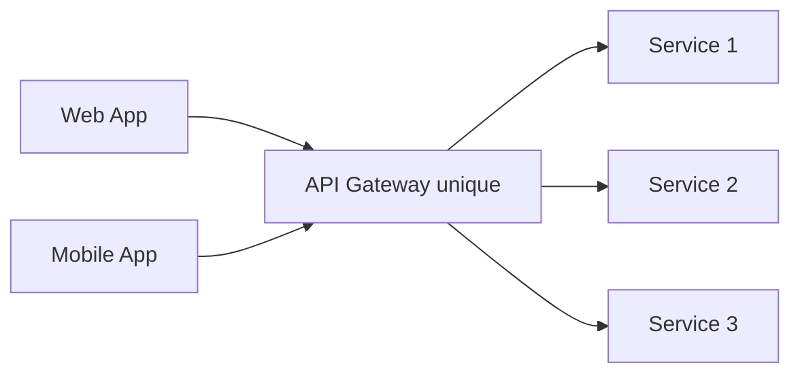
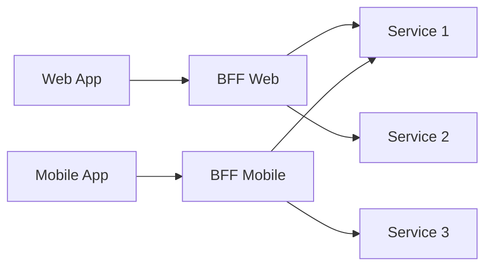

# Backend for Frontend (BFF)

## Concept

Le pattern **BFF (Backend for Frontend)** consiste à créer des backends séparés et spécialisés pour chaque type de client (web, mobile, IoT, partenaires, etc.).

:::tip Principe
Un BFF par type d'interface utilisateur pour optimiser l'expérience de chaque client.
:::

## 🎯 Problème résolu

### Sans BFF



**Problèmes :**
- L'API doit satisfaire tous les clients → compromis
- Mobile télécharge des données inutiles → consommation data/batterie
- Web fait plusieurs appels → latence réseau
- Logique de présentation dans les apps clientes → duplication

### Avec BFF



**Avantages :**
- Payload optimisé par client
- Agrégation côté serveur
- Adaptation aux contraintes de chaque plateforme

## 🏗️ Architecture

### Structure typique

```
├── bff-web/
│   ├── endpoints/
│   │   ├── dashboard.js
│   │   └── profile.js
│   └── aggregators/
│       └── user-aggregator.js
├── bff-mobile/
│   ├── endpoints/
│   │   ├── home.js
│   │   └── feed.js
│   └── transformers/
│       └── mobile-transformer.js
├── bff-partner-api/
│   └── endpoints/
│       └── public-data.js
└── core-services/
    ├── user-service/
    ├── product-service/
    └── order-service/
```

## 💻 Exemples

### Endpoint BFF Web

```javascript
// bff-web/endpoints/dashboard.js
router.get('/dashboard', async (req, res) => {
  const userId = req.user.id;
  
  // Agrégation de plusieurs services
  const [user, orders, recommendations, stats] = await Promise.all([
    userService.getUser(userId),
    orderService.getRecentOrders(userId),
    recommendationService.getPersonalized(userId),
    analyticsService.getUserStats(userId)
  ]);
  
  // Format adapté pour le web (détaillé)
  res.json({
    user: {
      name: user.fullName,
      email: user.email,
      avatar: user.profilePicture,
      membership: user.membershipTier
    },
    recentOrders: orders.map(o => ({
      id: o.id,
      date: o.createdAt,
      total: o.totalAmount,
      items: o.items.length,
      status: o.status
    })),
    recommendations: recommendations,
    statistics: {
      totalSpent: stats.totalAmount,
      orderCount: stats.orderCount,
      savedAmount: stats.discountTotal
    }
  });
});
```

### Endpoint BFF Mobile

```javascript
// bff-mobile/endpoints/home.js
router.get('/home', async (req, res) => {
  const userId = req.user.id;
  
  // Uniquement les données essentielles pour mobile
  const [user, lastOrder] = await Promise.all([
    userService.getUser(userId),
    orderService.getLastOrder(userId)
  ]);
  
  // Format ultra-léger pour mobile
  res.json({
    user: {
      name: user.firstName, // Prénom uniquement
      points: user.loyaltyPoints
    },
    lastOrder: lastOrder ? {
      id: lastOrder.id,
      status: lastOrder.status,
      eta: lastOrder.estimatedDelivery
    } : null,
    // Images optimisées pour mobile
    banners: await getBanners({ size: 'mobile' })
  });
});
```

## 🎨 Cas d'usage

### 1. Optimisation réseau mobile

**Web :** 10 appels API pour charger une page
**Mobile BFF :** 1 appel agrégé

```javascript
// Mobile BFF agrège tout en un appel
GET /bff/mobile/product/123

Response:
{
  product: {...},
  reviews: [...],
  relatedProducts: [...],
  availability: {...}
}
```

### 2. Adaptation du format

```javascript
// Web : données complètes
{
  user: {
    firstName: "John",
    lastName: "Doe",
    email: "john.doe@example.com",
    address: {
      street: "123 Main St",
      city: "Paris",
      postalCode: "75001",
      country: "France"
    },
    phoneNumbers: [...]
  }
}

// Mobile : données essentielles
{
  name: "John D.",
  email: "john.doe@example.com"
}
```

### 3. Logique métier spécifique

```javascript
// BFF Web : Fonctionnalités avancées
router.post('/cart/bulk-add', async (req, res) => {
  // Ajout en masse avec import CSV
  await cartService.addMultipleItems(req.body.items);
});

// BFF Mobile : Fonctionnalités simplifiées
router.post('/cart/add', async (req, res) => {
  // Ajout unitaire avec scan QR
  await cartService.addItem(req.body.barcode);
});
```

## 🔧 Technologies

### Node.js / Express

Léger, rapide, bon pour I/O intensif

```javascript
const express = require('express');
const app = express();

app.get('/bff/products', async (req, res) => {
  const products = await aggregateProducts();
  res.json(transform(products, req.deviceType));
});
```

### GraphQL

Flexible, client choisit les champs

```graphql
# BFF exposé en GraphQL
type Query {
  dashboard: Dashboard
}

type Dashboard {
  user: User
  orders: [Order]
  recommendations: [Product]
}

# Client mobile demande moins de champs
query {
  dashboard {
    user { name points }
    orders { id status }
  }
}
```

### Spring Boot (Java)

Pour environnements Java

```java
@RestController
@RequestMapping("/bff/mobile")
public class MobileBFFController {
    
    @GetMapping("/home")
    public HomeResponse getHome(@AuthenticationPrincipal User user) {
        return homeAggregator.aggregate(user.getId());
    }
}
```

## 🛡️ Sécurité

### Authentication déléguée

```javascript
// BFF valide le token mais ne gère pas l'auth
const auth = async (req, res, next) => {
  const token = req.headers.authorization;
  const user = await authService.validateToken(token);
  req.user = user;
  next();
};

app.use(auth);
```

### Rate limiting par client

```javascript
const rateLimit = require('express-rate-limit');

// Web : plus généreux
const webLimiter = rateLimit({
  windowMs: 60 * 1000,
  max: 100
});

// Mobile : plus strict
const mobileLimiter = rateLimit({
  windowMs: 60 * 1000,
  max: 30
});

app.use('/bff/web', webLimiter);
app.use('/bff/mobile', mobileLimiter);
```

## ⚖️ BFF vs API Gateway

| Aspect | BFF | API Gateway |
|--------|-----|-------------|
| **Ownership** | Par équipe frontend | Équipe plateforme |
| **Logique métier** | Oui (agrégation, transformation) | Non (routage uniquement) |
| **Nombre** | Plusieurs (1 par client) | Unique |
| **Évolution** | Indépendante par client | Impacte tous les clients |
| **Latence** | Peut agréger → gain | Proxy simple → overhead |

:::tip Utiliser les deux
API Gateway pour routage/sécurité + BFF pour logique client-spécifique
:::

## ⚠️ Pièges à éviter

### 1. Duplication excessive

**Problème :** Copier-coller de code entre BFFs

**Solution :** Librairies partagées pour logique commune

```javascript
// Shared library
const { pagination, imageResize } = require('@company/bff-commons');

// Dans chaque BFF
const results = pagination(data, req.query.page);
```

### 2. BFF trop épais

**Problème :** Logique métier dans le BFF

**Solution :** BFF = orchestration uniquement, logique dans les services

```javascript
// ❌ Mauvais : calcul dans BFF
const discount = order.total * 0.1;

// ✅ Bon : appel au service métier
const discount = await pricingService.calculateDiscount(order);
```

### 3. Un BFF pour tout

**Problème :** BFF générique qui sert tous les clients

**Solution :** Vraiment séparer par type de client

## ✅ Bonnes pratiques

1. **Ownership clair** : équipe frontend possède son BFF
2. **Versioning** : `/v1/bff/mobile`, `/v2/bff/mobile`
3. **Caching agressif** : réduire appels aux services
4. **Monitoring par BFF** : métriques séparées
5. **Tests de contrat** : garantir compatibilité avec clients
6. **Documentation** : OpenAPI/Swagger par BFF

## 📊 Métriques

```javascript
// Exemple de métriques
bff_requests_total{client="mobile", endpoint="/home"}
bff_response_time{client="web", endpoint="/dashboard"}
bff_aggregation_count{client="mobile"} // Nombre de services agrégés
bff_cache_hit_rate{client="web"}
```

## 🧪 Tests

### Test d'agrégation

```javascript
describe('Mobile BFF - Home endpoint', () => {
  it('should aggregate user and order data', async () => {
    userService.getUser.mockResolvedValue({ id: 1, name: 'John' });
    orderService.getLastOrder.mockResolvedValue({ id: 123 });
    
    const response = await request(app).get('/bff/mobile/home');
    
    expect(response.body).toEqual({
      user: { name: 'John', points: expect.any(Number) },
      lastOrder: { id: 123, status: expect.any(String) }
    });
  });
});
```

## Ressources

- [Pattern: Backends For Frontends](https://samnewman.io/patterns/architectural/bff/)
- [BFF @ SoundCloud](https://www.thoughtworks.com/en-us/insights/blog/bff-soundcloud)
- [GraphQL as a BFF](https://principledgraphql.com/operations#10-separate-the-graphql-layer-from-the-service-layer)