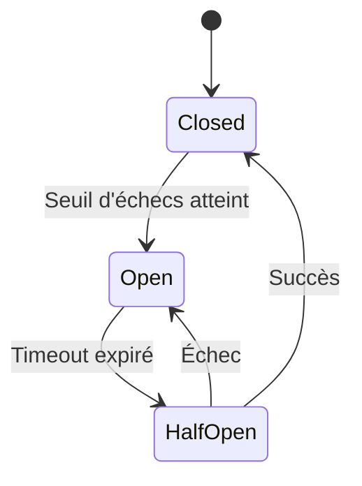

# Circuit Breaker Pattern

## Concept

Le **Circuit Breaker** est un pattern de résilience qui empêche une application d'appeler continuellement un service qui risque d'échouer, protégeant ainsi le système contre les défaillances en cascade.

:::tip Analogie
Comme un disjoncteur électrique qui coupe le courant lors d'une surcharge pour protéger l'installation.
:::

## 🎯 Problème résolu

Sans Circuit Breaker, quand un service est défaillant :
- Les threads s'accumulent en attente de timeout
- Épuisement des ressources (connexions, mémoire)
- Effet domino sur les autres services
- Temps de réponse dégradés pour tous les utilisateurs

## 🔄 États du Circuit Breaker



### 1. **Closed** (Fermé)

- Circuit normal, toutes les requêtes passent
- Compte les échecs
- Si le seuil est atteint → passage en **Open**

### 2. **Open** (Ouvert)

- Toutes les requêtes sont **immédiatement rejetées**
- Pas d'appel au service défaillant
- Fallback retourné instantanément
- Après un timeout → passage en **Half-Open**

### 3. **Half-Open** (Semi-ouvert)

- Laisse passer **quelques requêtes** de test
- Si succès → retour en **Closed**
- Si échec → retour en **Open**

## ⚙️ Configuration typique

```yaml
circuitBreaker:
  failureThreshold: 50%        # % d'échecs pour ouvrir
  slowCallThreshold: 5s        # Seuil de lenteur
  minimumNumberOfCalls: 10     # Appels avant évaluation
  waitDurationInOpenState: 60s # Durée en état Open
  permittedCallsInHalfOpen: 3  # Appels de test en Half-Open
```

## 💻 Implémentation

### Java (Resilience4j)

```java
CircuitBreaker circuitBreaker = CircuitBreaker.of("userService", 
    CircuitBreakerConfig.custom()
        .failureRateThreshold(50)
        .waitDurationInOpenState(Duration.ofSeconds(60))
        .slidingWindowSize(10)
        .build()
);

Supplier<User> decoratedSupplier = CircuitBreaker
    .decorateSupplier(circuitBreaker, () -> userService.getUser(id));

Try<User> result = Try.ofSupplier(decoratedSupplier)
    .recover(throwable -> getUserFromCache(id));
```

### Python (pybreaker)

```python
from pybreaker import CircuitBreaker

breaker = CircuitBreaker(
    fail_max=5,
    timeout_duration=60
)

@breaker
def call_external_service():
    response = requests.get('http://api.example.com/data')
    return response.json()

try:
    data = call_external_service()
except CircuitBreakerError:
    data = get_fallback_data()
```

### JavaScript (opossum)

```javascript
const CircuitBreaker = require('opossum');

const options = {
  timeout: 3000,
  errorThresholdPercentage: 50,
  resetTimeout: 30000
};

const breaker = new CircuitBreaker(callService, options);

breaker.fallback(() => getCachedData());

breaker.fire(userId)
  .then(data => console.log(data))
  .catch(err => console.error(err));
```

## 🛡️ Stratégies de Fallback

### 1. Cache

Retourner des données en cache (même périmées)

```java
.recover(throwable -> {
    return cache.get(key)
        .orElseThrow(() -> new ServiceUnavailableException());
})
```

### 2. Valeur par défaut

```java
.recover(throwable -> User.defaultUser())
```

### 3. Dégradation fonctionnelle

```java
.recover(throwable -> {
    // Retourner profil sans recommandations
    return new UserProfile(userId, name, Collections.emptyList());
})
```

### 4. Fail fast

```java
.recover(throwable -> {
    throw new ServiceUnavailableException("Service temporairement indisponible");
})
```

## 📊 Métriques à surveiller

- **État du circuit** : Open/Closed/HalfOpen
- **Taux d'échec** : % de requêtes en erreur
- **Nombre d'appels rejetés** : requêtes bloquées en état Open
- **Latence** : temps de réponse moyen
- **Taux de fallback** : fréquence d'utilisation du fallback

### Dashboard Grafana

```promql
# État du circuit
resilience4j_circuitbreaker_state{name="userService"}

# Taux d'échec
rate(resilience4j_circuitbreaker_calls_total{kind="failed"}[5m])

# Appels rejetés
resilience4j_circuitbreaker_not_permitted_calls_total
```

## 🎨 Patterns complémentaires

### Combinaison avec Retry

```java
Retry retry = Retry.ofDefaults("userService");
CircuitBreaker circuitBreaker = CircuitBreaker.ofDefaults("userService");

Supplier<User> supplier = () -> userService.getUser(id);

Supplier<User> decoratedSupplier = Decorators
    .ofSupplier(supplier)
    .withRetry(retry)           // D'abord retry
    .withCircuitBreaker(circuitBreaker)  // Puis circuit breaker
    .withFallback(ex -> getUserFromCache(id))
    .decorate();
```

### Avec Bulkhead

Limiter les ressources consommées même avant l'ouverture du circuit

```java
Bulkhead bulkhead = Bulkhead.of("userService", BulkheadConfig.custom()
    .maxConcurrentCalls(10)
    .build());

Supplier<User> decoratedSupplier = Decorators
    .ofSupplier(supplier)
    .withBulkhead(bulkhead)
    .withCircuitBreaker(circuitBreaker)
    .decorate();
```

## ⚠️ Pièges à éviter

### 1. Seuil trop sensible

Circuit s'ouvre trop souvent pour des erreurs transitoires
- **Solution** : ajuster `minimumNumberOfCalls` et `failureThreshold`

### 2. Timeout trop long en Open

Service reste indisponible trop longtemps
- **Solution** : `waitDurationInOpenState` adapté (30-60s généralement)

### 3. Pas de fallback

Circuit ouvert = erreur utilisateur
- **Solution** : toujours prévoir un fallback gracieux

### 4. Circuit global

Un circuit partagé entre plusieurs endpoints
- **Solution** : un circuit breaker par dépendance

## ✅ Bonnes pratiques

1. **Un circuit par dépendance** : isolation fine des pannes
2. **Monitorer l'état** : alertes sur ouverture prolongée
3. **Tester les fallbacks** : chaos engineering
4. **Documenter le comportement** : communication avec les équipes métier
5. **Logs structurés** : traçabilité des ouvertures/fermetures

## 🧪 Tests

### Test unitaire

```java
@Test
void shouldOpenCircuitAfterThresholdReached() {
    // Simuler échecs
    for (int i = 0; i < 10; i++) {
        Try.ofSupplier(decoratedSupplier);
    }
    
    assertThat(circuitBreaker.getState())
        .isEqualTo(CircuitBreaker.State.OPEN);
}
```

### Test d'intégration

```java
@Test
void shouldReturnFallbackWhenCircuitOpen() {
    // Ouvrir le circuit
    openCircuit();
    
    User result = userService.getUser("123");
    
    assertThat(result).isEqualTo(User.fallbackUser());
    verify(externalApi, never()).call();
}
```

## Ressources

- [Martin Fowler - Circuit Breaker](https://martinfowler.com/bliki/CircuitBreaker.html)
- [Resilience4j Documentation](https://resilience4j.readme.io/docs/circuitbreaker)
- [Netflix Hystrix (deprecated but educational)](https://github.com/Netflix/Hystrix/wiki)