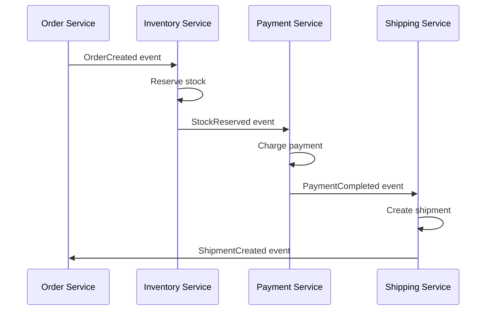
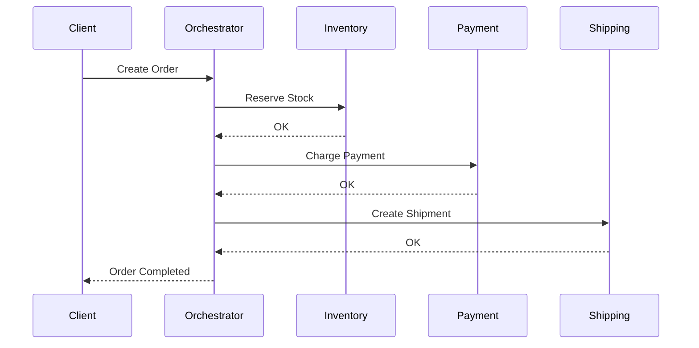

# Saga Pattern

## Concept

Le **Saga Pattern** est une solution pour gérer les **transactions distribuées** dans une architecture microservices. Au lieu d'une transaction ACID globale (impossible avec des bases séparées), une saga décompose la transaction en une série d'étapes locales avec des mécanismes de compensation en cas d'échec.

:::tip Principe
Une saga = une séquence de transactions locales. Si une étape échoue, on compense les étapes précédentes.
:::

## 🎯 Problème résolu

**Scénario :** Commander un produit nécessite :
1. Réserver le stock (Inventory Service)
2. Débiter le compte (Payment Service)
3. Créer l'expédition (Shipping Service)

**Sans Saga :**
- Impossible d'avoir une transaction ACID globale
- Si Payment échoue après réservation du stock → incohérence

**Avec Saga :**
- Chaque service effectue sa transaction locale
- En cas d'échec, compensation automatique (annuler réservation, rembourser, etc.)

## 🔄 Types de Saga

### 1. Choreography (Chorégraphie)

Chaque service publie des événements et réagit aux événements des autres. **Pas de coordinateur central**.



**Avantages :**
- Découplage maximal
- Pas de SPOF (Single Point of Failure)
- Scalabilité

**Inconvénients :**
- Complexité accrue
- Difficile à tracer/débugger
- Pas de vue globale

**Implémentation :**

```javascript
// Order Service
orderCreated(order) {
  eventBus.publish('OrderCreated', order);
}

// Inventory Service
eventBus.subscribe('OrderCreated', async (order) => {
  try {
    await reserveStock(order.items);
    eventBus.publish('StockReserved', order);
  } catch (error) {
    eventBus.publish('StockReservationFailed', order);
  }
});

// Payment Service
eventBus.subscribe('StockReserved', async (order) => {
  try {
    await chargePayment(order);
    eventBus.publish('PaymentCompleted', order);
  } catch (error) {
    eventBus.publish('PaymentFailed', order);
    // Trigger compensation
    eventBus.publish('CancelStockReservation', order);
  }
});
```

### 2. Orchestration

Un **coordinateur central** (orchestrateur) dirige la saga et appelle séquentiellement les services.



**Avantages :**
- Vue centralisée de la saga
- Facile à tracer et débugger
- Logique de compensation explicite

**Inconvénients :**
- Point de défaillance unique
- Couplage avec l'orchestrateur

**Implémentation :**

```java
public class OrderSagaOrchestrator {
    
    @Transactional
    public void executeOrderSaga(Order order) {
        SagaInstance saga = new SagaInstance(order.getId());
        
        try {
            // Step 1: Reserve stock
            saga.addStep(
                () -> inventoryService.reserveStock(order),
                () -> inventoryService.cancelReservation(order)
            );
            
            // Step 2: Charge payment
            saga.addStep(
                () -> paymentService.charge(order),
                () -> paymentService.refund(order)
            );
            
            // Step 3: Create shipment
            saga.addStep(
                () -> shippingService.createShipment(order),
                () -> shippingService.cancelShipment(order)
            );
            
            saga.execute();
            
        } catch (SagaException e) {
            saga.compensate();
            throw new OrderFailedException(e);
        }
    }
}
```

## 🛡️ Compensation

### Principe

Chaque transaction locale doit avoir une **transaction compensatoire** qui annule son effet.

| Action | Compensation |
|--------|--------------|
| Réserver stock | Libérer stock |
| Débiter compte | Créditer compte (remboursement) |
| Créer expédition | Annuler expédition |
| Envoyer email | Envoyer email d'annulation |

### Types de transactions

#### 1. **Compensable**
Peut être annulée (ex: réservation)

#### 2. **Pivot**
Point de non-retour (ex: paiement confirmé avec SLA)

#### 3. **Retriable**
Peut être réessayée jusqu'au succès (ex: notification)

### Exemple de compensation

```python
class OrderSaga:
    def __init__(self):
        self.completed_steps = []
    
    def execute(self, order):
        try:
            # Step 1
            inventory_id = self.reserve_stock(order)
            self.completed_steps.append(('inventory', inventory_id))
            
            # Step 2
            payment_id = self.charge_payment(order)
            self.completed_steps.append(('payment', payment_id))
            
            # Step 3
            shipment_id = self.create_shipment(order)
            self.completed_steps.append(('shipment', shipment_id))
            
        except Exception as e:
            self.compensate()
            raise SagaFailedException(e)
    
    def compensate(self):
        # Compenser dans l'ordre inverse
        for step_type, step_id in reversed(self.completed_steps):
            if step_type == 'inventory':
                self.cancel_stock_reservation(step_id)
            elif step_type == 'payment':
                self.refund_payment(step_id)
            elif step_type == 'shipment':
                self.cancel_shipment(step_id)
```

## 📊 Gestion de l'état

### Table de saga

Persister l'état de chaque saga pour gérer les reprises

```sql
CREATE TABLE saga_instances (
    saga_id UUID PRIMARY KEY,
    saga_type VARCHAR(50),
    status VARCHAR(20), -- STARTED, COMPLETED, COMPENSATING, FAILED
    current_step INT,
    payload JSONB,
    created_at TIMESTAMP,
    updated_at TIMESTAMP
);

CREATE TABLE saga_steps (
    step_id UUID PRIMARY KEY,
    saga_id UUID REFERENCES saga_instances(saga_id),
    step_name VARCHAR(100),
    status VARCHAR(20), -- PENDING, COMPLETED, FAILED, COMPENSATED
    compensated BOOLEAN DEFAULT false
);
```

### State Machine

```java
public enum SagaState {
    STARTED,
    STOCK_RESERVED,
    PAYMENT_COMPLETED,
    SHIPMENT_CREATED,
    COMPLETED,
    COMPENSATING,
    FAILED
}
```

## 🔧 Frameworks

### Axon Framework (Java)

```java
@Saga
public class OrderSaga {
    
    @StartSaga
    @SagaEventHandler(associationProperty = "orderId")
    public void handle(OrderCreatedEvent event) {
        commandGateway.send(new ReserveStockCommand(event.getOrderId()));
    }
    
    @SagaEventHandler(associationProperty = "orderId")
    public void handle(StockReservedEvent event) {
        commandGateway.send(new ChargePaymentCommand(event.getOrderId()));
    }
    
    @SagaEventHandler(associationProperty = "orderId")
    public void handle(PaymentFailedEvent event) {
        commandGateway.send(new CancelStockReservationCommand(event.getOrderId()));
    }
    
    @EndSaga
    @SagaEventHandler(associationProperty = "orderId")
    public void handle(OrderCompletedEvent event) {
        // Saga terminée
    }
}
```

### Netflix Conductor

Workflow as code avec interface graphique

```json
{
  "name": "order_saga",
  "tasks": [
    {
      "name": "reserve_stock",
      "taskReferenceName": "reserve_stock_ref",
      "type": "SIMPLE"
    },
    {
      "name": "charge_payment",
      "taskReferenceName": "charge_payment_ref",
      "type": "SIMPLE"
    }
  ]
}
```

### Temporal (Go, Java, TypeScript)

```typescript
export async function orderSaga(order: Order): Promise<void> {
  try {
    await activities.reserveStock(order);
    await activities.chargePayment(order);
    await activities.createShipment(order);
  } catch (error) {
    // Compensation automatique
    await compensate();
    throw error;
  }
}
```

## ⚠️ Défis

### 1. Isolation

Pas de lecture répétable entre étapes
- **Solution** : Semantic Lock (verrouillage logique)

### 2. Idempotence

Une compensation peut être appelée plusieurs fois
- **Solution** : Identifiants de déduplication

```python
def cancel_reservation(reservation_id, idempotency_key):
    if already_processed(idempotency_key):
        return  # Déjà compensé
    
    inventory.release(reservation_id)
    mark_as_processed(idempotency_key)
```

### 3. Durée d'exécution

Saga longue = risque de timeout
- **Solution** : Timeout par étape, retry avec backoff

## ✅ Bonnes pratiques

1. **Concevoir des compensations idempotentes**
2. **Logger chaque étape** pour traçabilité
3. **Monitorer les sagas en cours** (durée, taux d'échec)
4. **Tester les scénarios d'échec** (chaos engineering)
5. **Éviter les sagas trop longues** (> 5-10 étapes)
6. **Préférer l'orchestration** pour les cas complexes
7. **Documenter les flux de compensation**

## 📈 Métriques

- **Taux de succès des sagas**
- **Temps moyen d'exécution**
- **Nombre de compensations**
- **Sagas en timeout**
- **Étape la plus échouée**

## Ressources

- [Saga Pattern - Microservices.io](https://microservices.io/patterns/data/saga.html)
- [Distributed Sagas: A Protocol for Coordinating Microservices (Paper)](https://www.cs.cornell.edu/andru/cs711/2002fa/reading/sagas.pdf)
- [Axon Framework](https://axoniq.io/)
- [Temporal.io](https://temporal.io/)