# OWASP Top 10

## Introduction

L'OWASP Top 10 est la liste des 10 risques de sécurité les plus critiques pour les applications web (version 2021).

## Vue d'ensemble

| Rang | Risque | Impact |
|------|--------|--------|
| **A01** | Broken Access Control | 🔴 Critique |
| **A02** | Cryptographic Failures | 🔴 Critique |
| **A03** | Injection | 🔴 Critique |
| **A04** | Insecure Design | 🟠 Élevé |
| **A05** | Security Misconfiguration | 🟠 Élevé |
| **A06** | Vulnerable Components | 🟠 Élevé |
| **A07** | Authentication Failures | 🔴 Critique |
| **A08** | Software & Data Integrity | 🟠 Élevé |
| **A09** | Security Logging Failures | 🟡 Moyen |
| **A10** | Server-Side Request Forgery | 🟠 Élevé |

---

## A01 - Broken Access Control

### Problème
Utilisateurs accédant à des ressources non autorisées.

**Exemples** : Modification d'ID dans l'URL, élévation de privilèges, bypass d'autorisations.

### Où sécuriser ?

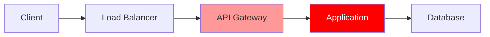

#### 🔴 Applicatif (Prioritaire)

**Spring Boot** :
```java
// ❌ Mauvais
@GetMapping("/users/{id}")
public User getUser(@PathVariable Long id) {
    return userService.findById(id);
}

// ✅ Bon
@GetMapping("/users/{id}")
@PreAuthorize("@userSecurity.canAccessUser(authentication, #id)")
public User getUser(@PathVariable Long id) {
    return userService.findById(id);
}

// UserSecurity.java
@Component
public class UserSecurity {
    public boolean canAccessUser(Authentication auth, Long userId) {
        User currentUser = (User) auth.getPrincipal();
        return currentUser.getId().equals(userId) || currentUser.isAdmin();
    }
}
```

**Angular** :
```typescript
// ✅ Bon - Guard
@Injectable()
export class AuthGuard implements CanActivate {
  canActivate(route: ActivatedRouteSnapshot): boolean {
    const userId = route.params['id'];
    return this.authService.canAccess(userId);
  }
}

// Route
{ path: 'users/:id', component: UserComponent, canActivate: [AuthGuard] }
```

**Actions** :
- ✅ `@PreAuthorize`, `@Secured` sur chaque endpoint
- ✅ Guards Angular sur routes sensibles
- ✅ Vérifier ownership des ressources

#### 🟠 Infra
- ✅ WAF avec règles anti-bypass
- ✅ API Gateway avec authentification centralisée

#### 🟡 DevOps
- ✅ Tests d'autorisation automatisés
- ✅ SAST pour détecter endpoints non protégés

---

## A02 - Cryptographic Failures

### Problème
Données sensibles exposées (transmission en clair, stockage non chiffré, algorithmes faibles).

### Où sécuriser ?

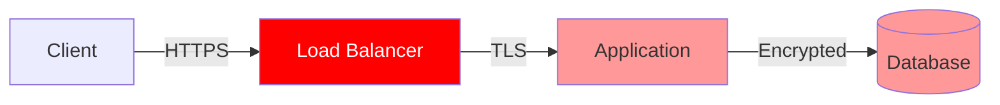

#### 🔴 Infra (Prioritaire)
- ✅ **HTTPS/TLS 1.3** partout
- ✅ Certificats valides (Let's Encrypt)
- ✅ HSTS activé
- ✅ Chiffrement des disques et backups

#### 🔴 Applicatif

**Spring Boot** :
```java
// ✅ Bon - Hachage mot de passe
@Configuration
public class SecurityConfig {
    @Bean
    public PasswordEncoder passwordEncoder() {
        return new BCryptPasswordEncoder(12);
    }
}

// Service
public void createUser(String password) {
    String hashed = passwordEncoder.encode(password);
    user.setPassword(hashed);
}
```

**application.yml** :
```yaml
# ✅ Bon - Pas de secrets en dur
spring:
  datasource:
    password: ${DB_PASSWORD}  # Variable d'environnement
```

**Actions** :
- ✅ BCrypt/Argon2 pour mots de passe
- ✅ Pas de secrets dans le code
- ✅ Chiffrement AES-256 pour données sensibles

#### 🟠 DevOps
- ✅ Vault (HashiCorp, AWS Secrets Manager)
- ✅ Scan de secrets (git-secrets, truffleHog)

---

## A03 - Injection

### Problème
Injection SQL, NoSQL, OS commands, LDAP.

### Où sécuriser ?

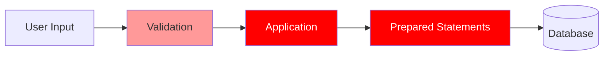

#### 🔴 Applicatif (Prioritaire)

**Spring Boot** :
```java
// ❌ Mauvais - SQL Injection
String query = "SELECT * FROM users WHERE username = '" + username + "'";
jdbcTemplate.query(query, ...);

// ✅ Bon - Prepared Statement
@Query("SELECT u FROM User u WHERE u.username = :username")
User findByUsername(@Param("username") String username);

// ✅ Bon - JPA Repository
public interface UserRepository extends JpaRepository<User, Long> {
    Optional<User> findByUsername(String username);
}
```

**Validation** :
```java
// ✅ Bon - Validation
@RestController
public class UserController {
    @PostMapping("/users")
    public User create(@Valid @RequestBody UserDto userDto) {
        return userService.create(userDto);
    }
}

@Data
public class UserDto {
    @NotBlank
    @Pattern(regexp = "^[a-zA-Z0-9_-]{3,20}$")
    private String username;
    
    @Email
    private String email;
}
```

**Angular** :
```typescript
// ✅ Bon - Validation côté client
this.userForm = this.fb.group({
  username: ['', [Validators.required, Validators.pattern('^[a-zA-Z0-9_-]{3,20}$')]],
  email: ['', [Validators.required, Validators.email]]
});
```

**Actions** :
- ✅ JPA/Hibernate (ORM)
- ✅ `@Valid` + Bean Validation
- ✅ Whitelist sur inputs

#### 🟠 Infra
- ✅ WAF avec règles anti-injection
- ✅ Comptes DB avec permissions minimales

#### 🟡 DevOps
- ✅ SAST pour détecter injections

---

## A04 - Insecure Design

### Problème
Failles de conception (pas de threat modeling, pas de rate limiting).

### Où sécuriser ?

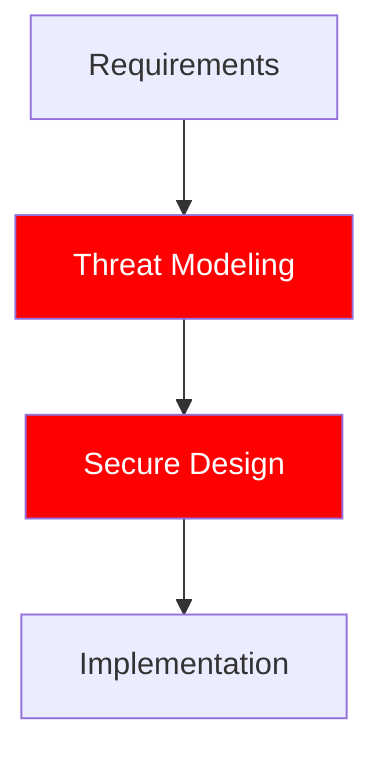

#### 🔴 Applicatif (Prioritaire)

**Spring Boot - Rate Limiting** :
```java
// ✅ Bon - Bucket4j
@RestController
public class AuthController {
    private final Bucket bucket = Bucket.builder()
        .addLimit(Limit.of(5, Duration.ofMinutes(1)))
        .build();
    
    @PostMapping("/login")
    public ResponseEntity<?> login(@RequestBody LoginDto dto) {
        if (!bucket.tryConsume(1)) {
            return ResponseEntity.status(429).body("Too many requests");
        }
        // Login logic
    }
}
```

**Actions** :
- ✅ Threat modeling (STRIDE)
- ✅ Rate limiting sur endpoints sensibles
- ✅ Validation métier stricte

#### 🟠 DevOps
- ✅ Security champions
- ✅ Design reviews

---

## A05 - Security Misconfiguration

### Problème
Configuration par défaut, services inutiles, erreurs détaillées en prod.

### Où sécuriser ?

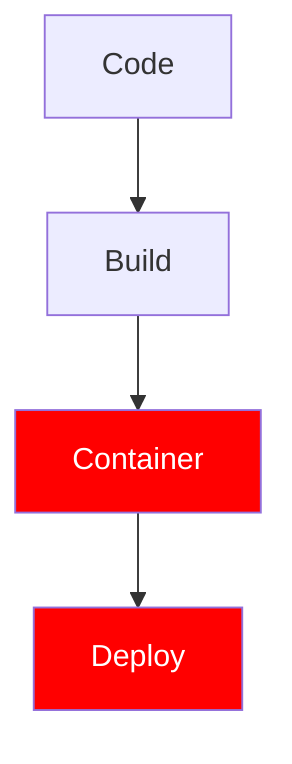

#### 🔴 Infra (Prioritaire)

**Dockerfile** :
```dockerfile
# ✅ Bon
FROM eclipse-temurin:17-jre-alpine
RUN addgroup -g 1001 spring && adduser -u 1001 -G spring -s /bin/sh -D spring
USER spring:spring
WORKDIR /app
COPY --chown=spring:spring target/*.jar app.jar
EXPOSE 8080
ENTRYPOINT ["java", "-jar", "app.jar"]
```

**Nginx** :
```nginx
# ✅ Bon - Security headers
add_header X-Frame-Options "DENY";
add_header X-Content-Type-Options "nosniff";
add_header X-XSS-Protection "1; mode=block";
add_header Strict-Transport-Security "max-age=31536000";
add_header Content-Security-Policy "default-src 'self'";
```

**Actions** :
- ✅ Principe du moindre privilège
- ✅ Désactiver services inutiles
- ✅ Hardening OS (CIS Benchmarks)

#### 🟠 Applicatif

**Spring Boot** :
```yaml
# ✅ Bon - application-prod.yml
spring:
  security:
    headers:
      frame-options: DENY
      content-type-options: nosniff
      xss-protection: 1; mode=block
server:
  error:
    include-message: never
    include-stacktrace: never
management:
  endpoints:
    web:
      exposure:
        include: health,metrics
```

**Angular** :
```typescript
// ✅ Bon - ErrorHandler personnalisé
@Injectable()
export class GlobalErrorHandler implements ErrorHandler {
  handleError(error: Error): void {
    console.error('Error occurred:', error.message); // Log interne
    this.notificationService.show('Une erreur est survenue'); // Message générique
  }
}
```

#### 🔴 DevOps (Prioritaire)
- ✅ Infrastructure as Code (Terraform)
- ✅ Scan de configuration (Checkov, TFSec)
- ✅ Environnements identiques

---

## A06 - Vulnerable Components

### Problème
Dépendances vulnérables (Log4Shell, Spring4Shell, etc.).

### Où sécuriser ?

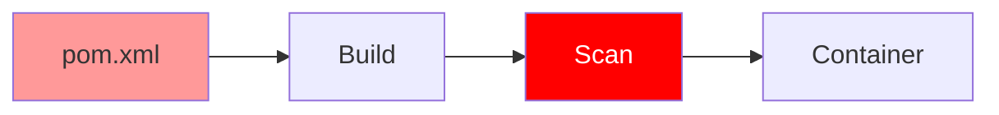

#### 🔴 DevOps (Prioritaire)

**SCA (Software Composition Analysis)** analyse les dépendances pour détecter vulnérabilités et licences.

**SBOM (Software Bill of Materials)** = Inventaire des composants logiciels.

**Maven - OWASP Dependency Check + SBOM** :
```xml
<!-- ✅ Bon -->
<plugin>
    <groupId>org.owasp</groupId>
    <artifactId>dependency-check-maven</artifactId>
    <version>9.0.0</version>
    <configuration>
        <failBuildOnCVSS>7</failBuildOnCVSS>
    </configuration>
</plugin>

<plugin>
    <groupId>org.cyclonedx</groupId>
    <artifactId>cyclonedx-maven-plugin</artifactId>
    <version>2.7.9</version>
    <executions>
        <execution>
            <phase>package</phase>
            <goals>
                <goal>makeAggregateBom</goal>
            </goals>
        </execution>
    </executions>
</plugin>
```

**GitLab CI - Pipeline sécurité** :
```yaml
# .gitlab-ci.yml
# ✅ Bon

stages:
  - build
  - security
  - deploy

variables:
  MAVEN_OPTS: "-Dmaven.repo.local=.m2/repository"

build:
  stage: build
  image: maven:3.9-eclipse-temurin-17
  script:
    - mvn clean package
    - mvn cyclonedx:makeAggregateBom
  artifacts:
    paths:
      - target/*.jar
      - target/bom.json
    expire_in: 1 week

dependency-check:
  stage: security
  image: maven:3.9-eclipse-temurin-17
  script:
    - mvn org.owasp:dependency-check-maven:check
  artifacts:
    reports:
      dependency_scanning: target/dependency-check-report.json
  allow_failure: false

container-scan:
  stage: security
  image: docker:latest
  services:
    - docker:dind
  script:
    - docker build -t $CI_REGISTRY_IMAGE:$CI_COMMIT_SHA .
    - docker run --rm -v /var/run/docker.sock:/var/run/docker.sock 
        aquasec/trivy image --severity HIGH,CRITICAL 
        --exit-code 1 $CI_REGISTRY_IMAGE:$CI_COMMIT_SHA
  dependencies:
    - build

# GitLab SAST intégré
include:
  - template: Security/SAST.gitlab-ci.yml
  - template: Security/Dependency-Scanning.gitlab-ci.yml
  - template: Security/Container-Scanning.gitlab-ci.yml
```

**Dependabot (GitLab Renovate)** :
```json
{
  "extends": ["config:base"],
  "packageRules": [
    {
      "matchUpdateTypes": ["minor", "patch"],
      "automerge": true
    },
    {
      "matchUpdateTypes": ["major"],
      "labels": ["security", "dependencies"]
    }
  ]
}
```

**Outils SCA** :

| Outil | Usage | CI/CD |
|-------|-------|-------|
| **OWASP Dependency Check** | CVE detection | `mvn check` |
| **Trivy** | Container + FS scan | `trivy image` |
| **GitLab Security** | Intégré | Templates |
| **Snyk** | Vulns + Fixes | `snyk test` |

**Actions** :
- ✅ **SCA** dans pipeline GitLab CI
- ✅ **SBOM** généré automatiquement
- ✅ Scan conteneurs avec Trivy
- ✅ Bloquer build si vulns critiques
- ✅ Renovate pour updates auto

#### 🟠 Infra
- ✅ Images de base minimales (Alpine)
- ✅ Registry avec scan (Harbor)

---

## A07 - Authentication Failures

### Problème
Bruteforce, mots de passe faibles, pas de MFA.

### Où sécuriser ?

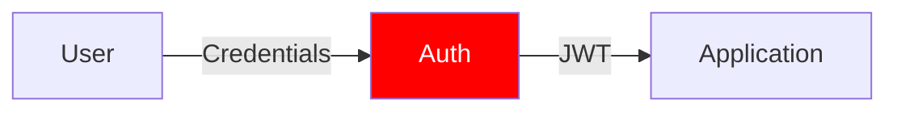

#### 🔴 Applicatif (Prioritaire)

**Spring Security avec OIDC** :
```java
// ✅ Bon - Configuration OIDC
@Configuration
@EnableWebSecurity
public class SecurityConfig {
    
    @Bean
    public SecurityFilterChain filterChain(HttpSecurity http) throws Exception {
        return http
            .csrf().csrfTokenRepository(CookieCsrfTokenRepository.withHttpOnlyFalse())
            .and()
            .authorizeHttpRequests(auth -> auth
                .requestMatchers("/api/public/**").permitAll()
                .anyRequest().authenticated()
            )
            .oauth2ResourceServer(oauth2 -> oauth2
                .jwt(jwt -> jwt.jwtAuthenticationConverter(jwtAuthConverter()))
            )
            .oauth2Login(oauth2 -> oauth2
                .defaultSuccessUrl("/dashboard")
                .failureUrl("/login?error=true")
            )
            .logout(logout -> logout
                .logoutSuccessUrl("/")
                .invalidateHttpSession(true)
                .deleteCookies("JSESSIONID")
            )
            .build();
    }
    
    @Bean
    public JwtAuthenticationConverter jwtAuthConverter() {
        JwtAuthenticationConverter converter = new JwtAuthenticationConverter();
        JwtGrantedAuthoritiesConverter authoritiesConverter = 
            new JwtGrantedAuthoritiesConverter();
        authoritiesConverter.setAuthoritiesClaimName("roles");
        authoritiesConverter.setAuthorityPrefix("ROLE_");
        converter.setJwtGrantedAuthoritiesConverter(authoritiesConverter);
        return converter;
    }
    
    @Bean
    public PasswordEncoder passwordEncoder() {
        return new BCryptPasswordEncoder(12);
    }
}
```

**application.yml - OIDC** :
```yaml
# ✅ Bon - Configuration OIDC
spring:
  security:
    oauth2:
      client:
        registration:
          keycloak:
            client-id: ${OIDC_CLIENT_ID}
            client-secret: ${OIDC_CLIENT_SECRET}
            scope: openid,profile,email
            authorization-grant-type: authorization_code
            redirect-uri: "{baseUrl}/login/oauth2/code/{registrationId}"
        provider:
          keycloak:
            issuer-uri: https://auth.example.com/realms/myrealm
            user-name-attribute: preferred_username
      resourceserver:
        jwt:
          issuer-uri: https://auth.example.com/realms/myrealm
          jwk-set-uri: https://auth.example.com/realms/myrealm/protocol/openid-connect/certs
```

**Contrôleur avec OIDC** :
```java
// ✅ Bon - Utilisation OIDC
@RestController
@RequestMapping("/api")
public class UserController {
    
    @GetMapping("/me")
    public Map<String, Object> getCurrentUser(@AuthenticationPrincipal Jwt jwt) {
        return Map.of(
            "sub", jwt.getSubject(),
            "email", jwt.getClaim("email"),
            "name", jwt.getClaim("name"),
            "roles", jwt.getClaim("roles")
        );
    }
    
    @GetMapping("/admin")
    @PreAuthorize("hasRole('ADMIN')")
    public String adminEndpoint(@AuthenticationPrincipal Jwt jwt) {
        return "Admin access granted for: " + jwt.getSubject();
    }
}
```

**Angular - OIDC Client** :
```typescript
// ✅ Bon - angular-oauth2-oidc
import { AuthConfig, OAuthService } from 'angular-oauth2-oidc';

export const authConfig: AuthConfig = {
  issuer: 'https://auth.example.com/realms/myrealm',
  clientId: 'angular-client',
  redirectUri: window.location.origin + '/callback',
  scope: 'openid profile email',
  responseType: 'code',
  showDebugInformation: false,
  requireHttps: true
};

@Injectable()
export class AuthService {
  constructor(private oauthService: OAuthService) {
    this.configure();
  }
  
  configure() {
    this.oauthService.configure(authConfig);
    this.oauthService.loadDiscoveryDocumentAndTryLogin();
  }
  
  login() {
    this.oauthService.initCodeFlow();
  }
  
  logout() {
    this.oauthService.logOut();
  }
  
  getToken(): string {
    return this.oauthService.getAccessToken();
  }
}
```

**Rate Limiting sur Login** :
```java
// ✅ Bon - Bucket4j
@Service
public class AuthService {
    private final LoadingCache<String, Integer> attemptsCache = CacheBuilder.newBuilder()
        .expireAfterWrite(5, TimeUnit.MINUTES)
        .build(new CacheLoader<>() {
            public Integer load(String key) { return 0; }
        });
    
    public void loginFailed(String username) {
        int attempts = attemptsCache.get(username);
        attemptsCache.put(username, attempts + 1);
        if (attempts >= 5) {
            throw new AccountLockedException("Account locked");
        }
    }
}
```

**Angular - JWT Interceptor** :
```typescript
// ✅ Bon
@Injectable()
export class JwtInterceptor implements HttpInterceptor {
  constructor(private authService: AuthService) {}
  
  intercept(req: HttpRequest<any>, next: HttpHandler): Observable<HttpEvent<any>> {
    const token = this.authService.getToken();
    if (token) {
      req = req.clone({
        setHeaders: { Authorization: `Bearer ${token}` }
      });
    }
    return next.handle(req).pipe(
      catchError((error: HttpErrorResponse) => {
        if (error.status === 401) {
          this.authService.login();
        }
        return throwError(() => error);
      })
    );
  }
}
```

**Actions** :
- ✅ **OIDC/OAuth2** pour authentification
- ✅ MFA au niveau IdP
- ✅ JWT validation (signature, expiration)
- ✅ Rate limiting (5 tentatives/5min)
- ✅ Account lockout
- ✅ Session timeout
- ✅ Secure cookies (HttpOnly, Secure, SameSite)

#### 🟠 Infra
- ✅ WAF : protection bruteforce

---

## A08 - Software & Data Integrity Failures

### Problème
Pipeline compromis, CDN non vérifié, désérialisation non sécurisée.

### Où sécuriser ?

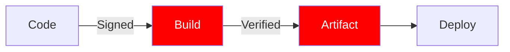

#### 🔴 DevOps (Prioritaire)

**Maven - Signature** :
```xml
<!-- ✅ Bon - GPG Plugin -->
<plugin>
    <groupId>org.apache.maven.plugins</groupId>
    <artifactId>maven-gpg-plugin</artifactId>
    <executions>
        <execution>
            <goals><goal>sign</goal></goals>
        </execution>
    </executions>
</plugin>
```

**Angular - SRI pour CDN** :
```html
<!-- ✅ Bon -->
<script 
    src="https://cdn.example.com/lib.js"
    integrity="sha384-oqVuAfXRKap7fdgcCY5uykM6+R9GqQ8K..."
    crossorigin="anonymous">
</script>
```

**Actions** :
- ✅ Signature des commits (GPG)
- ✅ Signature des images Docker
- ✅ SRI pour CDN
- ✅ Pipeline CI/CD sécurisé

#### 🟠 Applicatif

**Spring Boot - Désérialisation** :
```java
// ❌ Mauvais
ObjectInputStream ois = new ObjectInputStream(input);
Object obj = ois.readObject(); // Dangereux

// ✅ Bon - Utiliser JSON
ObjectMapper mapper = new ObjectMapper();
User user = mapper.readValue(json, User.class);
```

---

## A09 - Security Logging Failures

### Problème
Logs insuffisants, pas de monitoring, pas d'alertes.

### Où sécuriser ?

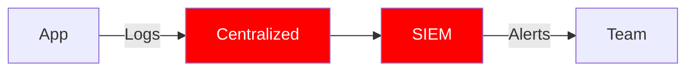

#### 🔴 Infra (Prioritaire)
- ✅ Logging centralisé (ELK, Splunk)
- ✅ SIEM avec alertes
- ✅ Rétention logs (compliance)

#### 🟠 Applicatif

**Spring Boot avec Actuator** :
```java
// ✅ Bon - Logging sécurité
@Slf4j
@RestController
public class AuthController {
    private final MeterRegistry meterRegistry;
    
    @PostMapping("/login")
    public ResponseEntity<?> login(@RequestBody LoginDto dto) {
        try {
            User user = authService.authenticate(dto);
            log.info("Successful login for user: {}", user.getUsername());
            meterRegistry.counter("auth.login.success").increment();
            return ResponseEntity.ok(token);
        } catch (BadCredentialsException e) {
            log.warn("Failed login attempt for username: {}", dto.getUsername());
            meterRegistry.counter("auth.login.failed").increment();
            return ResponseEntity.status(401).build();
        }
    }
}
```

**application.yml - Actuator + Prometheus** :
```yaml
# ✅ Bon - Configuration complète
management:
  endpoints:
    web:
      exposure:
        include: health,metrics,prometheus,info
      base-path: /actuator
  endpoint:
    health:
      show-details: when-authorized
  metrics:
    export:
      prometheus:
        enabled: true
    tags:
      application: ${spring.application.name}
      environment: ${spring.profiles.active}
  
spring:
  application:
    name: my-secure-app
```

**pom.xml - Dépendances** :
```xml
<!-- Actuator + Prometheus -->
<dependency>
    <groupId>org.springframework.boot</groupId>
    <artifactId>spring-boot-starter-actuator</artifactId>
</dependency>
<dependency>
    <groupId>io.micrometer</groupId>
    <artifactId>micrometer-registry-prometheus</artifactId>
</dependency>
```

**Prometheus - prometheus.yml** :
```yaml
# ✅ Bon - Scraping Spring Boot
scrape_configs:
  - job_name: 'spring-boot-app'
    metrics_path: '/actuator/prometheus'
    scrape_interval: 15s
    static_configs:
      - targets: ['app:8080']
```

**Grafana - Dashboard JSON** :
```json
{
  "dashboard": {
    "title": "Security Metrics",
    "panels": [
      {
        "title": "Failed Login Attempts",
        "targets": [
          {
            "expr": "rate(auth_login_failed_total[5m])"
          }
        ]
      },
      {
        "title": "HTTP 4xx Errors",
        "targets": [
          {
            "expr": "rate(http_server_requests_seconds_count{status=~\"4..\"}[5m])"
          }
        ]
      }
    ]
  }
}
```

**Métriques personnalisées** :
```java
// ✅ Bon - Métriques métier
@Service
public class SecurityMetrics {
    private final MeterRegistry registry;
    
    public void recordSuspiciousActivity(String type) {
        registry.counter("security.suspicious.activity", "type", type).increment();
    }
    
    public void recordAuthAttempt(boolean success) {
        registry.counter("auth.attempts", 
            "result", success ? "success" : "failure").increment();
    }
}
```

**logback-spring.xml** :
```xml
<!-- ✅ Bon - JSON pour parsing -->
<configuration>
    <appender name="JSON" class="ch.qos.logback.core.rolling.RollingFileAppender">
        <file>logs/app.log</file>
        <encoder class="net.logstash.logback.encoder.LogstashEncoder">
            <includeContext>true</includeContext>
            <includeMdc>true</includeMdc>
        </encoder>
        <rollingPolicy class="ch.qos.logback.core.rolling.TimeBasedRollingPolicy">
            <fileNamePattern>logs/app-%d{yyyy-MM-dd}.log</fileNamePattern>
            <maxHistory>30</maxHistory>
        </rollingPolicy>
    </appender>
    
    <logger name="com.example.security" level="INFO"/>
    <root level="INFO">
        <appender-ref ref="JSON"/>
    </root>
</configuration>
```

**Docker Compose - Stack complète** :
```yaml
# ✅ Bon - Monitoring stack
version: '3.8'
services:
  app:
    image: my-app:latest
    ports:
      - "8080:8080"
    environment:
      - SPRING_PROFILES_ACTIVE=prod
  
  prometheus:
    image: prom/prometheus:latest
    ports:
      - "9090:9090"
    volumes:
      - ./prometheus.yml:/etc/prometheus/prometheus.yml
  
  grafana:
    image: grafana/grafana:latest
    ports:
      - "3000:3000"
    environment:
      - GF_SECURITY_ADMIN_PASSWORD=admin123
    volumes:
      - grafana-storage:/var/lib/grafana
  
  loki:
    image: grafana/loki:latest
    ports:
      - "3100:3100"
  
  promtail:
    image: grafana/promtail:latest
    volumes:
      - ./logs:/var/log/app
      - ./promtail-config.yml:/etc/promtail/config.yml

volumes:
  grafana-storage:
```

**Actions** :
- ✅ Logger événements de sécurité
- ✅ Actuator + Prometheus metrics
- ✅ Grafana dashboards pour alertes
- ✅ Correlation IDs (MDC)
- ✅ Pas de données sensibles dans logs

---

## A10 - Server-Side Request Forgery (SSRF)

### Problème
Attaquant force le serveur à faire des requêtes vers destinations malveillantes.

### Où sécuriser ?

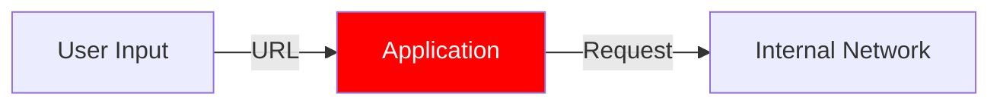

#### 🔴 Applicatif (Prioritaire)

**Spring Boot** :
```java
// ❌ Mauvais
@GetMapping("/fetch")
public String fetch(@RequestParam String url) {
    RestTemplate restTemplate = new RestTemplate();
    return restTemplate.getForObject(url, String.class); // SSRF
}

// ✅ Bon - Whitelist
@GetMapping("/fetch")
public String fetch(@RequestParam String url) {
    List<String> allowedHosts = List.of("api.trusted.com", "cdn.trusted.com");
    
    URI uri = URI.create(url);
    if (!allowedHosts.contains(uri.getHost())) {
        throw new IllegalArgumentException("Host not allowed");
    }
    
    // Bloquer IPs privées
    InetAddress addr = InetAddress.getByName(uri.getHost());
    if (addr.isSiteLocalAddress() || addr.isLoopbackAddress()) {
        throw new IllegalArgumentException("Private IP not allowed");
    }
    
    RestTemplate restTemplate = new RestTemplate();
    return restTemplate.getForObject(url, String.class);
}
```

**Actions** :
- ✅ Whitelist des destinations autorisées
- ✅ Bloquer IPs privées (127.0.0.1, 192.168.x.x, 10.x.x.x)
- ✅ Validation stricte des URLs

#### 🟠 Infra
- ✅ Network segmentation
- ✅ Egress filtering

---

## Bonnes Pratiques Supplémentaires

### CORS (Cross-Origin Resource Sharing)

**Spring Boot** :
```java
// ✅ Bon - CORS restrictif
@Configuration
public class CorsConfig implements WebMvcConfigurer {
    
    @Override
    public void addCorsMappings(CorsRegistry registry) {
        registry.addMapping("/api/**")
            .allowedOrigins("https://app.example.com")
            .allowedMethods("GET", "POST", "PUT", "DELETE")
            .allowedHeaders("Authorization", "Content-Type")
            .allowCredentials(true)
            .maxAge(3600);
    }
}
```

**Angular** :
```typescript
// Configuration proxy pour dev
// proxy.conf.json
{
  "/api": {
    "target": "http://localhost:8080",
    "secure": false,
    "changeOrigin": true
  }
}
```

---

### Security Headers

**Spring Security** :
```java
// ✅ Bon - Security headers complets
@Bean
public SecurityFilterChain filterChain(HttpSecurity http) throws Exception {
    return http
        .headers(headers -> headers
            .frameOptions().deny()
            .xssProtection().and()
            .contentTypeOptions().and()
            .httpStrictTransportSecurity()
                .includeSubDomains(true)
                .maxAgeInSeconds(31536000)
            .and()
            .contentSecurityPolicy("default-src 'self'; script-src 'self'; style-src 'self' 'unsafe-inline'")
            .and()
            .referrerPolicy(ReferrerPolicyHeaderWriter.ReferrerPolicy.STRICT_ORIGIN_WHEN_CROSS_ORIGIN)
            .and()
            .permissionsPolicy(policy -> policy
                .policy("geolocation=(self)")
                .policy("camera=()")
                .policy("microphone=()")
            )
        )
        .build();
}
```

---

### Input Validation & Sanitization

**Spring Boot - Validation avancée** :
```java
// ✅ Bon - DTO avec validation complète
@Data
public class UserDto {
    @NotBlank(message = "Username required")
    @Size(min = 3, max = 20)
    @Pattern(regexp = "^[a-zA-Z0-9_-]+$", message = "Invalid characters")
    private String username;
    
    @Email(message = "Invalid email")
    @NotBlank
    private String email;
    
    @NotBlank
    @Size(min = 12, message = "Password too short")
    @Pattern(regexp = "^(?=.*[a-z])(?=.*[A-Z])(?=.*\\d)(?=.*[@$!%*?&])[A-Za-z\\d@$!%*?&]+$",
             message = "Password must contain uppercase, lowercase, digit, and special char")
    private String password;
    
    @Past(message = "Birth date must be in the past")
    private LocalDate birthDate;
    
    @URL
    private String website;
}
```

**Angular - Validation formulaire** :
```typescript
// ✅ Bon
export class UserFormComponent {
  userForm = this.fb.group({
    username: ['', [
      Validators.required,
      Validators.minLength(3),
      Validators.maxLength(20),
      Validators.pattern(/^[a-zA-Z0-9_-]+$/)
    ]],
    email: ['', [Validators.required, Validators.email]],
    password: ['', [
      Validators.required,
      Validators.minLength(12),
      this.passwordStrengthValidator()
    ]]
  });
  
  passwordStrengthValidator(): ValidatorFn {
    return (control: AbstractControl): ValidationErrors | null => {
      const value = control.value;
      if (!value) return null;
      
      const hasUpperCase = /[A-Z]/.test(value);
      const hasLowerCase = /[a-z]/.test(value);
      const hasNumeric = /[0-9]/.test(value);
      const hasSpecialChar = /[@$!%*?&]/.test(value);
      
      const valid = hasUpperCase && hasLowerCase && hasNumeric && hasSpecialChar;
      return !valid ? { passwordStrength: true } : null;
    };
  }
}
```

**Sanitization HTML** :
```typescript
// ✅ Bon - Angular
import { DomSanitizer, SafeHtml } from '@angular/platform-browser';

@Component({...})
export class ArticleComponent {
  constructor(private sanitizer: DomSanitizer) {}
  
  getSafeHtml(content: string): SafeHtml {
    return this.sanitizer.sanitize(SecurityContext.HTML, content) || '';
  }
}
```

---

### API Rate Limiting

**Spring Boot - Bucket4j** :
```java
// ✅ Bon - Rate limiting par IP
@Component
public class RateLimitingFilter extends OncePerRequestFilter {
    private final Map<String, Bucket> cache = new ConcurrentHashMap<>();
    
    @Override
    protected void doFilterInternal(HttpServletRequest request, 
                                   HttpServletResponse response, 
                                   FilterChain filterChain) throws ServletException, IOException {
        String ip = request.getRemoteAddr();
        Bucket bucket = resolveBucket(ip);
        
        if (bucket.tryConsume(1)) {
            filterChain.doFilter(request, response);
        } else {
            response.setStatus(429);
            response.getWriter().write("Too many requests");
        }
    }
    
    private Bucket resolveBucket(String ip) {
        return cache.computeIfAbsent(ip, k -> createNewBucket());
    }
    
    private Bucket createNewBucket() {
        return Bucket.builder()
            .addLimit(Limit.of(100, Duration.ofMinutes(1)))
            .build();
    }
}
```

**Nginx - Rate limiting** :
```nginx
# ✅ Bon
http {
    limit_req_zone $binary_remote_addr zone=api:10m rate=10r/s;
    
    server {
        location /api/ {
            limit_req zone=api burst=20 nodelay;
            proxy_pass http://backend;
        }
    }
}
```

---

### Secrets Management

**Spring Cloud Config + Vault** :
```yaml
# bootstrap.yml
# ✅ Bon
spring:
  cloud:
    config:
      uri: http://config-server:8888
    vault:
      host: vault.example.com
      port: 8200
      scheme: https
      authentication: TOKEN
      token: ${VAULT_TOKEN}
      kv:
        enabled: true
        backend: secret
        profile-separator: '/'
```

**HashiCorp Vault** :
```bash
# ✅ Bon - Stockage secrets
vault kv put secret/myapp/db \
  username=dbuser \
  password=supersecret

# Récupération
vault kv get -field=password secret/myapp/db
```

---

### Container Security

**Dockerfile - Hardening complet** :
```dockerfile
# ✅ Bon - Multi-stage sécurisé
FROM maven:3.9-eclipse-temurin-17-alpine AS build
WORKDIR /build
COPY pom.xml .
RUN mvn dependency:go-offline
COPY src ./src
RUN mvn clean package -DskipTests && \
    mvn cyclonedx:makeAggregateBom

# Scan de vulnérabilités
FROM aquasec/trivy:latest AS scan
COPY --from=build /build/target/*.jar /scan/app.jar
RUN trivy rootfs --severity HIGH,CRITICAL --exit-code 1 /scan

# Runtime
FROM eclipse-temurin:17-jre-alpine AS runtime

# Mises à jour sécurité
RUN apk update && apk upgrade && \
    apk add --no-cache dumb-init && \
    rm -rf /var/cache/apk/*

# Utilisateur non-root
RUN addgroup -g 1001 -S appuser && \
    adduser -u 1001 -S appuser -G appuser

# Répertoire avec permissions restreintes
WORKDIR /app
RUN chown -R appuser:appuser /app

# Copie avec ownership
COPY --from=build --chown=appuser:appuser /build/target/*.jar app.jar
COPY --from=build --chown=appuser:appuser /build/target/bom.json /sbom/

USER appuser

# Port non-privilégié
EXPOSE 8080

# Health check
HEALTHCHECK --interval=30s --timeout=3s --retries=3 \
  CMD wget --no-verbose --tries=1 --spider http://localhost:8080/actuator/health || exit 1

# Init system pour PID 1
ENTRYPOINT ["dumb-init", "--"]
CMD ["java", \
     "-XX:+UseContainerSupport", \
     "-XX:MaxRAMPercentage=75.0", \
     "-Djava.security.egd=file:/dev/./urandom", \
     "-jar", "app.jar"]
```

**Kubernetes - Security Context** :
```yaml
# ✅ Bon - Pod sécurisé
apiVersion: v1
kind: Pod
metadata:
  name: secure-app
spec:
  securityContext:
    runAsNonRoot: true
    runAsUser: 1001
    fsGroup: 1001
    seccompProfile:
      type: RuntimeDefault
  
  containers:
  - name: app
    image: myapp:latest
    securityContext:
      allowPrivilegeEscalation: false
      readOnlyRootFilesystem: true
      capabilities:
        drop:
        - ALL
    
    resources:
      limits:
        memory: "512Mi"
        cpu: "500m"
      requests:
        memory: "256Mi"
        cpu: "250m"
    
    livenessProbe:
      httpGet:
        path: /actuator/health/liveness
        port: 8080
      initialDelaySeconds: 30
      periodSeconds: 10
    
    readinessProbe:
      httpGet:
        path: /actuator/health/readiness
        port: 8080
      initialDelaySeconds: 10
      periodSeconds: 5
```

---

### Network Security

**Architecture Zero Trust** :
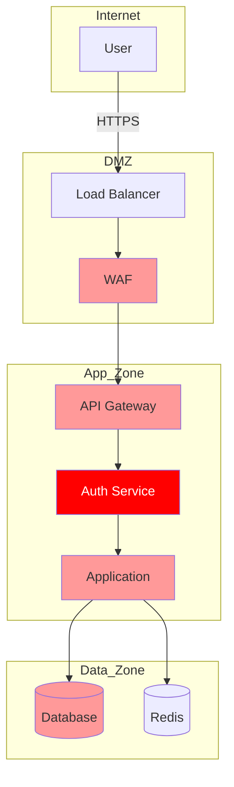

**Network Policies (Kubernetes)** :
```yaml
# ✅ Bon - Isolation réseau
apiVersion: networking.k8s.io/v1
kind: NetworkPolicy
metadata:
  name: app-network-policy
spec:
  podSelector:
    matchLabels:
      app: myapp
  policyTypes:
  - Ingress
  - Egress
  
  ingress:
  - from:
    - podSelector:
        matchLabels:
          app: api-gateway
    ports:
    - protocol: TCP
      port: 8080
  
  egress:
  - to:
    - podSelector:
        matchLabels:
          app: database
    ports:
    - protocol: TCP
      port: 5432
  - to:
    - podSelector:
        matchLabels:
          app: redis
    ports:
    - protocol: TCP
      port: 6379
```

---

### Backup & Disaster Recovery

**PostgreSQL - Backup chiffré** :
```bash
# ✅ Bon - Backup automatisé
#!/bin/bash
DATE=$(date +%Y%m%d_%H%M%S)
BACKUP_DIR="/backups"
DB_NAME="myapp"

# Dump + Compression + Chiffrement
pg_dump $DB_NAME | \
  gzip | \
  openssl enc -aes-256-cbc -salt -pbkdf2 -pass file:/secrets/backup.key \
  > $BACKUP_DIR/backup_${DB_NAME}_${DATE}.sql.gz.enc

# Upload vers S3 avec chiffrement côté serveur
aws s3 cp $BACKUP_DIR/backup_${DB_NAME}_${DATE}.sql.gz.enc \
  s3://my-backups/ \
  --storage-class GLACIER \
  --server-side-encryption AES256

# Rétention: supprimer backups > 30 jours
find $BACKUP_DIR -name "*.enc" -mtime +30 -delete
```

---

### Compliance & Audit

**Spring Boot Actuator - Audit Events** :
```java
// ✅ Bon - Audit des actions sensibles
@Service
@Slf4j
public class AuditService {
    private final ApplicationEventPublisher publisher;
    
    public void auditLogin(String username, boolean success) {
        AuditEvent event = new AuditEvent(
            username,
            success ? "LOGIN_SUCCESS" : "LOGIN_FAILURE",
            Map.of(
                "timestamp", Instant.now(),
                "ip", getCurrentIP(),
                "userAgent", getCurrentUserAgent()
            )
        );
        publisher.publishEvent(new AuditApplicationEvent(event));
        log.info("Audit: {} - {}", event.getType(), username);
    }
    
    public void auditDataAccess(String username, String resource) {
        AuditEvent event = new AuditEvent(
            username,
            "DATA_ACCESS",
            Map.of("resource", resource)
        );
        publisher.publishEvent(new AuditApplicationEvent(event));
    }
}
```

**GDPR - Data retention** :
```java
// ✅ Bon - Suppression automatique données
@Scheduled(cron = "0 0 2 * * *") // 2h du matin
public void deleteExpiredData() {
    LocalDateTime threshold = LocalDateTime.now().minusDays(90);
    
    // Logs > 90 jours
    logRepository.deleteByCreatedAtBefore(threshold);
    
    // Données utilisateurs supprimés
    userRepository.findByDeletedAtBefore(threshold.minusDays(30))
        .forEach(user -> {
            // Anonymisation
            user.setEmail("deleted@example.com");
            user.setName("Deleted User");
            userRepository.save(user);
        });
}
```

---

## Récapitulatif par Couche

### 🔴 Applicatif (Priorité Haute)
- A01: `@PreAuthorize`, Guards
- A02: BCrypt, pas de secrets en dur
- A03: JPA, `@Valid`
- A04: Rate limiting, validation métier
- A07: **OIDC/OAuth2**, MFA, JWT
- A10: Whitelist URLs, bloquer IPs privées
- **Bonus**: CORS restrictif, Security headers, Input validation

### 🔴 Infra (Priorité Haute)
- A02: HTTPS/TLS 1.3, HSTS
- A05: Hardening, moindre privilège
- A09: **Prometheus + Grafana + Loki**
- **Bonus**: WAF, Network segmentation, Backup chiffré

### 🔴 DevOps (Priorité Haute)
- A05: IaC, scan configuration
- A06: **SCA + SBOM** (CycloneDX, Trivy, Snyk)
- A08: Signature commits/images
- A09: **Actuator + Metrics**
- **Bonus**: Secrets management (Vault), Container hardening

---

## Ressources

- [OWASP Top 10 2021](https://owasp.org/Top10/)
- [Spring Security Documentation](https://docs.spring.io/spring-security/)
- [Angular Security Guide](https://angular.io/guide/security)
- [CycloneDX SBOM](https://cyclonedx.org/)
- [OWASP Dependency Check](https://owasp.org/www-project-dependency-check/)
- [Trivy Documentation](https://aquasecurity.github.io/trivy/)
- [Prometheus Documentation](https://prometheus.io/docs/)
- [Grafana Documentation](https://grafana.com/docs/)