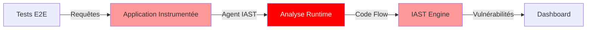

# 🔄 IAST - Interactive Application Security Testing

**IAST** (Test de sécurité interactif) combine SAST et DAST en instrumentant l'application pour analyser le code pendant l'exécution (gray-box).

## 🎯 Pourquoi IAST ?

- ✅ **Hybrid** : Combine SAST (code) + DAST (runtime)
- ✅ **Précision** : Moins de faux positifs que SAST/DAST seuls
- ✅ **Context-aware** : Comprend le flux de données
- ✅ **Real-time** : Détection pendant les tests
- ❌ **Performance** : Impact sur l'application instrumentée
- ❌ **Complexité** : Configuration plus complexe

## 🔧 Meilleurs outils IAST

### 1. Contrast Security (Recommandé - Enterprise)

**Langages** : Java, .NET, Node.js, Python, Ruby, Go

**Installation Java** :
```xml
<!-- pom.xml -->
<dependency>
    <groupId>com.contrastsecurity</groupId>
    <artifactId>contrast-agent</artifactId>
    <version>4.0.0</version>
</dependency>
```

```bash
# Démarrage avec agent
java -javaagent:contrast-agent.jar \
  -Dcontrast.api.url=https://app.contrastsecurity.com/Contrast \
  -Dcontrast.api.api_key=$API_KEY \
  -Dcontrast.api.service_key=$SERVICE_KEY \
  -Dcontrast.api.user_name=$USERNAME \
  -jar myapp.jar
```

**Docker** :
```dockerfile
FROM openjdk:17
COPY contrast-agent.jar /opt/contrast/
COPY app.jar /app/
ENV JAVA_TOOL_OPTIONS="-javaagent:/opt/contrast/contrast-agent.jar"
CMD ["java", "-jar", "/app/app.jar"]
```

**GitLab CI** :
```yaml
contrast-iast:
  stage: test
  image: openjdk:17
  before_script:
    - wget -O contrast-agent.jar https://repo1.maven.org/maven2/com/contrastsecurity/contrast-agent/4.0.0/contrast-agent-4.0.0.jar
  script:
    - java -javaagent:contrast-agent.jar -jar target/myapp.jar &
    - sleep 30
    - npm run e2e-tests
    - curl "$CONTRAST_API_URL/api/ng/$ORG_ID/traces/vulnerabilities"
```

---

### 2. Hdiv IAST (Open-source / Enterprise)

**Langages** : Java, .NET

**Installation** :
```xml
<!-- pom.xml -->
<dependency>
    <groupId>org.hdiv</groupId>
    <artifactId>hdiv-iast-agent</artifactId>
    <version>3.0.0</version>
</dependency>
```

```bash
java -javaagent:hdiv-iast-agent.jar \
  -Dhdiv.console.url=https://console.hdiv.io \
  -Dhdiv.console.token=$HDIV_TOKEN \
  -jar myapp.jar
```

---

### 3. Seeker (Synopsys)

**Langages** : Java, .NET, Node.js, Python

```bash
# Java
java -javaagent:seeker-agent.jar \
  -Dseeker.server.url=https://seeker.synopsys.com \
  -Dseeker.project.key=$PROJECT_KEY \
  -jar myapp.jar
```

---

### 4. Checkmarx CxIAST

**Langages** : Java, .NET

```yaml
# .gitlab-ci.yml
cxiast:
  stage: iast
  script:
    - docker run -d --name app-iast \
        -e CXIAST_MANAGER_URL=$CX_MANAGER_URL \
        -e CXIAST_AGENT_TOKEN=$CX_TOKEN \
        myapp:latest
    - docker exec app-iast run-tests
    - curl "$CX_MANAGER_URL/api/vulnerabilities"
```

---

### 5. Sqreen (Datadog - SaaS)

**Langages** : Java, Python, Ruby, Node.js, PHP, Go

**Node.js** :
```javascript
// app.js
require('sqreen');
const express = require('express');
const app = express();
// ... rest of your app
```

```bash
export SQREEN_TOKEN=$SQREEN_TOKEN
node app.js
```

---

### 6. Acunetix AcuSensor (IAST add-on)

**Langages** : PHP, Java, .NET

**PHP** :
```php
// Ajouter au début de votre app
require_once('/path/to/acusensor/acusensor.php');
```

---

## 📊 Comparaison des outils

| Outil | Langages | Type | Gratuit | Impact perf |
|-------|----------|------|---------|-------------|
| **Contrast Security** | 6+ | Enterprise | ❌ | 🟡 5-10% |
| **Hdiv IAST** | Java, .NET | Open/Enterprise | 🟡 | 🟡 5-15% |
| **Seeker** | 4+ | Enterprise | ❌ | 🟡 10-15% |
| **Checkmarx CxIAST** | Java, .NET | Enterprise | ❌ | 🟡 5-10% |
| **Sqreen** | 6+ | SaaS | ❌ | 🟢 2-5% |
| **Acunetix AcuSensor** | 3+ | Add-on | ❌ | 🟡 5-10% |

---

## 🔄 Architecture IAST


```mermaid
graph LR
    A[Tests E2E] -->|Requêtes| B[Application Instrumentée]
    B -->|Agent IAST| C[Analyse Runtime]
    C -->|Code Flow| D[IAST Engine]
    D -->|Vulnérabilités| E[Dashboard]
    
    style B fill:#ff9999
    style C fill:#ff0000,color:#fff
    style D fill:#ff9999
```

**Fonctionnement** :
1. L'agent IAST s'intègre à l'application
2. Lors des tests, l'agent suit le flux de données
3. Détection des vulnérabilités en temps réel
4. Rapport avec contexte complet (stack trace, variables)

---

## 🔄 Pipeline IAST complet

```yaml
# .gitlab-ci.yml
stages:
  - build
  - iast
  - report

variables:
  CONTRAST_API_URL: "https://app.contrastsecurity.com/Contrast"
  APP_URL: "http://localhost:8080"

build:
  stage: build
  script:
    - mvn clean package
    - wget -O contrast-agent.jar $CONTRAST_AGENT_URL
  artifacts:
    paths:
      - target/*.jar
      - contrast-agent.jar

iast-testing:
  stage: iast
  image: openjdk:17
  services:
    - postgres:latest
  variables:
    POSTGRES_DB: testdb
    POSTGRES_USER: test
    POSTGRES_PASSWORD: test
  script:
    # 1. Démarrer l'app avec agent IAST
    - |
      java -javaagent:contrast-agent.jar \
        -Dcontrast.api.url=$CONTRAST_API_URL \
        -Dcontrast.api.api_key=$CONTRAST_API_KEY \
        -Dcontrast.api.service_key=$CONTRAST_SERVICE_KEY \
        -Dcontrast.api.user_name=$CONTRAST_USERNAME \
        -Dspring.datasource.url=jdbc:postgresql://postgres:5432/testdb \
        -jar target/myapp.jar &
    
    # 2. Attendre le démarrage
    - sleep 30
    - curl --retry 10 --retry-delay 3 $APP_URL/actuator/health
    
    # 3. Exécuter les tests (IAST analyse en temps réel)
    - npm install
    - npm run test:e2e
    - mvn verify -Dtest.url=$APP_URL
    
    # 4. Récupérer les résultats
    - sleep 10
    - |
      curl -X GET "$CONTRAST_API_URL/api/ng/$CONTRAST_ORG_ID/traces/vulnerabilities" \
        -H "Authorization: $CONTRAST_AUTH_HEADER" \
        -H "API-Key: $CONTRAST_API_KEY" \
        -o iast-results.json
  artifacts:
    paths:
      - iast-results.json
    reports:
      sast: iast-results.json
  allow_failure: false

report:
  stage: report
  script:
    - echo "IAST vulnerabilities found:"
    - cat iast-results.json | jq '.vulnerabilities[] | {title, severity, url}'
```

---

## 🎯 Configuration par langage

### Java Spring Boot

```yaml
# application-iast.yml
spring:
  profiles: iast

# Démarrage
java -javaagent:contrast-agent.jar \
  -Dspring.profiles.active=iast \
  -jar myapp.jar
```

### .NET

```xml
<!-- web.config -->
<configuration>
  <appSettings>
    <add key="Contrast.Api.Url" value="https://app.contrastsecurity.com/Contrast"/>
    <add key="Contrast.Api.ApiKey" value="YOUR_API_KEY"/>
  </appSettings>
</configuration>
```

```bash
# Démarrage
dotnet myapp.dll --Contrast:Enable=true
```

### Node.js

```javascript
// app.js
if (process.env.NODE_ENV === 'iast') {
  require('contrast-agent');
}

const express = require('express');
const app = express();
// ... rest
```

### Python

```python
# app.py
from contrast.agent import install_agent

if os.getenv('ENABLE_IAST'):
    install_agent()

from flask import Flask
app = Flask(__name__)
# ... rest
```

---

## 🔐 Vulnérabilités détectées

### Runtime-specific
- ✅ SQL Injection (avec query réelle)
- ✅ XSS (avec payload exact)
- ✅ Path Traversal (chemin complet)
- ✅ Command Injection (commande exécutée)
- ✅ XXE (entité chargée)
- ✅ Insecure Deserialization

### Avec contexte complet
- Stack trace complète
- Variables impliquées
- Flux de données (source → sink)
- Impact réel

---

## 🎯 Meilleures pratiques

### 1. Environnement dédié
```yaml
# Ne jamais en production !
environment:
  name: iast-testing
```

### 2. Tests automatisés complets
```yaml
script:
  - npm run test:unit
  - npm run test:integration
  - npm run test:e2e  # Coverage maximale
```

### 3. Monitoring de performance
```yaml
script:
  - monitor_app_performance.sh
  - if [ $RESPONSE_TIME -gt 1000 ]; then echo "Too slow"; exit 1; fi
```

### 4. Rotation des credentials
```yaml
variables:
  IAST_TEST_USER: "iast-user-$CI_PIPELINE_ID"
```

### 5. Nettoyage post-test
```yaml
after_script:
  - pkill -f "java.*contrast-agent"
  - docker stop iast-app
```

---

## 🔄 Combinaison SAST + DAST + IAST

```yaml
stages:
  - sast
  - build
  - iast
  - dast

# 1. SAST : Analyse statique
sonarqube:
  stage: sast
  script:
    - sonar-scanner

# 2. Build avec instrumentation
build-iast:
  stage: build
  script:
    - mvn package
    - wget contrast-agent.jar

# 3. IAST : Tests avec agent
iast-test:
  stage: iast
  script:
    - java -javaagent:contrast-agent.jar -jar app.jar &
    - npm run test:e2e

# 4. DAST : Scan de l'app déployée
zap-scan:
  stage: dast
  script:
    - zap-baseline.py -t https://staging.app.com
```

---

## 🆘 Troubleshooting

### Agent ne démarre pas
```bash
# Vérifier les logs
java -javaagent:contrast-agent.jar -Dcontrast.log.level=DEBUG -jar app.jar

# Check permissions
ls -la contrast-agent.jar
```

### Performance dégradée
```yaml
# Réduire le mode de détection
-Dcontrast.assess.enable=false  # Désactiver assess
-Dcontrast.protect.enable=true  # Garder protect uniquement
```

### Pas de vulnérabilités détectées
```bash
# Vérifier la couverture des tests
# Plus de tests = plus de détection

# Vérifier l'agent
curl http://localhost:8080/contrast/health
```

---

## 📈 Métriques IAST

```yaml
# À surveiller
- Test coverage: > 80%
- Agent overhead: < 15%
- Vulnerabilities: 0 high/critical
- False positives: < 5%
- Detection time: Real-time
```

---

## 📚 Ressources

- [Contrast Security Documentation](https://docs.contrastsecurity.com/)
- [OWASP IAST](https://owasp.org/www-community/Vulnerability_Scanning_Tools)
- [Hdiv IAST](https://hdivsecurity.com/iast)

---

**IAST analyse votre application pendant l'exécution des tests avec une précision maximale !** 🔄🎯