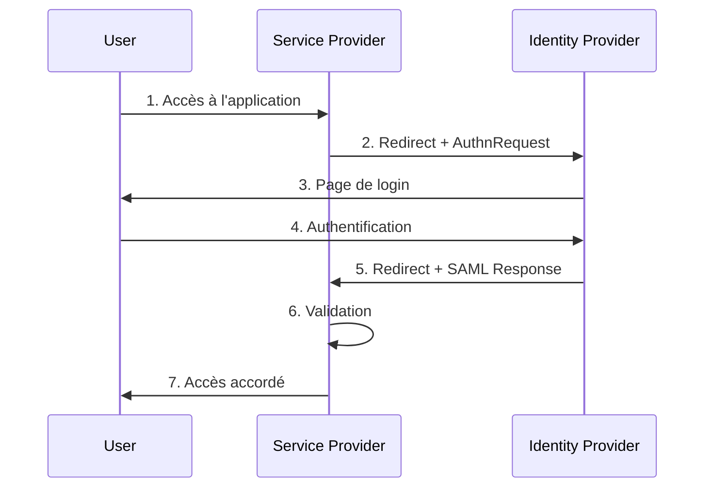
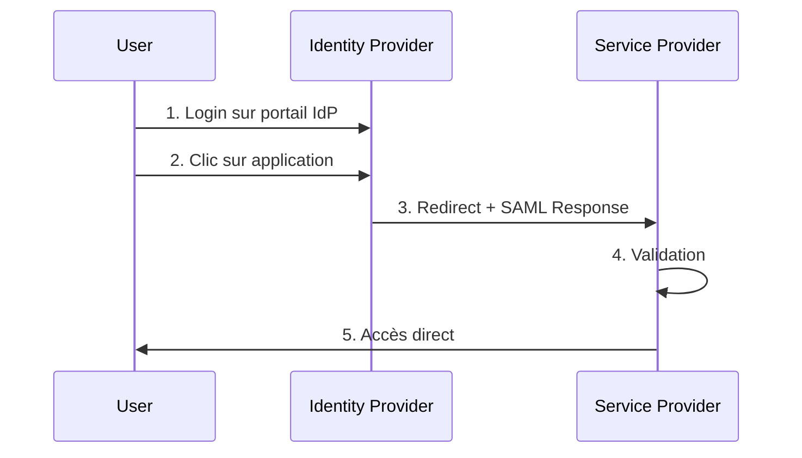
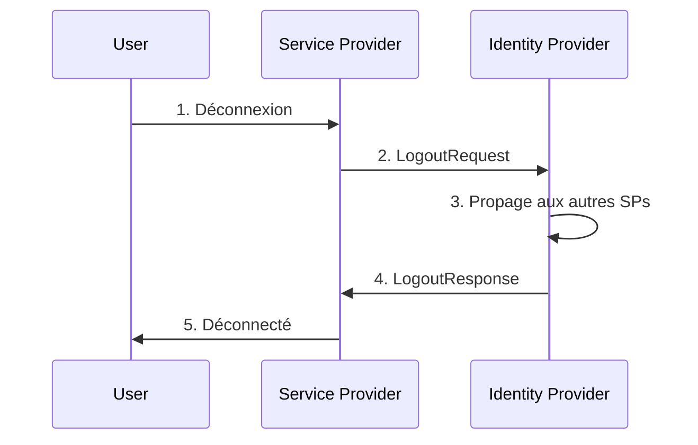

# SAML 2.0

## Introduction

SAML (Security Assertion Markup Language) 2.0 est un standard XML pour l'**authentification unique (SSO)** en entreprise. Il permet à un utilisateur de se connecter une seule fois et d'accéder à plusieurs applications.

## Concepts Clés

### Les Acteurs

- **User (Principal)** : L'utilisateur qui s'authentifie
- **Identity Provider (IdP)** : Service d'authentification (Okta, Azure AD, Google Workspace)
- **Service Provider (SP)** : L'application cible (Salesforce, Slack, AWS)

### L'Assertion SAML

Document XML signé contenant :
- Identité de l'utilisateur
- Attributs (email, nom, rôle)
- Conditions de validité (temporelle, audience)

## Les Flux SAML

### SP-Initiated SSO

L'utilisateur accède directement à l'application.



**Étapes** :
1. Tentative d'accès à une ressource protégée
2. SP génère une `AuthnRequest` et redirige vers l'IdP
3. L'IdP affiche le formulaire de connexion
4. L'utilisateur s'authentifie
5. L'IdP génère une `Response` SAML signée et redirige vers le SP
6. Le SP valide la signature et les conditions
7. Session créée, accès accordé

---

### IdP-Initiated SSO

L'utilisateur part du portail de l'IdP.



**Différence** : Pas d'`AuthnRequest`, l'IdP initie directement.

---

### Single Logout (SLO)

Déconnexion de toutes les applications simultanément.



---

## Structure des Messages

### AuthnRequest (simplifié)

```xml
<samlp:AuthnRequest
    ID="_unique_id"
    Destination="https://idp.example.com/sso"
    AssertionConsumerServiceURL="https://sp.example.com/acs">
    <saml:Issuer>https://sp.example.com</saml:Issuer>
</samlp:AuthnRequest>
```

### SAML Response (simplifié)

```xml
<samlp:Response InResponseTo="_unique_id">
    <saml:Issuer>https://idp.example.com</saml:Issuer>
    <samlp:Status><samlp:StatusCode Value="Success"/></samlp:Status>
    
    <saml:Assertion>
        <ds:Signature>...</ds:Signature>
        <saml:Subject>
            <saml:NameID>john.doe@example.com</saml:NameID>
        </saml:Subject>
        <saml:Conditions NotBefore="..." NotOnOrAfter="...">
            <saml:Audience>https://sp.example.com</saml:Audience>
        </saml:Conditions>
        <saml:AttributeStatement>
            <saml:Attribute Name="email">
                <saml:AttributeValue>john.doe@example.com</saml:AttributeValue>
            </saml:Attribute>
            <saml:Attribute Name="role">
                <saml:AttributeValue>admin</saml:AttributeValue>
            </saml:Attribute>
        </saml:AttributeStatement>
    </saml:Assertion>
</samlp:Response>
```

---

## Exemples de Requêtes HTTP

### Redirection vers IdP (HTTP Redirect)

```http
GET /sso?SAMLRequest=fZJNT8IwFMff...&RelayState=https://sp.example.com/dashboard HTTP/1.1
Host: idp.example.com
```

- **SAMLRequest** : AuthnRequest encodé en Base64
- **RelayState** : URL de destination finale

---

### Retour vers SP (HTTP POST)

**Formulaire auto-soumis** :

```html
<form method="POST" action="https://sp.example.com/acs">
    <input type="hidden" name="SAMLResponse" value="PHNhbWxw..." />
    <input type="hidden" name="RelayState" value="https://sp.example.com/dashboard" />
</form>
```

**Réception** :

```http
POST /acs HTTP/1.1
Host: sp.example.com
Content-Type: application/x-www-form-urlencoded

SAMLResponse=PHNhbWxw...&RelayState=https://sp.example.com/dashboard
```

---

### Métadonnées

**IdP Metadata** :

```xml
<md:EntityDescriptor entityID="https://idp.example.com">
    <md:IDPSSODescriptor>
        <md:KeyDescriptor use="signing">
            <ds:X509Certificate>MIIDXTCCAkWg...</ds:X509Certificate>
        </md:KeyDescriptor>
        <md:SingleSignOnService
            Binding="HTTP-POST"
            Location="https://idp.example.com/sso"/>
    </md:IDPSSODescriptor>
</md:EntityDescriptor>
```

**SP Metadata** :

```xml
<md:EntityDescriptor entityID="https://sp.example.com">
    <md:SPSSODescriptor>
        <md:AssertionConsumerService
            Binding="HTTP-POST"
            Location="https://sp.example.com/acs"/>
    </md:SPSSODescriptor>
</md:EntityDescriptor>
```

---

## Configuration

### Côté Service Provider

1. Générer Entity ID et ACS URL
2. Importer métadonnées IdP (certificat + endpoints)
3. Configurer mapping des attributs

### Côté Identity Provider

1. Ajouter le SP (Entity ID + ACS URL)
2. Configurer les attributs à envoyer
3. Assigner utilisateurs/groupes

---

## Validation de l'Assertion

**Le SP doit vérifier** :

1. ✅ Signature (avec certificat IdP)
2. ✅ Issuer (IdP attendu)
3. ✅ Audience (pour ce SP)
4. ✅ Validité temporelle (NotBefore/NotOnOrAfter)
5. ✅ InResponseTo (correspond à l'AuthnRequest)

:::danger
Ne jamais accepter une assertion sans valider la signature !
:::

---

## Sécurité

### Bonnes Pratiques

- ✅ **HTTPS obligatoire**
- ✅ **Valider les signatures**
- ✅ **Vérifier les conditions temporelles**
- ✅ **Certificats robustes** (RSA 2048+ bits)
- ✅ **Durée de vie courte** des assertions (≤ 5 min)
- ✅ **Synchronisation horaire** (NTP)

---

## Comparaison

| Aspect | SAML 2.0 | OAuth 2.0 | OIDC |
|--------|----------|-----------|------|
| **Format** | XML | JSON | JSON |
| **Objectif** | SSO entreprise | Autorisation | Authentification |
| **Use case** | B2B, Intranet | APIs | Web/Mobile |
| **Complexité** | Élevée | Moyenne | Faible |

---

## Quand utiliser SAML ?

### ✅ Utiliser SAML

- SSO entreprise centralisé
- Intégration B2B
- IdP SAML existant
- Applications SaaS d'entreprise

### ❌ Éviter SAML

- Applications mobiles natives → OIDC
- APIs REST → OAuth 2.0
- Projets simples → OIDC
- Pas d'expertise XML

---

## Dépannage Rapide

| Erreur | Cause | Solution |
|--------|-------|----------|
| **Invalid Signature** | Certificat incorrect | Vérifier certificat IdP |
| **Audience Restriction** | Entity ID différent | Vérifier Entity IDs |
| **Assertion Expired** | Décalage d'horloge | Synchroniser NTP |
| **InResponseTo mismatch** | Session perdue | Vérifier cookies |

---

## Ressources

- [SAML 2.0 Specification](https://docs.oasis-open.org/security/saml/v2.0/)

---

## Glossaire

- **SSO** : Single Sign-On - Authentification unique
- **Assertion** : Document XML signé avec infos utilisateur
- **Entity ID** : Identifiant unique du SP ou IdP
- **ACS** : Assertion Consumer Service - Endpoint de réception
- **IdP** : Identity Provider - Fournisseur d'identité
- **SP** : Service Provider - Application cible
- **RelayState** : URL de redirection après authentification