# 🛡️ OWASP Top 10 - Sécurité Applicative

Guide complet pour sécuriser vos applications Java, Drupal et Angular contre les vulnérabilités OWASP Top 10 (2021).

## 🎯 OWASP Top 10 - Vue d'ensemble

```mermaid
graph TB
    subgraph "OWASP Top 10 - 2021"
        A01[A01 - Broken Access Control]
        A02[A02 - Cryptographic Failures]
        A03[A03 - Injection]
        A04[A04 - Insecure Design]
        A05[A05 - Security Misconfiguration]
        A06[A06 - Vulnerable Components]
        A07[A07 - Authentication Failures]
        A08[A08 - Software/Data Integrity]
        A09[A09 - Logging/Monitoring Failures]
        A10[A10 - SSRF]
    end
    
    subgraph "Protection Stack"
        WAF[🔥 WAF]
        GATEWAY[🚪 API Gateway]
        AUTH[🔐 OAuth2/OIDC]
        VAULT[🔒 Vault]
        SAST[📊 SonarQube]
        DAST[🔍 OWASP ZAP]
        SCA[📦 Dependency Check]
    end
    
    A01 --> AUTH
    A02 --> VAULT
    A03 --> SAST
    A04 --> SAST
    A05 --> SAST
    A06 --> SCA
    A07 --> AUTH
    A08 --> SAST
    A09 --> SAST
    A10 --> WAF
    
    AUTH --> GATEWAY
    VAULT --> GATEWAY
    GATEWAY --> WAF
    
    style A01 fill:#dc3545,color:#fff
    style A02 fill:#dc3545,color:#fff
    style A03 fill:#dc3545,color:#fff
```



## 🔴 A01 - Broken Access Control

### Description
Échec dans l'application des restrictions d'accès permettant aux utilisateurs d'accéder à des ressources non autorisées.

### Exemples d'attaques
- Modification d'URL pour accéder à d'autres comptes
- Élévation de privilèges
- CORS mal configuré
- IDOR (Insecure Direct Object References)

### ☕ Protection Java/Spring Boot

```java
// SecurityConfig.java
@Configuration
@EnableWebSecurity
@EnableMethodSecurity(prePostEnabled = true)
public class SecurityConfig {
    
    @Bean
    public SecurityFilterChain filterChain(HttpSecurity http) throws Exception {
        http
            .authorizeHttpRequests(auth -> auth
                // Public endpoints
                .requestMatchers("/api/public/**").permitAll()
                .requestMatchers("/health", "/metrics").permitAll()
                
                // Admin only
                .requestMatchers("/api/admin/**").hasRole("ADMIN")
                
                // User endpoints
                .requestMatchers("/api/users/**").hasAnyRole("USER", "ADMIN")
                
                // Authenticated
                .anyRequest().authenticated()
            )
            .csrf(csrf -> csrf
                .csrfTokenRepository(CookieCsrfTokenRepository.withHttpOnlyFalse())
            )
            .sessionManagement(session -> session
                .sessionCreationPolicy(SessionCreationPolicy.STATELESS)
            )
            .oauth2ResourceServer(oauth2 -> oauth2
                .jwt(jwt -> jwt.jwtAuthenticationConverter(jwtAuthenticationConverter()))
            );
        
        return http.build();
    }
    
    // Method-level security
    @Service
    public class UserService {
        
        @PreAuthorize("hasRole('ADMIN') or #userId == authentication.principal.id")
        public User getUser(Long userId) {
            return userRepository.findById(userId)
                .orElseThrow(() -> new ResourceNotFoundException("User not found"));
        }
        
        @PreAuthorize("@userSecurity.canAccessResource(#resourceId, authentication)")
        public Resource getResource(Long resourceId) {
            return resourceRepository.findById(resourceId)
                .orElseThrow(() -> new ResourceNotFoundException("Resource not found"));
        }
    }
    
    // Custom security expression
    @Component("userSecurity")
    public class UserSecurityService {
        
        public boolean canAccessResource(Long resourceId, Authentication auth) {
            UserDetails user = (UserDetails) auth.getPrincipal();
            Resource resource = resourceRepository.findById(resourceId).orElse(null);
            
            if (resource == null) return false;
            
            // Check ownership
            if (resource.getOwnerId().equals(user.getId())) {
                return true;
            }
            
            // Check team membership
            return resource.getTeam().getMembers().contains(user);
        }
    }
}
```

### 🔷 Protection Drupal

```php
<?php
// custom_module.permissions.yml
permissions:
  'access custom content':
    title: 'Access custom content'
    description: 'Permission to view custom content'
  'administer custom content':
    title: 'Administer custom content'
    description: 'Full administrative access'

// CustomController.php
namespace Drupal\custom_module\Controller;

use Drupal\Core\Access\AccessResult;
use Drupal\Core\Controller\ControllerBase;
use Drupal\node\NodeInterface;

class CustomController extends ControllerBase {
  
  /**
   * Access callback for custom route.
   */
  public function access(NodeInterface $node) {
    $current_user = \Drupal::currentUser();
    
    // Check basic permission
    if (!$current_user->hasPermission('access custom content')) {
      return AccessResult::forbidden();
    }
    
    // Check ownership
    if ($node->getOwnerId() == $current_user->id()) {
      return AccessResult::allowed()->cachePerUser()->addCacheableDependency($node);
    }
    
    // Check team membership
    if ($node->hasField('field_team')) {
      $team_members = $node->get('field_team')->referencedEntities();
      foreach ($team_members as $member) {
        if ($member->id() == $current_user->id()) {
          return AccessResult::allowed()->cachePerUser()->addCacheableDependency($node);
        }
      }
    }
    
    return AccessResult::forbidden();
  }
}

// services.yml
services:
  custom_module.access_checker:
    class: Drupal\custom_module\Access\CustomAccessChecker
    tags:
      - { name: access_check, applies_to: _custom_access }
```

### 🅰️ Protection Angular

```typescript
// auth.guard.ts
@Injectable()
export class AuthGuard implements CanActivate {
  constructor(
    private authService: AuthService,
    private router: Router
  ) {}
  
  canActivate(
    route: ActivatedRouteSnapshot,
    state: RouterStateSnapshot
  ): Observable<boolean> {
    return this.authService.getCurrentUser().pipe(
      map(user => {
        // Check authentication
        if (!user) {
          this.router.navigate(['/login']);
          return false;
        }
        
        // Check roles
        const requiredRoles = route.data['roles'] as string[];
        if (requiredRoles && !this.hasRequiredRoles(user, requiredRoles)) {
          this.router.navigate(['/forbidden']);
          return false;
        }
        
        // Check ownership for resource routes
        if (route.data['checkOwnership']) {
          const resourceId = route.params['id'];
          return this.authService.canAccessResource(resourceId, user.id);
        }
        
        return true;
      }),
      catchError(() => {
        this.router.navigate(['/login']);
        return of(false);
      })
    );
  }
  
  private hasRequiredRoles(user: User, roles: string[]): boolean {
    return roles.some(role => user.roles.includes(role));
  }
}

// app-routing.module.ts
const routes: Routes = [
  {
    path: 'admin',
    canActivate: [AuthGuard],
    data: { roles: ['ADMIN'] },
    loadChildren: () => import('./admin/admin.module').then(m => m.AdminModule)
  },
  {
    path: 'users/:id',
    canActivate: [AuthGuard],
    data: { checkOwnership: true },
    component: UserDetailComponent
  }
];

// HTTP Interceptor for CORS
@Injectable()
export class SecurityInterceptor implements HttpInterceptor {
  intercept(req: HttpRequest<any>, next: HttpHandler): Observable<HttpEvent<any>> {
    // Add security headers
    const secureReq = req.clone({
      setHeaders: {
        'X-Requested-With': 'XMLHttpRequest',
        'X-Frame-Options': 'DENY',
        'X-Content-Type-Options': 'nosniff'
      }
    });
    
    return next.handle(secureReq);
  }
}
```

## 🔴 A02 - Cryptographic Failures

### ☕ Java - Chiffrement sécurisé

```java
@Configuration
public class CryptoConfig {
    
    // Use strong algorithms
    @Bean
    public PasswordEncoder passwordEncoder() {
        return new BCryptPasswordEncoder(12); // Cost factor 12
    }
    
    // AES-GCM for data encryption
    @Service
    public class EncryptionService {
        
        private static final String ALGORITHM = "AES/GCM/NoPadding";
        private static final int TAG_LENGTH_BIT = 128;
        private static final int IV_LENGTH_BYTE = 12;
        
        @Value("${encryption.key}")
        private String base64Key;
        
        public String encrypt(String plaintext) throws Exception {
            SecretKey key = new SecretKeySpec(
                Base64.getDecoder().decode(base64Key), 
                "AES"
            );
            
            // Generate random IV
            byte[] iv = new byte[IV_LENGTH_BYTE];
            new SecureRandom().nextBytes(iv);
            
            Cipher cipher = Cipher.getInstance(ALGORITHM);
            GCMParameterSpec parameterSpec = new GCMParameterSpec(TAG_LENGTH_BIT, iv);
            cipher.init(Cipher.ENCRYPT_MODE, key, parameterSpec);
            
            byte[] cipherText = cipher.doFinal(plaintext.getBytes(StandardCharsets.UTF_8));
            
            // Prepend IV to ciphertext
            byte[] encrypted = new byte[IV_LENGTH_BYTE + cipherText.length];
            System.arraycopy(iv, 0, encrypted, 0, IV_LENGTH_BYTE);
            System.arraycopy(cipherText, 0, encrypted, IV_LENGTH_BYTE, cipherText.length);
            
            return Base64.getEncoder().encodeToString(encrypted);
        }
        
        public String decrypt(String encrypted) throws Exception {
            byte[] decoded = Base64.getDecoder().decode(encrypted);
            
            // Extract IV
            byte[] iv = new byte[IV_LENGTH_BYTE];
            System.arraycopy(decoded, 0, iv, 0, IV_LENGTH_BYTE);
            
            // Extract ciphertext
            byte[] cipherText = new byte[decoded.length - IV_LENGTH_BYTE];
            System.arraycopy(decoded, IV_LENGTH_BYTE, cipherText, 0, cipherText.length);
            
            SecretKey key = new SecretKeySpec(
                Base64.getDecoder().decode(base64Key), 
                "AES"
            );
            
            Cipher cipher = Cipher.getInstance(ALGORITHM);
            GCMParameterSpec parameterSpec = new GCMParameterSpec(TAG_LENGTH_BIT, iv);
            cipher.init(Cipher.DECRYPT_MODE, key, parameterSpec);
            
            byte[] plaintext = cipher.doFinal(cipherText);
            return new String(plaintext, StandardCharsets.UTF_8);
        }
    }
    
    // TLS configuration
    @Bean
    public TomcatServletWebServerFactory servletContainer() {
        TomcatServletWebServerFactory tomcat = new TomcatServletWebServerFactory() {
            @Override
            protected void postProcessContext(Context context) {
                SecurityConstraint constraint = new SecurityConstraint();
                constraint.setUserConstraint("CONFIDENTIAL");
                
                SecurityCollection collection = new SecurityCollection();
                collection.addPattern("/*");
                constraint.addCollection(collection);
                
                context.addConstraint(constraint);
            }
        };
        tomcat.addAdditionalTomcatConnectors(redirectConnector());
        return tomcat;
    }
    
    private Connector redirectConnector() {
        Connector connector = new Connector("org.apache.coyote.http11.Http11NioProtocol");
        connector.setScheme("http");
        connector.setPort(8080);
        connector.setSecure(false);
        connector.setRedirectPort(8443);
        return connector;
    }
}
```

### 🔷 Drupal - Encryption

```php
<?php
// settings.php
$settings['hash_salt'] = 'CHANGE_THIS_TO_RANDOM_STRING';

// Use Encrypt module
use Drupal\encrypt\EncryptionProfileManager;
use Drupal\encrypt\Entity\EncryptionProfile;

// Encrypt sensitive data
$encryption_profile = EncryptionProfile::load('my_encryption_profile');
$encrypted = \Drupal::service('encryption')->encrypt($plaintext, $encryption_profile);

// Password hashing
use Drupal\Core\Password\PasswordInterface;

$password_hasher = \Drupal::service('password');
$hashed = $password_hasher->hash($password);
$is_valid = $password_hasher->check($password, $hashed);
```

## 🔴 A03 - Injection (SQL, XSS, Command)

### ☕ Java - Prevention Injection

```java
// SQL Injection Prevention
@Repository
public interface UserRepository extends JpaRepository<User, Long> {
    
    // ✅ GOOD - Parameterized query
    @Query("SELECT u FROM User u WHERE u.email = :email")
    Optional<User> findByEmail(@Param("email") String email);
    
    // ❌ BAD - String concatenation
    // @Query("SELECT u FROM User u WHERE u.email = '" + email + "'")
    
    // ✅ GOOD - Native query with parameters
    @Query(value = "SELECT * FROM users WHERE status = ?1 AND role = ?2", nativeQuery = true)
    List<User> findByStatusAndRole(String status, String role);
}

// XSS Prevention
@Service
public class HtmlSanitizerService {
    
    private final PolicyFactory policy;
    
    public HtmlSanitizerService() {
        this.policy = Sanitizers.FORMATTING
            .and(Sanitizers.LINKS)
            .and(Sanitizers.BLOCKS);
    }
    
    public String sanitize(String html) {
        return policy.sanitize(html);
    }
}

// Command Injection Prevention
@Service
public class FileService {
    
    // ✅ GOOD - Use ProcessBuilder with List
    public void executeCommand(String filename) throws IOException {
        // Whitelist validation
        if (!filename.matches("[a-zA-Z0-9._-]+")) {
            throw new IllegalArgumentException("Invalid filename");
        }
        
        ProcessBuilder pb = new ProcessBuilder(
            "convert",
            filename,
            filename + ".pdf"
        );
        pb.directory(new File("/tmp"));
        Process process = pb.start();
    }
    
    // ❌ BAD - Runtime.exec with string concatenation
    // Runtime.getRuntime().exec("convert " + filename + " output.pdf");
}

// LDAP Injection Prevention
@Service
public class LdapService {
    
    public List<User> searchUsers(String username) {
        // Escape LDAP special characters
        String escapedUsername = LdapEncoder.filterEncode(username);
        
        LdapQuery query = LdapQueryBuilder.query()
            .where("uid").is(escapedUsername);
        
        return ldapTemplate.search(query, new UserAttributesMapper());
    }
}
```

### 🔷 Drupal - Prevention Injection

```php
<?php
// SQL Injection Prevention
use Drupal\Core\Database\Database;

// ✅ GOOD - Parameterized query
$connection = Database::getConnection();
$query = $connection->select('users_field_data', 'u')
  ->fields('u', ['uid', 'name', 'mail'])
  ->condition('u.mail', $email, '=')
  ->condition('u.status', 1, '=');
$results = $query->execute()->fetchAll();

// ✅ GOOD - Dynamic query with placeholders
$query = $connection->query('SELECT * FROM {users} WHERE mail = :email', [
  ':email' => $email
]);

// ❌ BAD - String concatenation
// $query = "SELECT * FROM users WHERE mail = '$email'";

// XSS Prevention
use Drupal\Component\Utility\Html;
use Drupal\Component\Utility\Xss;

// Filter dangerous tags
$safe_string = Xss::filter($user_input);

// Escape HTML
$escaped = Html::escape($user_input);

// In templates (Twig auto-escapes)
// {{ user_input }}  - Auto-escaped
// {{ user_input|raw }}  - NOT escaped (dangerous)

// Command Injection Prevention
use Symfony\Component\Process\Process;

// ✅ GOOD - Use Process with array
$process = new Process([
  'convert',
  $filename,
  $output_filename
]);
$process->run();

// ❌ BAD - Shell execution
// exec("convert $filename $output_filename");
```

### 🅰️ Angular - Prevention XSS

```typescript
// XSS Prevention in Angular
import { DomSanitizer, SafeHtml } from '@angular/platform-browser';

@Component({
  selector: 'app-content',
  template: `
    <!-- ✅ GOOD - Angular auto-escapes -->
    <div>{{ userInput }}</div>
    
    <!-- ✅ GOOD - Sanitized HTML -->
    <div [innerHTML]="sanitizedHtml"></div>
    
    <!-- ❌ BAD - Bypass security -->
    <!-- <div [innerHTML]="unsafeHtml"></div> -->
  `
})
export class ContentComponent {
  userInput: string;
  sanitizedHtml: SafeHtml;
  
  constructor(private sanitizer: DomSanitizer) {}
  
  ngOnInit() {
    // Sanitize HTML
    this.sanitizedHtml = this.sanitizer.sanitize(
      SecurityContext.HTML,
      this.userInput
    );
  }
  
  // Custom sanitizer
  sanitizeInput(input: string): string {
    return input
      .replace(/</g, '&lt;')
      .replace(/>/g, '&gt;')
      .replace(/"/g, '&quot;')
      .replace(/'/g, '&#x27;')
      .replace(/\//g, '&#x2F;');
  }
}

// CSP Headers
// index.html
<meta http-equiv="Content-Security-Policy" 
      content="default-src 'self'; 
               script-src 'self'; 
               style-src 'self' 'unsafe-inline'; 
               img-src 'self' data: https:;
               font-src 'self' data:;">
```

## 🔴 A04 - Insecure Design


### Rate Limiting

```java
// Java - Rate Limiting with Bucket4j
@Configuration
public class RateLimitConfig {
    
    @Bean
    public Bucket createBucket() {
        Bandwidth limit = Bandwidth.classic(100, Refill.intervally(100, Duration.ofMinutes(1)));
        return Bucket4j.builder()
            .addLimit(limit)
            .build();
    }
}

@RestController
public class ApiController {
    
    @Autowired
    private Bucket bucket;
    
    @GetMapping("/api/resource")
    public ResponseEntity<?> getResource() {
        if (bucket.tryConsume(1)) {
            return ResponseEntity.ok(resource);
        }
        return ResponseEntity.status(HttpStatus.TOO_MANY_REQUESTS)
            .body("Rate limit exceeded");
    }
}
```

## 🔴 A05 - Security Misconfiguration

### Security Headers

```java
// Java/Spring - Security Headers
@Configuration
public class SecurityHeadersConfig {
    
    @Bean
    public SecurityFilterChain configure(HttpSecurity http) throws Exception {
        http.headers(headers -> headers
            .contentSecurityPolicy("default-src 'self'; script-src 'self' 'unsafe-inline'; style-src 'self' 'unsafe-inline'")
            .referrerPolicy(ReferrerPolicyHeaderWriter.ReferrerPolicy.STRICT_ORIGIN_WHEN_CROSS_ORIGIN)
            .permissionsPolicy(policy -> policy.policy("geolocation=(), microphone=(), camera=()"))
            .frameOptions().deny()
            .xssProtection().block(true)
            .contentTypeOptions().disable()
            .httpStrictTransportSecurity()
                .includeSubDomains(true)
                .maxAgeInSeconds(31536000)
        );
        
        return http.build();
    }
}
```

### Nginx Configuration Sécurisée

```nginx
# nginx.conf
server {
    listen 443 ssl http2;
    server_name example.com;
    
    # SSL Configuration
    ssl_certificate /etc/nginx/ssl/cert.pem;
    ssl_certificate_key /etc/nginx/ssl/key.pem;
    ssl_protocols TLSv1.2 TLSv1.3;
    ssl_ciphers HIGH:!aNULL:!MD5;
    ssl_prefer_server_ciphers on;
    
    # Security Headers
    add_header X-Frame-Options "DENY" always;
    add_header X-Content-Type-Options "nosniff" always;
    add_header X-XSS-Protection "1; mode=block" always;
    add_header Referrer-Policy "strict-origin-when-cross-origin" always;
    add_header Content-Security-Policy "default-src 'self'; script-src 'self' 'unsafe-inline'; style-src 'self' 'unsafe-inline';" always;
    add_header Strict-Transport-Security "max-age=31536000; includeSubDomains" always;
    add_header Permissions-Policy "geolocation=(), microphone=(), camera=()" always;
    
    # Hide version
    server_tokens off;
    
    # Limit request size
    client_max_body_size 10M;
    
    # Timeouts
    client_body_timeout 12;
    client_header_timeout 12;
    keepalive_timeout 15;
    send_timeout 10;
    
    # Rate limiting
    limit_req_zone $binary_remote_addr zone=api_limit:10m rate=10r/s;
    
    location /api/ {
        limit_req zone=api_limit burst=20 nodelay;
        proxy_pass http://backend;
    }
}
```

Suite dans le prochain message avec A06-A10...
